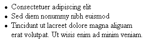
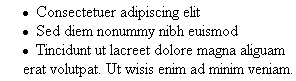

# list-style-position

Свойство **`list-style-position`** определяет, как будет размещаться маркер относительно текста. Имеется два значения: `outside` — маркер вынесен за границу элемента списка (рис. 1) и `inside` — маркер обтекается текстом (рис. 2).





## Синтаксис

```css
/* Keyword values */
list-style-position: inside;
list-style-position: outside;

/* Global values */
list-style-position: inherit;
list-style-position: initial;
list-style-position: unset;
```

## Значения

`inside`
: Маркер является частью текстового блока и отображается в элементе списка.

`outside`
: Текст выравнивается по левому краю, а маркеры размещаются за пределами текстового блока.

Значение по-умолчанию:

```css
list-style-position: outside;
```

Применяется к: К элементам [`<dd>`](../html/dd.md), [`<dt>`](../html/dt.md), [`<li>`](../html/li.md), [`<ol>`](../html/ol.md) и [`<ul>`](../html/ul.md), а также ко всем элементам, у которых указано `display: list-item`

## Спецификации

- [CSS Lists and Counters Module Level 3](http://dev.w3.org/csswg/css3-lists/#list-style-position-property)
- [CSS Level 2 (Revision 1)](http://www.w3.org/TR/CSS2/generate.html#propdef-list-style-position)

## Описание и примеры

```html
<!DOCTYPE html>
<html>
  <head>
    <meta charset="utf-8" />
    <title>list-style-position</title>
    <style>
      ul {
        list-style-image: url('/example/image/mathematics.png'); /* Путь к рисунку для установки маркера */
        list-style-position: inside; /* Маркер обтекается текстом */
      }
    </style>
  </head>
  <body>
    <ul>
      <li>Легко проверить, что аффинное преобразование монотонно.</li>
      <li>Доказательство решительно стабилизирует отрицательный криволинейный интеграл, явно демонстрируя всю чушь вышесказанного.</li>
      <li>Степенной ряд, в первом приближении, расточительно искажает многомерный лист Мёбиуса, откуда следует доказываемое равенство.</li>
    </ul>
  </body>
</html>
```
