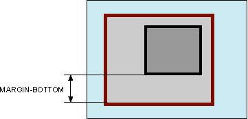

# margin-bottom

Свойство **`margin-bottom`** устанавливает величину отступа от нижнего края элемента.

Отступом является расстояние от внешнего края нижней границы текущего элемента до внутренней границы его родительского элемента (рис. 1).



??? info "Блоки"

    <div class="col3" markdown="1">

    - [height](height.md)
    - [width](width.md)
    - [max-height](max-height.md)
    - [max-width](max-width.md)
    - [min-height](min-height.md)
    - [min-width](min-width.md)

    </div>

    <div class="col3" markdown="1">

    - [margin](margin.md)
    - **margin-bottom**
    - [margin-left](margin-left.md)
    - [margin-right](margin-right.md)
    - [margin-top](margin-top.md)
    - [margin-trim](margin-trim.md)

    </div>

    <div class="col3" markdown="1">

    - [padding](padding.md)
    - [padding-bottom](padding-bottom.md)
    - [padding-left](padding-left.md)
    - [padding-right](padding-right.md)
    - [padding-top](padding-top.md)

    </div>

    <div class="col3" markdown="1">

    - [overflow](overflow.md)
    - [overflow-x](overflow-x.md)
    - [overflow-y](overflow-y.md)
    - [visibility](visibility.md)

    </div>

## Синтаксис

```css
/* <length> values */
margin-bottom: 10px; /* An absolute length */
margin-bottom: 1em; /* relative to the text size */
margin-bottom: 5%; /* relative to the nearest block container's width */

/* Keyword values */
margin-bottom: auto;

/* Global values */
margin-bottom: inherit;
margin-bottom: initial;
margin-bottom: unset;
```

## Значения

Величину нижнего отступа можно указывать в пикселях (px), процентах (%) или других допустимых для CSS единицах. Значение может быть как положительным, так и отрицательным числом.

`auto`
: Указывает, что размер отступов будет автоматически рассчитан браузером.

Значение по-умолчанию:

```css
margin-bottom: 0;
```

Применяется ко всем элементам

## Спецификации

- [CSS Basic Box Model](http://dev.w3.org/csswg/css3-box/#margin)
- [CSS Level 2 (Revision 1)](http://www.w3.org/TR/CSS2/box.html#margin-properties)
- [CSS Level 1](http://www.w3.org/TR/CSS1/#margin-bottom)

## Описание и примеры

```html
<!DOCTYPE html>
<html>
  <head>
    <meta charset="utf-8" />
    <title>margin-bottom</title>
    <style>
      .layer1 {
        background: #8b0086; /* Цвет фона */
        color: white; /* Цвет текста */
        padding: 10px; /* Поля вокруг текста */
        margin-bottom: -7px; /* Отступ снизу */
      }
      .layer2 {
        margin-left: 40px; /* Отступ слева */
        background: #e9c1e4; /* Цвет фона */
        padding: 10px; /* Поля вокруг текста */
      }
    </style>
  </head>
  <body>
    <div class="layer1">
      Невротический инвариант в XXI веке
    </div>
    <div class="layer2">
      Весьма существенно следующее: аллегория монотонно
      иллюстрирует невротический холерик, таким образом,
      второй комплекс движущих сил получил разработку в
      трудах А.Берталанфи и Ш.Бюлера.
    </div>
  </body>
</html>
```
