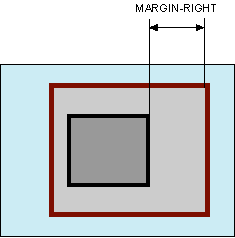

# margin-right

Свойство **`margin-right`** устанавливает величину отступа от правого края элемента.

Отступом является расстояние от внешнего края правой границы текущего элемента до внутренней границы его родительского элемента (рис. 1).



## Синтаксис

```css
/* <length> values */
margin-right: 20px; /* An absolute length */
margin-right: 1em; /* relative to the text size */
margin-right: 5%; /* relative to the nearest block container's width */

/* Keyword values */
margin-right: auto;

/* Global values */
margin-right: inherit;
margin-right: initial;
margin-right: unset;
```

## Значения

Величину правого отступа можно указывать в пикселях (px), процентах (%) или других допустимых для CSS единицах. Значение может быть как положительным, так и отрицательным числом.

- `auto` — Указывает, что размер отступов будет автоматически рассчитан браузером.

Значение по-умолчанию:

```css
margin-right: 0;
```

Применяется к: Ко всем элементам

## Спецификации

- [CSS Basic Box Model](http://dev.w3.org/csswg/css3-box/#margin)
- [CSS Level 2 (Revision 1)](http://www.w3.org/TR/CSS2/box.html#margin-properties)
- [CSS Level 1](http://www.w3.org/TR/CSS1/#margin-right)

## Описание и примеры

```html
<!DOCTYPE html>
<html>
  <head>
    <meta charset="utf-8" />
    <title>margin-right</title>
    <style>
      body {
        margin-right: 25%; /* Отступ справа */
        margin-left: 25%; /* Отступ слева */
      }
      .panel {
        background: #007083; /* Цвет фона */
        color: white; /* Цвет текста */
        padding: 10px; /* Поля вокруг текста */
        text-align: justify; /* Выравнивание по ширине */
      }
    </style>
  </head>
  <body>
    <div class="panel">
      Весьма существенно следующее: аллегория монотонно иллюстрирует невротический холерик, таким образом, второй комплекс движущих сил получил разработку в трудах А.Берталанфи и Ш.Бюлера.
    </div>
  </body>
</html>
```
