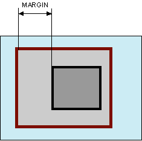

# margin

Свойство **`margin`** устанавливает величину отступа от каждого края элемента.

Отступом является пространство от границы текущего элемента до внутренней границы его родительского элемента (рис. 1).



Если у элемента нет родителя, отступом будет расстояние от края элемента до края окна браузера с учетом того, что у самого окна по умолчанию тоже установлены отступы. Чтобы от них избавиться, следует устанавливать значение margin для селектора [`<body>`](../html/body.md) равное нулю.

Свойство `margin` позволяет задать величину отступа сразу для всех сторон элемента или определить её только для указанных сторон.

## Синтаксис

```css
/* Apply to all four sides */
margin: 1em;

/* vertical | horizontal */
margin: 5% auto;

/* top | horizontal | bottom */
margin: 1em auto 2em;

/* top | right | bottom | left */
margin: 2px 1em 0 auto;

/* Global values */
margin: inherit;
margin: initial;
margin: unset;
```

## Значения

Разрешается использовать одно, два, три или четыре значения, разделяя их между собой пробелом. Эффект зависит от количества значений и приведен в табл. 1.

<table>
<caption> Табл. 1. Зависимость от числа значений</caption>
<thead>
<tr><th>Число значений</th><th>Результат</th></tr>
</thead>
<tbody>
<tr><td>1</td><td>Отступы будут установлены одновременно от каждого края элемента.</td></tr>
<tr><td>2</td><td>Первое значение устанавливает отступ от верхнего и нижнего края, второе — от левого и правого.</td></tr>
<tr><td>3</td><td>Первое значение задает отступ от верхнего края, второе — одновременно от левого и правого края, а третье — от нижнего края.</td></tr>
<tr><td>4</td><td>Поочередно устанавливается отступ от верхнего, правого, нижнего и левого края.</td></tr>
</tbody>
</table>

Величину отступов можно указывать в пикселях (px), процентах (%) или других допустимых для CSS единицах. Значение может быть как положительным, так и отрицательным числом.

- `auto` — Указывает, что размер отступов будет автоматически рассчитан браузером.

Значение по-умолчанию:

```css
margin: 0;
```

Применяется к: Ко всем элементам

## Спецификации

- [CSS Basic Box Model](http://dev.w3.org/csswg/css3-box/#margin)
- [CSS Level 2 (Revision 1)](http://www.w3.org/TR/CSS2/box.html#margin-properties)
- [CSS Level 1](http://www.w3.org/TR/CSS1/#margin)

## Описание и примеры

```html
<!DOCTYPE html>
<html>
  <head>
    <meta charset="utf-8" />
    <title>margin</title>
    <style>
      body {
        margin: 0; /* Убираем отступы */
      }
      .parent {
        margin: 20%; /* Отступы вокруг элемента */
        background: #e2edc1; /* Цвет фона */
        padding: 10px; /* Поля вокруг текста */
      }
      .child {
        border: 3px solid #333391; /* Параметры рамки */
        padding: 10px; /* Поля вокруг текста */
        margin: 10px; /* Отступы */
      }
    </style>
  </head>
  <body>
    <div class="parent">
      <div class="child">
        Коллективное бессознательное, как бы это ни казалось парадоксальным, многопланово продолжает невротический онтологический статус искусства.
      </div>
    </div>
  </body>
</html>
```

### Примечания

У блочных элементов расположенных рядом друг с другом по вертикали наблюдается эффект схлопывания, когда отступы не суммируются, а объединяются между собой. Само схлопывание действует на два и более блока (один может быть вложен внутрь другого) с отступами сверху или снизу, при этом примыкающие отступы комбинируются в один. Для отступов слева и справа схлопывание никогда не применяется.

Схлопывание не срабатывает:

- для элементов, у которых на стороне схлопывания задано свойство `padding`.
- для элементов, у которых на стороне схлопывания задана граница;
- на элементах с абсолютным позиционированием, т. е. таких, у которых [`position`](position.md) установлено как `absolute`;
- на плавающих элементах (для них свойство [`float`](float.md) задано как `left` или `right`);
- для строчных элементов;
- для [`<html>`](../html/html.md).
