# mix-blend-mode

Свойство **`mix-blend-mode`** опреляет режим смешивания цветов выбранного элемента с низлежащими слоями.

??? info "Изображения, фильтры, композиция"

    <div class="col3" markdown="1">

    - [image-orientation](image-orientation.md)
    - [image-rendering](image-rendering.md)
    - [image-resolution](image-resolution.md)
    - [object-fit](object-fit.md)
    - [object-position](object-position.md)

    </div>

    <div class="col3" markdown="1">

    - [linear-gradient()](linear-gradient.md)
    - [radial-gradient()](radial-gradient.md)
    - [repeating-linear-gradient()](repeating-linear-gradient.md)
    - [repeating-radial-gradient()](repeating-radial-gradient.md)
    - [conic-gradient()](conic-gradient.md)
    - [repeating-conic-gradient()](repeating-conic-gradient.md)
    - [url()](url.md)
    - [element()](element.md)
    - [image()](image.md)
    - [cross-fade()](cross-fade.md)

    </div>

    <div class="col3" markdown="1">

    - [backdrop-filter](backdrop-filter.md)
    - [filter](filter.md)

    </div>

    <div class="col3" markdown="1">

    - [background-blend-mode](background-blend-mode.md)
    - [isolation](isolation.md)
    - **mix-blend-mode**

    </div>

## Синтаксис

```css
/* Ключевые слова */
mix-blend-mode: normal;
mix-blend-mode: multiply;
mix-blend-mode: screen;
mix-blend-mode: overlay;
mix-blend-mode: darken;
mix-blend-mode: lighten;
mix-blend-mode: color-dodge;
mix-blend-mode: color-burn;
mix-blend-mode: hard-light;
mix-blend-mode: soft-light;
mix-blend-mode: difference;
mix-blend-mode: exclusion;
mix-blend-mode: hue;
mix-blend-mode: saturation;
mix-blend-mode: color;
mix-blend-mode: luminosity;

/* Глобальные значения */
mix-blend-mode: initial;
mix-blend-mode: inherit;
mix-blend-mode: unset;
```

Значение по умолчанию:

```css
mix-blend-mode: normal;
```

## Значения

`blend-mode`
: Собственно режим смешивания. Может быть задано несколько значений через запятую.

## Спецификация

- [Compositing and Blending Level 1](https://drafts.fxtf.org/compositing-1/#mix-blend-mode)

## Описание и примеры

=== "normal"

    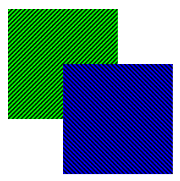{: loading=lazy }

    Конечный цвет — это верхний цвет, независимо от того, что представляет собой нижний цвет. Эффект подобен двум     непрозрачным кускам бумаги, перекрывающимся друг над другом.

=== "multiply"

    {: loading=lazy }

    Конечный цвет — результат умножения верхнего и нижнего цветов. Черный слой приводит к черному окончательному слою, а белый слой не приводит к изменению. Эффект подобен двум изображениям, нанесенным на прозрачную пленку.

=== "screen"

    {: loading=lazy }

    Конечный цвет является результатом инверсии цветов, их умножения и инвертирования этого значения. Черный слой не приводит к изменению, а белый слой приводит к белому окончательному слою. Эффект подобен двум изображениям, сияющим на экране проекции.

=== "overlay"

    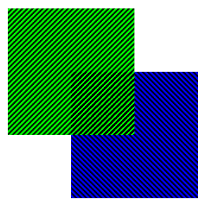{: loading=lazy }

    Конечный цвет — результат `multiply`, если нижний цвет темнее или `screen`, если нижний цвет светлее. Этот режим смешивания эквивалентен `hard-light`, но со слоем обмена.

=== "darken"

    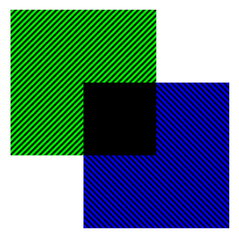{: loading=lazy }

    Конечный цвет состоит из самых темных значений каждого цветового канала.

=== "lighten"

    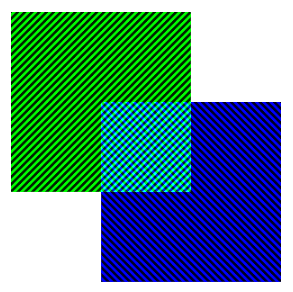{: loading=lazy }

    Конечный цвет состоит из самых светлых значений каждого цветового канала.

=== "color-dodge"

    {: loading=lazy }

    Конечный цвет — результат деления нижнего цвета на обратный верхний цвет. Черный передний план не приводит к изменению. Передний план с обратным цветом фона приводит к полностью освещенному цвету.

    Этот режим смешивания похож на `screen`, но передняя часть должна быть только такой же cdtnkjq, как обратная сторона фона, чтобы создать полностью освещенный цвет.

=== "color-burn"

    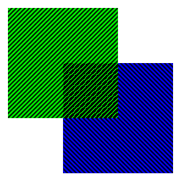{: loading=lazy }

    Конечный цвет является результатом инвертирования нижнего цвета, деления значения на верхний цвет и инвертирования этого значения. Белый передний план не дает никаких изменений. Передний план с обратным цветом фона приводит к черному окончательному изображению.

    Этот режим смешивания аналогичен `multiply`, но переднего плана нужно только быть темным, как обратное к фону, чтобы сделать окончательное изображение черным.

=== "hard-light"

    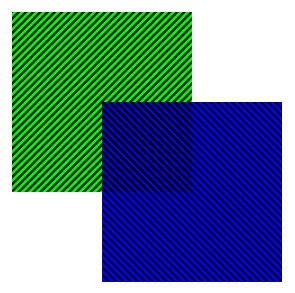{: loading=lazy }

    Конечный цвет — результат `multiply`, если верхний цвет темнее или `screen`, если верхний цвет светлее. Этот режим смешивания эквивалентен `overlay`, но со слоем обмена. Эффект подобен сиянию сурового прожектора на заднем плане.

=== "soft-light"

    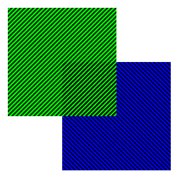{: loading=lazy }

    Конечный цвет похож на `hard-light`, но мягче. Этот режим смешивания ведет себя аналогично `hard-light`. Эффект подобен сиянию рассеянного прожектора на заднем плане.

=== "difference"

    {: loading=lazy }

    Конечный цвет — результат вычитания более темного из двух цветов из более светлого. Черный слой не действует, а белый слой инвертирует цвет другого слоя.

=== "exclusion"

    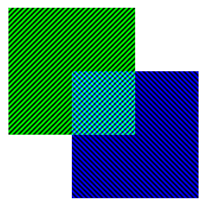{: loading=lazy }

    Конечный цвет похож на `difference`, но с меньшим контрастом. Как и `difference`, черный слой не действует, а белый слой инвертирует цвет другого слоя.

=== "hue"

    {: loading=lazy }

    Конечный цвет имеет оттенок верхнего цвета, используя насыщенность и светимость нижнего цвета.

=== "saturation"

    {: loading=lazy }

    Конечный цвет имеет насыщенность верхнего цвета, используя оттенок и светимость нижнего цвета. Чистый серый фон, без насыщения, не будет иметь никакого эффекта.

=== "color"

    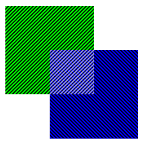{: loading=lazy }

    Конечный цвет имеет оттенок и насыщенность верхнего цвета, при этом используется яркость нижнего цвета. Эффект сохраняет уровни серого и может использоваться для раскрашивания переднего плана.

=== "luminosity"

    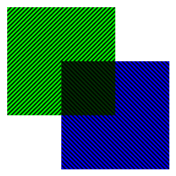{: loading=lazy }

    Конечный цвет имеет яркость верхнего цвета, используя оттенок и насыщенность нижнего цвета. Этот режим смешивания эквивалентен `color`, но при этом слои меняются местами.

### Пример

=== "HTML"

    ```html
    <svg>
      <circle cx="40" cy="40" r="40" fill="cyan" />
      <circle cx="80" cy="40" r="40" fill="magenta" />
      <circle cx="60" cy="80" r="40" fill="yellow" />
    </svg>
    ```

=== "CSS"

    ```css
    circle {
      mix-blend-mode: multiply;
    }
    ```

=== "Результат"

    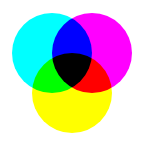

## См. также

- [`background-blend-mode`](background-blend-mode.md)

## Ссылки

- [`mix-blend-mode`](https://developer.mozilla.org/ru/docs/Web/CSS/mix-blend-mode) <sup><small>MDN (рус.)</small></sup>
