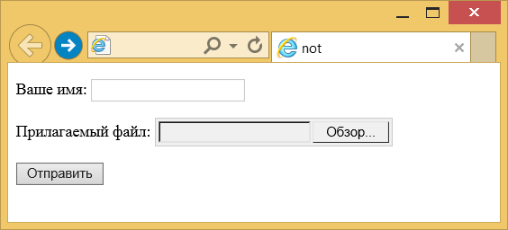

# :not()

Псевдокласс **`:not`** задаёт правила стилей для элементов, которые не содержат указанный селектор.

## Синтаксис

```
Селектор:not(<Селектор>) {
	...
}
```

В качестве селектора могут указываться единичные псевдоклассы, теги, идентификаторы, классы и селекторы атрибутов. Нельзя использовать псевдокласс `:not` (конструкция `:not(:not(...))` запрещена) и псевдоэлементы.

## Сертификаты

- [Selectors Level 4](https://drafts.csswg.org/selectors-4/#negation)
- [Selectors Level 3](https://drafts.csswg.org/selectors-3/#negation)

## Пример 1

```html
<!DOCTYPE html>
<html>
  <head>
    <meta charset="utf-8" />
    <title>not</title>
    <style>
      input:not([type='submit']) {
        border: 1px solid #ccc;
        padding: 3px;
      }
    </style>
  </head>
  <body>
    <form action="handler.php">
      <p>Ваше имя: <input name="user" /></p>
      <p>
        Прилагаемый файл: <input type="file" name="file" />
      </p>
      <p><input type="submit" value="Отправить" /></p>
    </form>
  </body>
</html>
```

В данном примере стиль применяется ко всем элементам `<input>` за исключением того, в параметрах которого установлено `type="submit"` (кнопка «Отправить»). Результат примера показан на рис. 1.



## Пример 2

=== "HTML"

    ```html
    <p>I am a paragraph.</p>
    <p class="fancy">I am so very fancy!</p>
    <div>I am NOT a paragraph.</div>
    ```

=== "CSS"

    ```css
    .fancy {
      text-shadow: 2px 2px 3px gold;
    }

    /* <p> elements that are not in the class `.fancy` */
    p:not(.fancy) {
      color: green;
    }

    /* Elements that are not <p> elements */
    body :not(p) {
      text-decoration: underline;
    }

    /* Elements that are not <div> and not <span> elements */
    body :not(div):not(span) {
      font-weight: bold;
    }

    /* Elements that are not `.crazy` or `.fancy` */
    /* Note that this syntax is not well supported yet. */
    body :not(.crazy, .fancy) {
      font-family: sans-serif;
    }
    ```

## Ссылки

- [`:not()`](https://developer.mozilla.org/en-US/docs/Web/CSS/:not) <sup><small>MDN (рус.)</small></sup>
