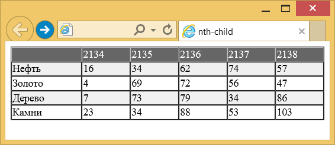
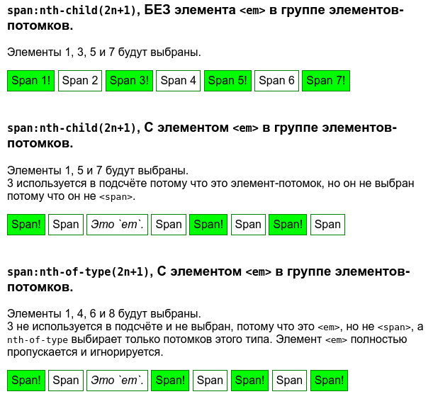

# :nth-child()

Псевдокласс **`:nth-child`** используется для добавления стиля к элементам на основе нумерации в дереве элементов.

## Синтаксис

```css
/* Выбирает каждый четвёртый элемент
   среди любой группы соседних элементов */
:nth-child(4n) {
  color: lime;
}
```

## Значения

`odd`
: Все нечётные номера элементов.

`even`
: Все чётные номера элементов.

`<число>`
: Порядковый номер дочернего элемента относительно своего родителя. Нумерация начинается с 1, это будет первый элемент в списке.

`<выражение>`
: Задаётся в виде `an±b`, где `a` и `b` — целые числа, а `n` — счётчик, который автоматически принимает значение `0`, `1`, `2`...

: Если `a` равно нулю, то оно не пишется и запись сокращается до `b`. Если `b` равно нулю, то оно также не указывается и выражение записывается в форме `an`. `a` и `b` могут быть отрицательными числами, в этом случае знак плюс меняется на минус, например: `5n-1`.

За счёт использования отрицательных значений `a` и `b` некоторые результаты могут также получиться отрицательными или равными нулю. Однако на элементы оказывают влияние только положительные значения из-за того, что нумерация элементов начинается с `1`.

Результат для различных значений псевдокласса

| Значение | Номера элементов   | Описание                                                                         |
| -------- | ------------------ | -------------------------------------------------------------------------------- |
| `1`      | 1                  | Первый элемент, является синонимом псевдокласса [`:first-child`](first-child.md) |
| `5`      | 5                  | Пятый элемент                                                                    |
| `2n`     | 2, 4, 6, 8, 10,…   | Все чётные элементы, аналог значения even                                        |
| `2n+1`   | 1, 3, 5, 7, 9,…    | Все нечётные элементы, аналог значения `odd`                                     |
| `3n`     | 3, 6, 9, 12, 15,…  | Каждый третий элемент                                                            |
| `3n+2`   | 2, 5, 8, 11, 14,…  | Каждый третий элемент, начиная со второго                                        |
| `n+4`    | 4, 5, 6, 7, 8,…    | Все элементы, кроме первых трёх                                                  |
| `-n+3`   | 3, 2, 1            | Первые три элемента                                                              |
| `5n-2`   | 3, 8, 13, 18, 23,… | —                                                                                |
| `even`   | 2, 4, 6, 8, 10,…   | Все чётные элементы                                                              |
| `odd`    | 1, 3, 5, 7, 9,…    | Все нечётные элементы                                                            |

Допустимо комбинировать два псевдокласса `:nth-child` для выбора диапазона элементов. Здесь будут выбраны все элементы со второго по пятый.

```css
:nth-child(n + 2):nth-child(-n + 5) {
  /* … */
}
```

## Спецификации

- [Selectors Level 4](https://drafts.csswg.org/selectors-4/#nth-child-pseudo)
- [Selectors Level 3](https://drafts.csswg.org/selectors-3/#nth-child-pseudo)

## Примеры

### Пример 1

```html
<!DOCTYPE html>
<html>
  <head>
    <meta charset="utf-8" />
    <title>nth-child</title>
    <style>
      table {
        width: 100%; /* Ширина таблицы */
        border-spacing: 0; /* Расстояние между ячейками */
      }
      tr:nth-child(2n) {
        background: #f0f0f0; /* Цвет фона */
      }
      tr:nth-child(1) {
        background: #666; /* Цвет фона */
        color: #fff; /* Цвет текста */
      }
    </style>
  </head>
  <body>
    <table border="1">
      <tr>
        <td>&nbsp;</td>
        <td>2134</td>
        <td>2135</td>
        <td>2136</td>
        <td>2137</td>
        <td>2138</td>
      </tr>
      <tr>
        <td>Нефть</td>
        <td>16</td>
        <td>34</td>
        <td>62</td>
        <td>74</td>
        <td>57</td>
      </tr>
      <tr>
        <td>Золото</td>
        <td>4</td>
        <td>69</td>
        <td>72</td>
        <td>56</td>
        <td>47</td>
      </tr>
      <tr>
        <td>Дерево</td>
        <td>7</td>
        <td>73</td>
        <td>79</td>
        <td>34</td>
        <td>86</td>
      </tr>
      <tr>
        <td>Камни</td>
        <td>23</td>
        <td>34</td>
        <td>88</td>
        <td>53</td>
        <td>103</td>
      </tr>
    </table>
  </body>
</html>
```

В данном примере псевдокласс `:nth-child` используется для изменения стиля первой строки таблицы, а также для выделения цветом всех чётных строк (рис. 1).



### Пример 2

```html tab="HTML"
<h3>
  <code>span:nth-child(2n+1)</code>, БЕЗ элемента <code>&lt;em&gt;</code> в
  группе элементов-потомков.
</h3>
<p>Элементы 1, 3, 5 и 7 будут выбраны.</p>
<div class="first">
  <span>Span 1!</span>
  <span>Span 2</span>
  <span>Span 3!</span>
  <span>Span 4</span>
  <span>Span 5!</span>
  <span>Span 6</span>
  <span>Span 7!</span>
</div>

<br />

<h3>
  <code>span:nth-child(2n+1)</code>, С элементом <code>&lt;em&gt;</code> в
  группе элементов-потомков.
</h3>
<p>
  Элементы 1, 5 и 7 будут выбраны.<br />
  3 используется в подсчёте потому что это элемент-потомок, но он не выбран
  потому что он не <code>&lt;span&gt;</code>.
</p>
<div class="second">
  <span>Span!</span>
  <span>Span</span>
  <em>Это `em`.</em>
  <span>Span</span>
  <span>Span!</span>
  <span>Span</span>
  <span>Span!</span>
  <span>Span</span>
</div>

<br />

<h3>
  <code>span:nth-of-type(2n+1)</code>, С элементом <code>&lt;em&gt;</code> в
  группе элементов-потомков.
</h3>
<p>
  Элементы 1, 4, 6 и 8 будут выбраны.<br />
  3 не используется в подсчёте и не выбран, потому что это
  <code>&lt;em&gt;</code>, но не <code>&lt;span&gt;</code>, а
  <code>nth-of-type</code> выбирает только потомков этого типа. Элемент
  <code>&lt;em&gt;</code> полностью пропускается и игнорируется.
</p>
<div class="third">
  <span>Span!</span>
  <span>Span</span>
  <em>Это `em`.</em>
  <span>Span!</span>
  <span>Span</span>
  <span>Span!</span>
  <span>Span</span>
  <span>Span!</span>
</div>
```

```css tab="CSS"
html {
  font-family: sans-serif;
}

span,
div em {
  padding: 5px;
  border: 1px solid green;
  display: inline-block;
  margin-bottom: 3px;
}

.first span:nth-child(2n + 1),
.second span:nth-child(2n + 1),
.third span:nth-of-type(2n + 1) {
  background-color: lime;
}
```

Результат:



## См. также

- [:nth-of-type](nth-of-type.md)
- [:nth-last-child](nth-last-child.md)

## Ссылки

- [:nth-child](https://developer.mozilla.org/ru/docs/Web/CSS/:nth-child) на MDN
