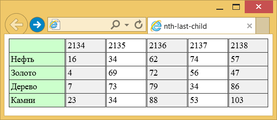
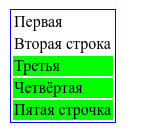

# :nth-last-child()

Псевдокласс **`:nth-last-child`** используется для добавления стиля к элементам на основе нумерации в дереве элементов. В отличие от псевдокласса [`:nth-child`](nth-child.md) отсчёт ведётся не от первого элемента, а от последнего.

## Синтаксис

```css
element:nth-last-child(an + b) {
  /* стили */
}
```

## Значения

`odd`
: Все нечётные номера элементов, начиная с конца.

`even`
: Все чётные номера элементов, начиная с конца.

`<число>`
: Порядковый номер дочернего элемента относительно своего родителя. Нумерация начинается с `1`, это соответствует последнему элементу в списке.

`<выражение>`
: Задаётся в виде `an±b`, где `a` и `b` целые числа, а `n` — счётчик, который автоматически принимает значение 0, 1, 2...
Если `a` равно нулю, то оно не пишется и запись сокращается до `b`. Если `b` равно нулю, то оно также не указывается и выражение записывается в форме `an`. `a` и `b` могут быть отрицательными числами, в этом случае знак плюс меняется на минус, например: `5n-1`.

: За счёт использования отрицательных значений `a` и `b` некоторые результаты могут также получиться отрицательными или равными нулю. Однако на элементы оказывают влияние только положительные значения из-за того, что нумерация элементов начинается с `1`.

Результат для различных значений псевдокласса

| Значение | Номера элементов   | Описание                                                        |
| -------- | ------------------ | --------------------------------------------------------------- |
| 1        | 1                  | Последний элемент, является синонимом псевдокласса :last-child. |
| 5        | 5                  | Пятый элемент с конца.                                          |
| 2n       | 2, 4, 6, 8, 10,…   | Все чётные элементы, начиная с конца; аналог значения even.     |
| 2n+1     | 1, 3, 5, 7, 9,…    | Все нечётные элементы, начиная с конца; аналог значения odd.    |
| 3n       | 3, 6, 9, 12,…      | Каждый третий элемент, начиная с конца.                         |
| 3n+2     | 2, 5, 8, 11, 14,…  | Каждый третий элемент, начиная с предпоследнего.                |
| n+4      | 4, 5, 6, 7, 8,…    | Все элементы, кроме последних трёх.                             |
| -n+3     | 3, 2, 1            | Последние три элемента.                                         |
| 5n-2     | 3, 8, 13, 18, 23,… | —                                                               |
| even     | 2, 4, 6, 8, 10,…   | Все чётные элементы, начиная с конца.                           |
| odd      | 1, 3, 5, 7, 9,…    | Все нечётные элементы, начиная с конца.                         |

## Спецификации

- [Selectors Level 4](https://drafts.csswg.org/selectors-4/#nth-last-child-pseudo)
- [Selectors Level 3](https://drafts.csswg.org/selectors-3/#nth-last-child-pseudo)

## Примеры

### Пример 1

В данном примере псевдокласс `:nth-last-child` используется для выделения цветом всех нечётных колонок, начиная с последней.

```html
<!DOCTYPE html>
<html>
  <head>
    <meta charset="utf-8" />
    <title>nth-last-child</title>
    <style>
      table {
        width: 100%; /* Ширина таблицы */
        border-collapse: collapse; /* Убираем двойные границы */
        border-spacing: 0; /* Расстояние между ячейками */
      }
      td {
        border: 1px solid #333; /* Параметры рамки */
        padding: 3px; /* Поля в ячейках */
        border-left: 3px double #333; /* Граница слева */
      }
      td:nth-last-child(2n + 1) {
        background: #f0f0f0; /* Цвет фона */
      }
      td:nth-child(1) {
        border: 1px solid #333; /* Параметры рамки */
        background: #cfc; /* Цвет фона */
      }
    </style>
  </head>
  <body>
    <table>
      <tr>
        <td>&nbsp;</td>
        <td>2134</td>
        <td>2135</td>
        <td>2136</td>
        <td>2137</td>
        <td>2138</td>
      </tr>
      <tr>
        <td>Нефть</td>
        <td>16</td>
        <td>34</td>
        <td>62</td>
        <td>74</td>
        <td>57</td>
      </tr>
      <tr>
        <td>Золото</td>
        <td>4</td>
        <td>69</td>
        <td>72</td>
        <td>56</td>
        <td>47</td>
      </tr>
      <tr>
        <td>Дерево</td>
        <td>7</td>
        <td>73</td>
        <td>79</td>
        <td>34</td>
        <td>86</td>
      </tr>
      <tr>
        <td>Камни</td>
        <td>23</td>
        <td>34</td>
        <td>88</td>
        <td>53</td>
        <td>103</td>
      </tr>
    </table>
  </body>
</html>
```



### Пример 2

=== "CSS"

    ```css
    table {
      border: 1px solid blue;
    }
    tr:nth-last-child(-n + 3) {
      /* последние 3 потомка */
      background-color: lime;
    }
    ```

=== "HTML"

    ```html
    <table>
      <tbody>
        <tr>
          <td>Первая</td>
        </tr>
        <tr>
          <td>Вторая строка</td>
        </tr>
        <tr>
          <td>Третья</td>
        </tr>
        <tr>
          <td>Четвёртая</td>
        </tr>
        <tr>
          <td>Пятая строчка</td>
        </tr>
      </tbody>
    </table>
    ```

=== "Результат"

    

## См. также

- [`:nth-child`](nth-child.md)

## Ссылки

- [`:nth-last-child`](https://developer.mozilla.org/ru/docs/Web/CSS/:nth-last-child) на MDN
