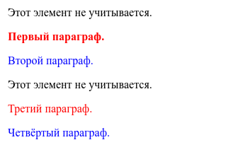
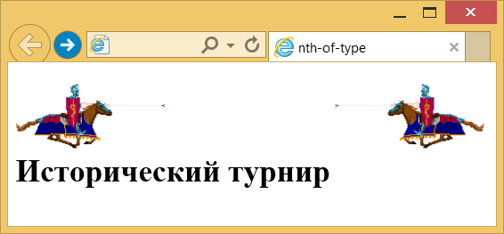

# :nth-of-type()

Псевдокласс **`:nth-of-type`** используется для добавления стиля к элементам указанного типа на основе нумерации в дереве элементов.

??? info "Псевдоклассы"

    <div class="col3" markdown="1">

    - [:active](active.md)
    - [:any-link](any-link.md)
    - [:blank](blank.md)
    - [:checked](checked.md)
    - [:current()](current.md)
    - [:default](default.md)
    - [:defined](defined.md)
    - [:dir()](dir.md)
    - [:disabled](disabled.md)
    - [:empty](empty.md)
    - [:enabled](enabled.md)
    - [:first](first.md)
    - [:first-child](first-child.md)
    - [:first-of-type](first-of-type.md)
    - [:focus](focus.md)
    - [:focus-visible](focus-visible.md)
    - [:focus-within](focus-within.md)
    - [:fullscreen](fullscreen.md)
    - [:future](future.md)
    - [:has()](has.md)
    - :host
    - :host()
    - :host-context()
    - [:hover](hover.md)
    - [:indeterminate](indeterminate.md)
    - [:in-range](in-range.md)
    - [:invalid](invalid.md)
    - [:is()](is.md)
    - [:lang()](lang.md)
    - [:last-child](last-child.md)
    - [:last-of-type](last-of-type.md)
    - [:left](left-pseudo-class.md)
    - [:link](link.md)
    - :local-link
    - [:not()](not.md)
    - [:nth-child()](nth-child.md)
    - :nth-col()
    - [:nth-last-child()](nth-last-child.md)
    - :nth-last-col()
    - [:nth-last-of-type()](nth-last-of-type.md)
    - **:nth-of-type()**
    - [:only-child](only-child.md)
    - [:only-of-type](only-of-type.md)
    - [:optional](optional.md)
    - [:out-of-range](out-of-range.md)
    - [:past](past.md)
    - [:placeholder-shown](placeholder-shown.md)
    - [:read-only](read-only.md)
    - [:read-write](read-write.md)
    - [:required](required.md)
    - :right
    - [:root](root.md)
    - [:scope](scope.md)
    - [:target](target.md)
    - :target-within
    - :user-invalid
    - [:valid](valid.md)
    - [:visited](visited.md)
    - [:where()](where.md)

    </div>

## Синтаксис

```css
/* Выбирает каждый четвёртый элемент <p>
   среди любой группы соседних элементов. */
p:nth-of-type(4n) {
  color: lime;
}
```

## Значения

`odd`
: Все нечётные номера элементов.

`even`
: Все чётные номера элементов.

`<число>`
: Порядковый номер дочернего элемента относительно своего родителя. Нумерация начинается с 1, это будет первый элемент в списке.

`<выражение>`
: Задаётся в виде `an±b`, где `a` и `b` — целые числа, а `n` — счётчик, который автоматически принимает значение 0, 1, 2...

Если `a` равно нулю, то оно не пишется и запись сокращается до `b`. Если `b` равно нулю, то оно также не указывается и выражение записывается в форме `an`. `a` и `b` могут быть отрицательными числами, в этом случае знак плюс меняется на минус, например: `5n-1`.

За счёт использования отрицательных значений `a` и `b` некоторые результаты могут также получиться отрицательными или равными нулю. Однако на элементы оказывают влияние только положительные значения из-за того, что нумерация элементов начинается с `1`.

В табл. 1 приведены некоторые возможные выражения и ключевые слова, а также указано, какие номера элементов будут задействованы.

Табл. 1. Результат для различных значений псевдокласса

| Значение | Номера элементов   | Описание                                                          |
| -------- | ------------------ | ----------------------------------------------------------------- |
| `1`      | 1                  | Первый элемент, является синонимом псевдокласса `:first-of-type`. |
| `5`      | 5                  | Пятый элемент.                                                    |
| `2n`     | 2, 4, 6, 8, 10,…   | Все чётные элементы, аналог значения `even`.                      |
| `2n+1`   | 1, 3, 5, 7, 9,…    | Все нечётные элементы, аналог значения `odd`.                     |
| `3n`     | 3, 6, 9, 12, 15,…  | Каждый третий элемент.                                            |
| `3n+2`   | 2, 5, 8, 11, 14,…  | Каждый третий элемент, начиная со второго.                        |
| `n+4`    | 4, 5, 6, 7, 8,…    | Все элементы, кроме первых трёх.                                  |
| `-n+3`   | 3, 2, 1            | Первые три элемента.                                              |
| `5n-2`   | 3, 8, 13, 18, 23,… | —                                                                 |
| `even`   | 2, 4, 6, 8, 10,…   | Все чётные элементы.                                              |
| `odd`    | 1, 3, 5, 7, 9,…    | Все нечётные элементы.                                            |

Допустимо комбинировать два псевдокласса `:nth-of-type` для выбора диапазона элементов. Здесь будут выбраны все элементы со второго по пятый.

```css
:nth-of-type(n + 2):nth-of-type(-n + 5) {
  /* … */
}
```

## Спецификации

- [Selectors Level 4](https://drafts.csswg.org/selectors-4/#nth-of-type-pseudo)
- [Selectors Level 3](https://drafts.csswg.org/selectors-3/#nth-of-type-pseudo)

## Примеры

### Пример 1

=== "HTML"

    ```html
    <div>
      <div>Этот элемент не учитывается.</div>
      <p>Первый параграф.</p>
      <p>Второй параграф.</p>
      <div>Этот элемент не учитывается.</div>
      <p>Третий параграф.</p>
      <p>Четвёртый параграф.</p>
    </div>
    ```

=== "CSS"

    ```css
    /* Нечётные параграфы */
    p:nth-of-type(2n + 1) {
      color: red;
    }

    /* Чётные параграфы */
    p:nth-of-type(2n) {
      color: blue;
    }

    /* Первый параграф */
    p:nth-of-type(1) {
      font-weight: bold;
    }
    ```

=== "Результат"

    

### Пример 2

```html
<!DOCTYPE html>
<html>
  <head>
    <meta charset="utf-8" />
    <title>nth-of-type</title>
    <style>
      img:nth-of-type(2n + 1) {
        float: left;
      }
      img:nth-of-type(2n) {
        float: right;
      }
    </style>
  </head>
  <body>
    <p>
      
      
    </p>

    <h1>Исторический турнир</h1>
  </body>
</html>
```

В данном примере нечётные картинки выравниваются по левому краю окна, а чётные картинки по правому.



## См. также

- [`:nth-child`](nth-child.md)
- [`:nth-last-of-type`](nth-last-of-type.md)

## Ссылки

- Псевдо-класс [`:nth-of-type()`](https://developer.mozilla.org/ru/docs/Web/CSS/:nth-of-type) <sup><small>MDN (рус.)</small></sup>
