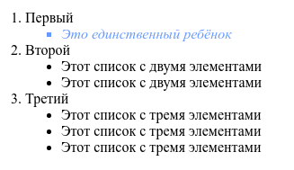

# :only-child

Псевдокласс `:only-child` применяется к дочернему элементу, только если он является единственным у родителя.

## Описание

В качестве примера рассмотрим следующий код HTML:

```html
<article>
  <h1>Роль цитокинов при дорсалгии</h1>
  <p>Автор: Гордон Фримен, канд. физ.-мат. наук</p>
  <p>Содержание статьи</p>
  <address>Почта: freemen@blackmesa.com</address>
  <p>Опубликовано: <time datetime="2018-11-27">27 ноября 2018</time></p>
</article>
```

Псевдокласс `:only-child` без указания селектора выберет все единственные элементы и установит для них красный цвет текста. Здесь единственным будет элемент `<time>`, поскольку он является единственным дочерним элементом у своего родителя `<p>`.

```css
article :only-child {
  color: red;
}
```

При добавлении селектора к `:only-child` сперва рассматриваются все единственные дочерние элементы у своих родителей, затем проверяется, относятся ли они к указанному типу. Если эти два условия совпадают (в данном случае единственный элемент и элемент `<h1>`), тогда заголовок окрасится красным цветом. Поскольку `<h1>` не является единственным и кроме него есть другие элементы (`<p>` и `<address>`), то ничего выбрано не будет.

```css
article h1:only-child {
  color: red;
}
```

Вместо `:only-child` можно использовать комбинации `:first-child:last-child` или `:nth-child(1):nth-last-child(1)`.

## Примеры

### Пример 1

```html tab="HTML"
<div>
  <span>Этот span единственный ребёнок своего папы:(</span>
</div>

<div>
  <span>Этот span один из потомков родителя</span>
  <span>Этот span один из детей отца</span>
</div>
```

```css tab="CSS"
span:only-child {
  color: red;
}
```

Результат:


### Пример 2

Пример со списком

```html tab="HTML"
<ol>
  <li>
    Первый
    <ul>
      <li>Это единственный ребёнок</li>
    </ul>
  </li>
  <li>
    Второй
    <ul>
      <li>Этот список с двумя элементами</li>
      <li>Этот список с двумя элементами</li>
    </ul>
  </li>
  <li>
    Третий
    <ul>
      <li>Этот список с тремя элементами</li>
      <li>Этот список с тремя элементами</li>
      <li>Этот список с тремя элементами</li>
    </ul>
  </li>
  <ol></ol>
</ol>
```

```css tab="CSS"
li li {
  list-style-type: disc;
}
li:only-child {
  color: #6699ff;
  font-style: italic;
  list-style-type: square;
}
```

Результат



## См. также

- [:only-of-type](only-of-type.md)

## Ссылки

- [:only-child](https://developer.mozilla.org/ru/docs/Web/CSS/:only-child) на MDN
