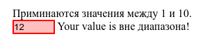

# :out-of-range

Псевдокласс **`:out-of-range`** применяется к полям форм, у которых введённое пользователем значение выходит из заданного диапазона. Псевдокласс работает только для тех полей, где пользователь может сам ввести значение, даже несмотря на ограничения наложенные атрибутами `min` и `max`.

## Синтаксис

```
Селектор:out-of-range { ... }
```

## Спецификации

- [HTML Living Standard](https://html.spec.whatwg.org/multipage/semantics-other.html#selector-out-of-range)
- [Selectors Level 4](https://drafts.csswg.org/selectors-4/#out-of-range-pseudo)

## Примеры

### Пример 1

=== "HTML"

    ```html
    <form action="" id="form1">
      <ul>
        Приминаются значения между 1 и 10.
        <li>
          <input
            id="value1"
            name="value1"
            type="number"
            placeholder="1 to 10"
            min="1"
            max="10"
            value="12"
          />
          <label for="value1">Your value is </label>
        </li>
      </ul>
    </form>
    ```

=== "CSS"

    ```css
    li {
      list-style: none;
      margin-bottom: 1em;
    }
    input {
      border: 1px solid black;
    }
    input:in-range {
      background-color: rgba(0, 255, 0, 0.25);
    }
    input:out-of-range {
      background-color: rgba(255, 0, 0, 0.25);
      border: 2px solid red;
    }
    input:in-range + label::after {
      content: ' НОРМАЛЬНОЕ';
    }
    input:out-of-range + label::after {
      content: 'вне диапазона!';
    }
    ```

=== "Результат"

    

### Пример 2

```html
<!DOCTYPE html>
<html>
  <head>
    <meta charset="utf-8" />
    <title>:out-of-range</title>
    <style>
      input:out-of-range {
        background: #f9c3d2; /* Цвет фона */
      }
      label {
        height: 1em;
      }
      input:out-of-range + label::after {
        content: 'Неверное число'; /* Выводим текст */
        color: #ec008c; /* Цвет текста */
        margin-left: 0.5em; /* Отступ слева */
      }
    </style>
  </head>
  <body>
    <form>
      <p>Введите число от 1 до 10</p>
      <p>
        <input
          type="number"
          id="dec"
          min="1"
          max="10"
          value="1"
        />
        <label for="dec"></label>
      </p>
    </form>
  </body>
</html>
```

## См. также

- [`:in-range`](in-range.md)

## Ссылки

- [`:out-of-range`](https://developer.mozilla.org/ru/docs/Web/CSS/:out-of-range) на MDN
