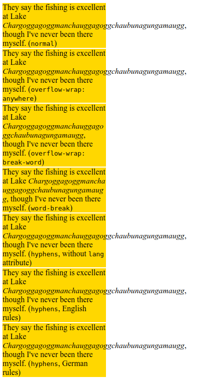

# overflow-wrap

Свойство **`overflow-wrap`** применяется к встроенным элементам, определяя, должен ли браузер вставлять разрывы строк в неразрывную строку, чтобы текст не переполнял ее строку.

## Синтаксис

```css
/* Keyword values */
overflow-wrap: normal;
overflow-wrap: break-word;
overflow-wrap: anywhere;

/* Global values */
overflow-wrap: inherit;
overflow-wrap: initial;
overflow-wrap: unset;
```

## Значения

`normal`
: Строки могут разрываться только в обычных точках разрыва слов (например, пробел между двумя словами).

`anywhere`
: Во избежание переполнения неразрывная строка символов - например, длинное слово или URL-адрес - может быть разбита в любой точке, если в строке нет других приемлемых точек разрыва. В точке останова символ переноса не вставляется. Возможности мягкого переноса, представленные разрывом слов, учитываются при расчете собственных размеров минимального содержимого.

`break-word`
: То же самое, что и в любом месте, с обычно неразрывными словами, которые можно разбивать в произвольных точках, если в строке нет других приемлемых точек разрыва, но возможности мягкого переноса, представленные разрывом слова, НЕ учитываются при вычислении внутренних размеров минимального содержимого.

## Спецификация

- [CSS Text Module Level 3](https://drafts.csswg.org/css-text-3/#propdef-overflow-wrap)

## Пример

```html tab="HTML"
<p>
  They say the fishing is excellent at Lake
  <em class="normal">Chargoggagoggmanchauggagoggchaubunagungamaugg</em>, though
  I've never been there myself. (<code>normal</code>)
</p>
<p>
  They say the fishing is excellent at Lake
  <em class="ow-anywhere">Chargoggagoggmanchauggagoggchaubunagungamaugg</em>,
  though I've never been there myself. (<code>overflow-wrap: anywhere</code>)
</p>
<p>
  They say the fishing is excellent at Lake
  <em class="ow-break-word">Chargoggagoggmanchauggagoggchaubunagungamaugg</em>,
  though I've never been there myself. (<code>overflow-wrap: break-word</code>)
</p>
<p>
  They say the fishing is excellent at Lake
  <em class="word-break">Chargoggagoggmanchauggagoggchaubunagungamaugg</em>,
  though I've never been there myself. (<code>word-break</code>)
</p>
<p>
  They say the fishing is excellent at Lake
  <em class="hyphens">Chargoggagoggmanchauggagoggchaubunagungamaugg</em>, though
  I've never been there myself. (<code>hyphens</code>, without
  <code>lang</code> attribute)
</p>
<p lang="en">
  They say the fishing is excellent at Lake
  <em class="hyphens">Chargoggagoggmanchauggagoggchaubunagungamaugg</em>, though
  I've never been there myself. (<code>hyphens</code>, English rules)
</p>
<p class="hyphens" lang="de">
  They say the fishing is excellent at Lake
  <em class="hyphens">Chargoggagoggmanchauggagoggchaubunagungamaugg</em>, though
  I've never been there myself. (<code>hyphens</code>, German rules)
</p>
```

```css tab="CSS"
p {
  width: 13em;
  margin: 2px;
  background: gold;
}

.ow-anywhere {
  overflow-wrap: anywhere;
}

.ow-break-word {
  overflow-wrap: break-word;
}

.word-break {
  word-break: break-all;
}

.hyphens {
  hyphens: auto;
}
```

Результат:



## См. также

- [word-break](word-break.md)
- [hyphens](hyphens.md)
- [text-overflow](text-overflow.md)

## Ссылки

- [overflow-wrap](https://developer.mozilla.org/en-US/docs/Web/CSS/overflow-wrap) на MDN
