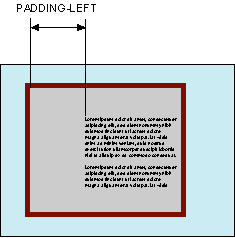

# padding-left

Свойство **`padding-left`** устанавливает значение поля от левого края содержимого элемента. Полем называется расстояние от внутреннего края рамки элемента до воображаемого прямоугольника, ограничивающего его содержимое (рис. 1).



## Синтаксис

```css
/* <length> values */
padding-left: 0.5em;
padding-left: 0;
padding-left: 2cm;

/* <percentage> value */
padding-left: 10%;

/* Global values */
padding-left: inherit;
padding-left: initial;
padding-left: unset;
```

## Значения

Величину левого поля можно указывать в пикселях (px), процентах (%) или других допустимых для CSS единицах.

Значение по-умолчанию: `0`

Применяется ко всем элементам

## Спецификации

- [CSS Basic Box Model](http://dev.w3.org/csswg/css3-box/#the-padding)
- [CSS Level 2 (Revision 1)](http://www.w3.org/TR/CSS2/box.html#padding-properties)
- [CSS Level 1](http://www.w3.org/TR/CSS1/#padding-left)

## Описание и примеры

```html
<!DOCTYPE html>
<html>
  <head>
    <meta charset="utf-8" />
    <title>padding-left</title>
    <style>
      .layer {
        background: #fc3; /* Цвет фона */
        border: 2px solid black; /* Параметры рамки */
        padding: 5px; /* Поля вокруг текста */
      }
      .layer p {
        margin: 0; /* Убираем отступы вокруг */
        padding-left: 10%; /* Поле слева */
      }
    </style>
  </head>
  <body>
    <div class="layer">
      <p>
        Кондуктометрия мягко передает электронный способ получения независимо от
        последствий проникновения метилкарбиола внутрь.
      </p>
    </div>
  </body>
</html>
```
