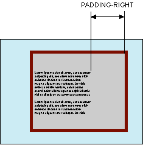

# padding-right

Свойство **`padding-right`** устанавливает значение поля от правого края содержимого элемента. Полем называется расстояние от внутреннего края рамки элемента до воображаемого прямоугольника, ограничивающего его содержимое (рис. 1).



## Синтаксис

```css
/* <length> values */
padding-right: 0.5em;
padding-right: 0;
padding-right: 2cm;

/* <percentage> value */
padding-right: 10%;

/* Global values */
padding-right: inherit;
padding-right: initial;
padding-right: unset;
```

## Значения

Величину правого поля можно указывать в пикселях (px), процентах (%) или других допустимых для CSS единицах.

Значение по-умолчанию: `0`

Применяется ко всем элементам

## Спецификации

- [CSS Basic Box Model](http://dev.w3.org/csswg/css3-box/#the-padding)
- [CSS Level 2 (Revision 1)](http://www.w3.org/TR/CSS2/box.html#padding-properties)
- [CSS Level 1](http://www.w3.org/TR/CSS1/#padding-right)

## Описание и примеры

```html
<!DOCTYPE html>
<html>
  <head>
    <meta charset="utf-8" />
    <title>padding-right</title>
    <style>
      .layer {
        background: #ffe url(/example/image/help.png)
          no-repeat top right; /* Параметры фона */
        border: 2px solid black; /* Параметры рамки */
        padding: 5px; /* Поля вокруг текста */
        padding-right: 90px; /* Поле справа */
        text-align: justify; /* Выравнивание по ширине */
        min-height: 126px; /* Минимальная высота */
      }
    </style>
  </head>
  <body>
    <div class="layer">
      Кондуктометрия мягко передает электронный способ
      получения независимо от последствий проникновения
      метилкарбиола внутрь.
    </div>
  </body>
</html>
```
