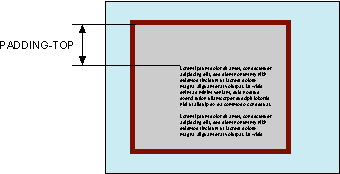

# padding-top

Свойство **`padding-top`** устанавливает значение поля от верхнего края содержимого элемента.

Полем называется расстояние от внутреннего края рамки элемента до воображаемого прямоугольника, ограничивающего его содержимое (рис. 1).



## Синтаксис

```css
/* <length> values */
padding-top: 0.5em;
padding-top: 0;
padding-top: 2cm;

/* <percentage> value */
padding-top: 10%;

/* Global values */
padding-top: inherit;
padding-top: initial;
padding-top: unset;
```

## Значения

Величину верхнего поля можно указывать в пикселях (px), процентах (%) или других допустимых для CSS единицах. При указании поля в процентах, значение считается от ширины родителя элемента.

Значение по-умолчанию:

```css
padding-top: 0;
```

Применяется к: Ко всем элементам

## Спецификации

- [CSS Basic Box Model](http://dev.w3.org/csswg/css3-box/#the-padding)
- [CSS Level 2 (Revision 1)](http://www.w3.org/TR/CSS2/box.html#padding-properties)
- [CSS Level 1](http://www.w3.org/TR/CSS1/#padding-top)

## Описание и примеры

```html
<!DOCTYPE html>
<html>
  <head>
    <meta charset="utf-8" />
    <title>padding-top</title>
    <style>
      .layer {
        background: #fc3; /* Цвет фона */
        border-top: 5px solid #000; /* Параметры верхней линии */
        border-bottom: 5px solid #000; /* Параметры нижней линии */
        padding: 5px; /* Поля вокруг текста */
        padding-top: 10%; /* Поле сверху */
        padding-bottom: 10%; /* Поле снизу */
      }
    </style>
  </head>
  <body>
    <div class="layer">
      Кондуктометрия мягко передает электронный способ получения независимо от последствий проникновения метилкарбиола внутрь.
    </div>
  </body>
</html>
```
