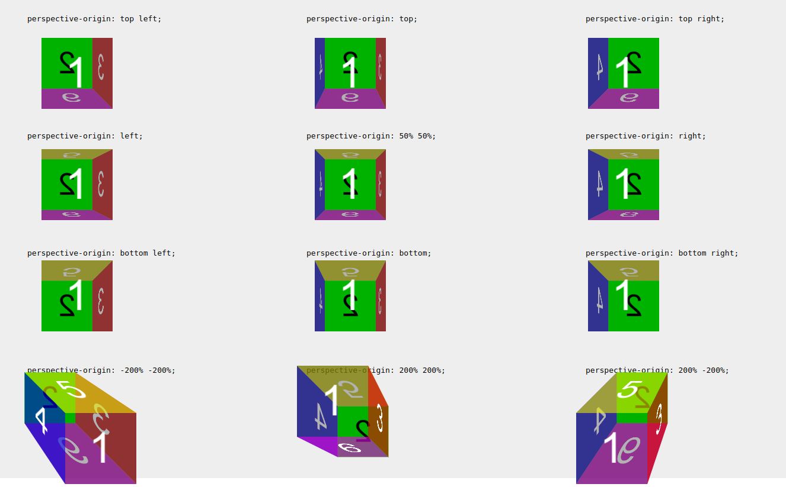

# perspective-origin

Свойство **`perspective-origin`** определяет позицию, из которой смотрит зритель. Оно используется в качестве точки схода свойством [`perspective`](perspective.md).

Свойства `perspective-origin` и `perspective` прикрепляются к родительскому элементу дочернего элемента, преобразованного в трехмерном пространстве, в отличие от функции преобразования `perspective()`, которая размещается на преобразованном элементе.

## Синтаксис

```css
/* One-value syntax */
perspective-origin: x-position;

/* Two-value syntax */
perspective-origin: x-position y-position;

/* When both x-position and y-position are keywords,
   the following is also valid */
perspective-origin: y-position x-position;

/* Global values */
perspective-origin: inherit;
perspective-origin: initial;
perspective-origin: unset;
```

## Значения

`x-position`
: Указывает положение абсциссы точки схода. Может иметь одно из следующих значений:
: - `<length-percentage>` указание позиции в виде абсолютного значения длины или относительно ширины элемента. Значение может быть отрицательным.
: - `left`, ключевое слово, являющееся ярлыком для значения длины `0`.
: - `center`, ключевое слово, являющееся ярлыком для `50%` процентного значения.
: - `right`, ключевое слово, являющееся ярлыком для `100%` процентного значения.

`y-position`
: Указывает положение ординаты точки схода. Может иметь одно из следующих значений:
: - `<length-percentage>` указание положения в виде абсолютного значения длины или относительно высоты элемента. Значение может быть отрицательным.
: - `top`, ключевое слово, являющееся ярлыком для значения длины `0`.
: - `center`, ключевое слово, являющееся ярлыком для `50%` процентного значения.
: - `bottom`, ключевое слово, являющееся ярлыком для `100%` процентного значения.

## Спецификация

- [CSS Transforms Level 2](https://drafts.csswg.org/css-transforms-2/#perspective-origin-property)

## Пример

```html tab="HTML"
<section>
<figure>
  <caption><code>perspective-origin: top left;</code></caption>
    <div class="container">
    <div class="cube potl">
      <div class="face front">1</div>
      <div class="face back">2</div>
      <div class="face right">3</div>
      <div class="face left">4</div>
      <div class="face top">5</div>
      <div class="face bottom">6</div>
    </div>
</figure>

<figure>
  <caption><code>perspective-origin: top;</code></caption>
   <div class="container">
    <div class="cube potm">
      <div class="face front">1</div>
      <div class="face back">2</div>
      <div class="face right">3</div>
      <div class="face left">4</div>
      <div class="face top">5</div>
      <div class="face bottom">6</div>
    </div>
  </div>
</figure>

<figure>
  <caption><code>perspective-origin: top right;</code></caption>
  <div class="container">
    <div class="cube potr">
      <div class="face front">1</div>
      <div class="face back">2</div>
      <div class="face right">3</div>
      <div class="face left">4</div>
      <div class="face top">5</div>
      <div class="face bottom">6</div>
    </div>
  </div>
</figure>

<figure>
  <caption><code>perspective-origin: left;</code></caption>
  <div class="container">
    <div class="cube poml">
      <div class="face front">1</div>
      <div class="face back">2</div>
      <div class="face right">3</div>
      <div class="face left">4</div>
      <div class="face top">5</div>
      <div class="face bottom">6</div>
    </div>
  </div>
</figure>

<figure>
  <caption><code>perspective-origin: 50% 50%;</code></caption>
  <div class="container">
    <div class="cube pomm">
      <div class="face front">1</div>
      <div class="face back">2</div>
      <div class="face right">3</div>
      <div class="face left">4</div>
      <div class="face top">5</div>
      <div class="face bottom">6</div>
    </div>
  </div>
</figure>

<figure>
  <caption><code>perspective-origin: right;</code></caption>
  <div class="container">
    <div class="cube pomr">
      <div class="face front">1</div>
      <div class="face back">2</div>
      <div class="face right">3</div>
      <div class="face left">4</div>
      <div class="face top">5</div>
      <div class="face bottom">6</div>
    </div>
  </div>
</figure>

<figure>
  <caption><code>perspective-origin: bottom left;</code></caption>
  <div class="container">
    <div class="cube pobl">
      <div class="face front">1</div>
      <div class="face back">2</div>
      <div class="face right">3</div>
      <div class="face left">4</div>
      <div class="face top">5</div>
      <div class="face bottom">6</div>
    </div>
  </div>
</figure>

<figure>
  <caption><code>perspective-origin: bottom;</code></caption>
  <div class="container">
    <div class="cube pobm">
      <div class="face front">1</div>
      <div class="face back">2</div>
      <div class="face right">3</div>
      <div class="face left">4</div>
      <div class="face top">5</div>
      <div class="face bottom">6</div>
    </div>
  </div>
</figure>

<figure>
  <caption><code>perspective-origin: bottom right;</code></caption>
  <div class="container">
    <div class="cube pobr">
      <div class="face front">1</div>
      <div class="face back">2</div>
      <div class="face right">3</div>
      <div class="face left">4</div>
      <div class="face top">5</div>
      <div class="face bottom">6</div>
    </div>
  </div>
</figure>

<figure>
  <caption><code>perspective-origin: -200% -200%;</code></caption>
  <div class="container">
    <div class="cube po200200neg">
      <div class="face front">1</div>
      <div class="face back">2</div>
      <div class="face right">3</div>
      <div class="face left">4</div>
      <div class="face top">5</div>
      <div class="face bottom">6</div>
    </div>
  </div>
</figure>

<figure>
  <caption><code>perspective-origin: 200% 200%;</code></caption>
  <div class="container">
    <div class="cube po200200pos">
      <div class="face front">1</div>
      <div class="face back">2</div>
      <div class="face right">3</div>
      <div class="face left">4</div>
      <div class="face top">5</div>
      <div class="face bottom">6</div>
    </div>
  </div>
</figure>

<figure>
  <caption><code>perspective-origin: 200% -200%;</code></caption>
  <div class="container">
    <div class="cube po200200">
      <div class="face front">1</div>
      <div class="face back">2</div>
      <div class="face right">3</div>
      <div class="face left">4</div>
      <div class="face top">5</div>
      <div class="face bottom">6</div>
    </div>
  </div>
</figure>

</section>
```

```css tab="CSS"
/* perspective-origin values (unique per example) */
.potl {
  perspective-origin: top left;
}
.potm {
  perspective-origin: top;
}
.potr {
  perspective-origin: top right;
}
.poml {
  perspective-origin: left;
}
.pomm {
  perspective-origin: 50% 50%;
}
.pomr {
  perspective-origin: right;
}
.pobl {
  perspective-origin: bottom left;
}
.pobm {
  perspective-origin: bottom;
}
.pobr {
  perspective-origin: bottom right;
}
.po200200neg {
  perspective-origin: -200% -200%;
}
.po200200pos {
  perspective-origin: 200% 200%;
}
.po200200 {
  perspective-origin: 200% -200%;
}

/* Define the container div, the cube div, and a generic face */
.container {
  width: 100px;
  height: 100px;
  margin: 24px;
  border: none;
}

.cube {
  width: 100%;
  height: 100%;
  backface-visibility: visible;
  perspective: 300px;
  transform-style: preserve-3d;
}

.face {
  display: block;
  position: absolute;
  width: 100px;
  height: 100px;
  border: none;
  line-height: 100px;
  font-family: sans-serif;
  font-size: 60px;
  color: white;
  text-align: center;
}

/* Define each face based on direction */
.front {
  background: rgba(0, 0, 0, 0.3);
  transform: translateZ(50px);
}
.back {
  background: rgba(0, 255, 0, 1);
  color: black;
  transform: rotateY(180deg) translateZ(50px);
}
.right {
  background: rgba(196, 0, 0, 0.7);
  transform: rotateY(90deg) translateZ(50px);
}
.left {
  background: rgba(0, 0, 196, 0.7);
  transform: rotateY(-90deg) translateZ(50px);
}
.top {
  background: rgba(196, 196, 0, 0.7);
  transform: rotateX(90deg) translateZ(50px);
}
.bottom {
  background: rgba(196, 0, 196, 0.7);
  transform: rotateX(-90deg) translateZ(50px);
}

/* Make the layout a little nicer */
section {
  background-color: #eee;
  padding: 10px;
  font-family: sans-serif;
  text-align: left;
  display: grid;
  grid-template-columns: repeat(3, 1fr);
}
```

Результат



## См. также

- [`transform-style`](transform-style.md)
- [`perspective`](perspective.md)

## Ссылки

- [`perspective-origin`](https://developer.mozilla.org/ru/docs/Web/CSS/perspective-origin) на MDN
