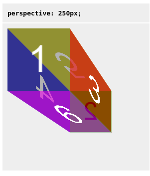
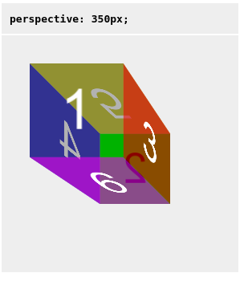
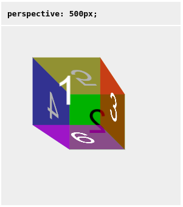

# perspective

Свойство **`perspective`** определяет расcтояние между плоскостью `z = 0` и пользователем для того чтобы придать 3D-позиционируемому элементу эффект переспективы. Каждый трансформируемый элемент с `z > 0` станет больше, с `z < 0` соответственно меньше.

Элементы части которые находятся за пользователем, т. е. z-координата этих элементов больше чем значение свойства `perspective`, не отрисовываются.

Точка схождения по-умолчанию расположена в центре элемента, но её можно переместить используя свойство [`perspective-origin`](perspective-origin.md).

При использовании данного свойства со значениями отличными от `0` или `none` создается новый stacking context.

??? info "Трансформации"

    <div class="col3" markdown="1">

    - [backface-visibility](backface-visibility.md)
    - **perspective**
    - [perspective-origin](perspective-origin.md)
    - [transform](transform.md)
    - [transform-box](transform-box.md)
    - [transform-origin](transform-origin.md)
    - [transform-style](transform-style.md)

    </div>

## Синтаксис

```css
/* Keyword value */
perspective: none;

/* Значения <length> */
perspective: 20px;
perspective: 3.5em;

/* Глобальные значения */
perspective: inherit;
perspective: initial;
perspective: unset;
```

## Значения

`none`
: Указывает что трасформация перспективы к элементу применяться не будет.

`<length>`
: length устанавливает растояние от пользователя до плоскости `z = 0`. Применяет трасформацию к элементу и его содержимому. Если значение отрицательно или равно `0`, то преобразование не применяется.

## Спецификация

- [CSS Transforms Level 2](https://drafts.csswg.org/css-transforms-2/#perspective-property)

## Пример

=== "HTML"

    ```html
    <table>
      <tbody>
        <tr>
          <th><code>perspective: 250px;</code></th>
          <th><code>perspective: 350px;</code></th>
          <th><code>perspective: 500px;</code></th>
        </tr>
        <tr>
          <td>
            <div class="container">
              <div class="cube pers250">
                <div class="face front">1</div>
                <div class="face back">2</div>
                <div class="face right">3</div>
                <div class="face left">4</div>
                <div class="face top">5</div>
                <div class="face bottom">6</div>
              </div>
            </div>
          </td>
          <td>
            <div class="container">
              <div class="cube pers350">
                <div class="face front">1</div>
                <div class="face back">2</div>
                <div class="face right">3</div>
                <div class="face left">4</div>
                <div class="face top">5</div>
                <div class="face bottom">6</div>
              </div>
            </div>
          </td>
          <td>
            <div class="container">
              <div class="cube pers500">
                <div class="face front">1</div>
                <div class="face back">2</div>
                <div class="face right">3</div>
                <div class="face left">4</div>
                <div class="face top">5</div>
                <div class="face bottom">6</div>
              </div>
            </div>
          </td>
        </tr>
      </tbody>
    </table>
    ```

=== "CSS"

    ```css
    /* Короткие классы для различных значений perspective */
    .pers250 {
      perspective: 250px;
      -webkit-perspective: 250px;
    }
    .pers350 {
      perspective: 350px;
      -webkit-perspective: 350px;
    }
    .pers500 {
      perspective: 500px;
      -webkit-perspective: 500px;
    }

    /* Определяем div.container, div.cube, и свойства граней куба */
    .container {
      width: 200px;
      height: 200px;
      margin: 75px 0 0 75px;
      border: none;
    }
    .cube {
      width: 100%;
      height: 100%;
      backface-visibility: visible;
      perspective-origin: 150% 150%;
      transform-style: preserve-3d;
      -webkit-backface-visibility: visible;
      -webkit-perspective-origin: 150% 150%;
      -webkit-transform-style: preserve-3d;
    }
    .face {
      display: block;
      position: absolute;
      width: 100px;
      height: 100px;
      border: none;
      line-height: 100px;
      font-family: sans-serif;
      font-size: 60px;
      color: white;
      text-align: center;
    }

    /* Определяем каждую грань в зависимости от направления */
    .front {
      background: rgba(0, 0, 0, 0.3);
      transform: translateZ(50px);
      -webkit-transform: translateZ(50px);
    }
    .back {
      background: rgba(0, 255, 0, 1);
      color: black;
      transform: rotateY(180deg) translateZ(50px);
      -webkit-transform: rotateY(180deg) translateZ(50px);
    }
    .right {
      background: rgba(196, 0, 0, 0.7);
      transform: rotateY(90deg) translateZ(50px);
      -webkit-transform: rotateY(90deg) translateZ(50px);
    }
    .left {
      background: rgba(0, 0, 196, 0.7);
      transform: rotateY(-90deg) translateZ(50px);
      -webkit-transform: rotateY(-90deg) translateZ(50px);
    }
    .top {
      background: rgba(196, 196, 0, 0.7);
      transform: rotateX(90deg) translateZ(50px);
      -webkit-transform: rotateX(90deg) translateZ(50px);
    }
    .bottom {
      background: rgba(196, 0, 196, 0.7);
      transform: rotateX(-90deg) translateZ(50px);
      -webkit-transform: rotateX(-90deg) translateZ(50px);
    }

    /* Делаем таблицу немного лучше */
    th,
    p,
    td {
      background-color: #eeeeee;
      padding: 10px;
      font-family: sans-serif;
      text-align: left;
    }
    ```

=== "Результат"

    

    

    

## Ссылки

- [`perspective`](https://developer.mozilla.org/ru/docs/Web/CSS/perspective) <sup><small>MDN (рус.)</small></sup>
