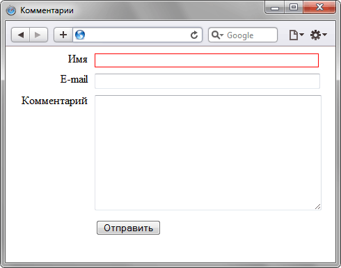

# :required

Псевдокласс **`:required`** применяет стилевые правила к элементу [`<input>`](/html/input/), у которого установлен атрибут `required`, он позволяет выделять поля обязательные к заполнению перед отправкой формы.

??? info "Псевдоклассы"

    <div class="col3" markdown="1">

    - [:active](active.md)
    - [:any-link](any-link.md)
    - [:blank](blank.md)
    - [:checked](checked.md)
    - [:current()](current.md)
    - [:default](default.md)
    - [:defined](defined.md)
    - [:dir()](dir.md)
    - [:disabled](disabled.md)
    - [:empty](empty.md)
    - [:enabled](enabled.md)
    - [:first](first.md)
    - [:first-child](first-child.md)
    - [:first-of-type](first-of-type.md)
    - [:focus](focus.md)
    - [:focus-visible](focus-visible.md)
    - [:focus-within](focus-within.md)
    - [:fullscreen](fullscreen.md)
    - [:future](future.md)
    - [:has()](has.md)
    - :host
    - :host()
    - :host-context()
    - [:hover](hover.md)
    - [:indeterminate](indeterminate.md)
    - [:in-range](in-range.md)
    - [:invalid](invalid.md)
    - [:is()](is.md)
    - [:lang()](lang.md)
    - [:last-child](last-child.md)
    - [:last-of-type](last-of-type.md)
    - [:left](left-pseudo-class.md)
    - [:link](link.md)
    - :local-link
    - [:not()](not.md)
    - [:nth-child()](nth-child.md)
    - :nth-col()
    - [:nth-last-child()](nth-last-child.md)
    - :nth-last-col()
    - [:nth-last-of-type()](nth-last-of-type.md)
    - [:nth-of-type()](nth-of-type.md)
    - [:only-child](only-child.md)
    - [:only-of-type](only-of-type.md)
    - [:optional](optional.md)
    - [:out-of-range](out-of-range.md)
    - [:past](past.md)
    - [:placeholder-shown](placeholder-shown.md)
    - [:read-only](read-only.md)
    - [:read-write](read-write.md)
    - **:required**
    - :right
    - [:root](root.md)
    - [:scope](scope.md)
    - [:target](target.md)
    - :target-within
    - :user-invalid
    - [:valid](valid.md)
    - [:visited](visited.md)
    - [:where()](where.md)

    </div>

## Синтаксис

```css
input:required {
  /* ... */
}
```

## Спецификации

- [HTML Living Standard](https://html.spec.whatwg.org/multipage/semantics-other.html#selector-required)
- [HTML5](https://www.w3.org/TR/html50/disabled-elements.html#selector-required)
- [Selectors Level 4](https://drafts.csswg.org/selectors-4/#opt-pseudos)
- [CSS Basic User Interface Module Level 3](https://drafts.csswg.org/css-ui-3/#pseudo-required-value)

## Пример

```html
<!DOCTYPE html>
<html>
  <head>
    <meta charset="utf-8" />
    <title>Комментарии</title>
    <style>
      #comment p {
        margin: 0 0 5px; /* Отступ снизу */
      }
      #comment label {
        width: 110px; /* Ширина текста */
        float: left; /* Выстраиваем по горизонтали */
        text-align: right; /* Текст по правому краю */
        padding-right: 10px; /* Поле справа */
      }
      #comment input[type='text'],
      #comment textarea {
        width: 320px; /* Ширина текстовых полей */
      }
      input:required {
        border: 1px solid red; /* Красная рамка для обязательных полей */
      }
    </style>
  </head>
  <body>
    <form id="comment">
      <p>
        <label for="user">Имя</label>
        <input id="user" type="text" required />
      </p>

      <p>
        <label for="email">E-mail</label
        ><input id="email" type="text" />
      </p>
      <p>
        <label for="text">Комментарий</label>
        <textarea cols="40" rows="10" id="text"></textarea>
      </p>
      <p>
        <label>&nbsp;</label
        ><input type="submit" id="send" value="Отправить" />
      </p>
    </form>
  </body>
</html>
```

В данном примере обязательным считается поле для ввода имени, оно выделяется красной рамкой за счёт применения псевдокласса `:required`. Результат:



## См. также

- [:optional](optional.md)
- [:invalid](invalid.md)
- [:valid](valid.md)

## Ссылки

- Псевдо-класс [:required](https://developer.mozilla.org/ru/docs/Web/CSS/:required) <sup><small>MDN (рус.)</small></sup>
