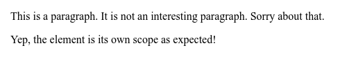
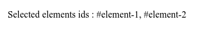

# :scope

Псевдокласс **`:scope`** представляет собой элементы, которые являются ориентиром для селекторов, чтобы соответствовать против.

В настоящее время при использовании в таблице стилей `:scope` совпадает с [`:root`](root.md), поскольку в настоящее время нет способа явно установить элемент области действия. При использовании из DOM API, такого как `querySelector()`, `querySelectorAll()`, `match()` или `Element.closest()`, `:scope` соответствует элементу, для которого вы вызвали метод.

## Синтаксис

```css
/* Selects a scoped element */
:scope {
  background-color: lime;
}
```

## Спецификация

- [Selectors Level 4](https://drafts.csswg.org/selectors-4/#the-scope-pseudo)

## Примеры

### Пример 1

В этом простом примере мы демонстрируем, что использование псевдокласса `:scope` из метода `Element.matches()` соответствует элементу, для которого он вызывается.

```js tab="JavaScript"
let paragraph = document.getElementById('para')
let output = document.getElementById('output')

if (paragraph.matches(':scope')) {
  output.innerText = 'Yep, the element is its own scope as expected!'
}
```

```html tab="HTML"
<p id="para">
  This is a paragraph. It is not an interesting paragraph. Sorry about that.
</p>
<p id="output"></p>
```

Результат:



### Пример 2

Ситуация, когда псевдокласс `:scope` оказывается полезной, - это когда вам нужно получить прямого потомка уже извлеченного элемента.

```js tab="JavaScript"
var context = document.getElementById('context')
var selected = context.querySelectorAll(':scope > div')

document.getElementById('results').innerHTML = Array.prototype.map
  .call(selected, function (element) {
    return '#' + element.getAttribute('id')
  })
  .join(', ')
```

```html tab="HTML"
<div id="context">
  <div id="element-1">
    <div id="element-1.1"></div>
    <div id="element-1.2"></div>
  </div>
  <div id="element-2">
    <div id="element-2.1"></div>
  </div>
</div>
<p>
  Selected elements ids :
  <span id="results"></span>
</p>
```

Результат:



## См. также

- [:root](root.md)
- [:has()](has.md)

## Ссылки

- [:scope](https://developer.mozilla.org/en-US/docs/Web/CSS/:scope) на MDN
