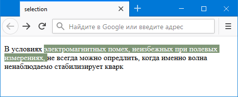

# ::selection

Псевдоэлемент **`::selection`** применяет стиль к выделенному пользователем тексту. В правилах стилей допускается использовать следующие свойства:

- [`color`](color.md)
- [`background-color`](background-color.md)
- [`cursor`](cursor.md)
- [`caret-color`](caret-color.md)
- [`outline`](outline.md) и его подробные свойства
- [`text-decoration`](text-decoration.md) и его подробные свойства
- [`text-emphasis-color`](text-emphasis-color.md)
- [`text-shadow`](text-shadow.md).

## Синтаксис

```css
::selection {
  background-color: cyan;
}
```

## Спецификация

- [CSS Pseudo-Elements Level 4](https://drafts.csswg.org/css-pseudo-4/#selectordef-selection)

## Примечание

Firefox до версии 62 использует нестандартный псевдоэлемент `::-moz-selection`.

## Примеры

### Пример 1

```html tab="HTML"
This text has special styles when you highlight it.
<p>Also try selecting text in this paragraph.</p>
```

```css tab="CSS"
/* Make selected text gold on a red background */
::selection {
  color: gold;
  background-color: red;
}

/* Make selected text in a paragraph white on a blue background */
p::selection {
  color: white;
  background-color: blue;
}
```

### Пример 2

В данном примере при выделении текста он изменяет свой цвет и фон.

```html
<!DOCTYPE html>
<html>
  <head>
    <meta charset="utf-8" />
    <title>selection</title>
    <style>
      p::selection {
        color: #ff0; /* Цвет текста */
        background: #000; /* Цвет фона */
      }
    </style>
  </head>
  <body>
    <p>При выделении этого текста он изменит свой цвет.</p>
  </body>
</html>
```

### Пример 3

**Как задать цвет выделения текста?**

Чтобы указать цвет и фон выделенного текста применяется псевдоэлемент `::selection`, в котором задаются свойства `color` и `background`, как покаано в примере.

```html
<!DOCTYPE html>
<html>
  <head>
    <meta charset="utf-8" />
    <title>Выделение</title>
    <style>
      ::selection {
        background: #809778; /* Цвет фона */
        color: #fff; /* Цвет текста */
      }
    </style>
  </head>
  <body>
    <p>
      В условиях электромагнитных помех, неизбежных при полевых измерениях, не
      всегда можно опредлить, когда именно волна ненаблюдаемо стабилизирует
      кварк
    </p>
  </body>
</html>
```

Результат



## См. также

- [pointer-events](pointer-events.md)

## Ссылки

- [::selection](https://developer.mozilla.org/en-US/docs/Web/CSS/::selection) на MDN
