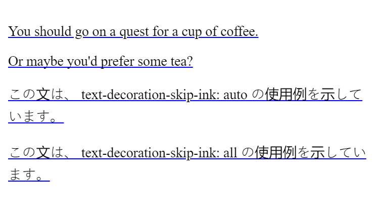

---
description:
---

# text-decoration-skip-ink

Свойство **`text-decoration-skip-ink`** определяет способ рисования надстрочных и нижних подчеркиваний при прохождении над верхними и нижними элементами глифов.

??? info "Текст"

    <div class="col3" markdown="1">

    - [hanging-punctuation](hanging-punctuation.md)
    - [hyphens](hyphens.md)
    - [letter-spacing](letter-spacing.md)
    - [line-break](line-break.md)
    - [overflow-wrap](overflow-wrap.md)
    - [paint-order](paint-order.md)
    - [tab-size](tab-size.md)
    - [text-align](text-align.md)
    - [text-align-last](text-align-last.md)
    - [text-indent](text-indent.md)
    - [text-justify](text-justify.md)
    - [text-size-adjust](text-size-adjust.md)
    - [text-transform](text-transform.md)
    - [white-space](white-space.md)
    - [word-break](word-break.md)
    - [word-spacing](word-spacing.md)

    </div>

    <div class="col3" markdown="1">

    - [letter-spacing](letter-spacing.md)
    - [text-decoration](text-decoration.md)
    - [text-decoration-color](text-decoration-color.md)
    - [text-decoration-line](text-decoration-line.md)
    - [text-decoration-style](text-decoration-style.md)
    - [text-decoration-thickness](text-decoration-thickness.md)
    - [text-decoration-skip](text-decoration-skip.md)
    - **text-decoration-skip-ink**
    - [text-emphasis](text-emphasis.md)
    - [text-emphasis-color](text-emphasis-color.md)
    - [text-emphasis-position](text-emphasis-position.md)
    - [text-emphasis-style](text-emphasis-style.md)
    - [text-indent](text-indent.md)
    - [text-rendering](text-rendering.md)
    - [text-shadow](text-shadow.md)
    - [text-underline-position](text-underline-position.md)
    - [text-transform](text-transform.md)
    - [white-space](white-space.md)
    - [word-spacing](word-spacing.md)

    </div>

## Синтаксис

```css
/* Single keyword */
text-decoration-skip-ink: none;
text-decoration-skip-ink: auto;
text-decoration-skip-ink: all;

/* Global keywords */
text-decoration-skip: inherit;
text-decoration-skip: initial;
text-decoration-skip: unset;
```

## Значения

`none`
: Подчеркивания и надчеркивания рисуются по всей длине текстового содержимого, включая части, которые пересекают нижние и верхние элементы глифов.

**`auto`**
: Браузер может прерывать подчеркивание и наложение, чтобы они не касались глифа и не приближались к нему. То есть они прерываются там, где в противном случае они пересекали бы глиф.

`all`
: Браузер должен прерывать подчеркивание и подчеркивание, чтобы они не касались глифа и не приближались к нему. Это может быть полезно с некоторыми китайскими, японскими или корейскими (CJK) шрифтами, где автоматическое поведение может не создавать прерываний.

## Определение

|                      |                |
| -------------------- | -------------- |
| Начальное значение   | `auto`         |
| Применяется ко       | всем элементам |
| Наследуется          | да             |
| Вычисленное значение | как определено |
| Тип анимации         | дискретный     |

## Поддержка браузерами

<p class="ciu_embed" data-feature="mdn-css__properties__text-decoration-skip-ink" data-periods="future_1,current,past_1,past_2" data-accessible-colours="false"></p>

## Примеры

### Пример 1

<iframe class="interactive" frameborder="0" height="390" src="https://interactive-examples.mdn.mozilla.net/pages/css/text-decoration-skip-ink.html" title="text-decoration-skip-ink" width="100%"></iframe>

### Пример 2

=== "CSS"

    ```css
    p {
      font-size: 1.5em;
      text-decoration: underline blue;
      text-decoration-skip-ink: auto; /* this is the default anyway */
    }

    .no-skip-ink {
      text-decoration-skip-ink: none;
    }

    .skip-ink-all {
      text-decoration-skip-ink: all;
    }
    ```

=== "HTML"

    ```html
    <p>You should go on a quest for a cup of coffee.</p>
    <p class="no-skip-ink">Or maybe you'd prefer some tea?</p>
    <p>
      この文は、 text-decoration-skip-ink: auto
      の使用例を示しています。
    </p>
    <p class="skip-ink-all">
      この文は、 text-decoration-skip-ink: all
      の使用例を示しています。
    </p>
    ```

=== "Результат"

    

## См. также

- Элемент [`a`](/html/a/) — текст <a href="#">ссылки</a>
- Элемент [`u`](/html/u/) — <u>подчеркнутый</u> текст

## Ссылки

- Свойство [`text-decoration-skip-ink`](https://developer.mozilla.org/ru/docs/Web/CSS/text-decoration-skip-ink) <sup><small>MDN (рус.)</small></sup>
- [CSS Text Decoration Module Level 4](https://drafts.csswg.org/css-text-decor-4/#text-decoration-skip-ink-property) <sup><small>Спецификация (eng.)</small></sup>
