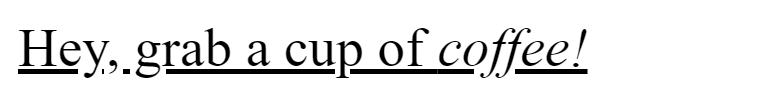

# text-decoration-skip

Свойство **`text-decoration-skip`** устанавливает, какие части содержимого элемента должны пропускать текстовое оформление, влияющее на элемент. Оно контролирует все линии оформления текста, нарисованные элементом или его родителями.

!!! note "Важно"

    Большинство браузеров поддерживают более простое свойство [`text-decoration-skip-ink`](text-decoration-skip-ink.md).

??? info "Текст"

    <div class="col3" markdown="1">

    - [hanging-punctuation](hanging-punctuation.md)
    - [hyphens](hyphens.md)
    - [letter-spacing](letter-spacing.md)
    - [line-break](line-break.md)
    - [overflow-wrap](overflow-wrap.md)
    - [paint-order](paint-order.md)
    - [tab-size](tab-size.md)
    - [text-align](text-align.md)
    - [text-align-last](text-align-last.md)
    - [text-indent](text-indent.md)
    - [text-justify](text-justify.md)
    - [text-size-adjust](text-size-adjust.md)
    - [text-transform](text-transform.md)
    - [white-space](white-space.md)
    - [word-break](word-break.md)
    - [word-spacing](word-spacing.md)

    </div>

    <div class="col3" markdown="1">

    - [letter-spacing](letter-spacing.md)
    - [text-decoration](text-decoration.md)
    - `text-decoration-color`
    - `text-decoration-line`
    - `text-decoration-style`
    - `text-decoration-thickness`
    - [text-decoration-skip](text-decoration-skip.md)
    - `text-decoration-skip-ink`
    - [text-emphasis](text-emphasis.md)
    - [text-emphasis-color](text-emphasis-color.md)
    - [text-emphasis-position](text-emphasis-position.md)
    - [text-emphasis-style](text-emphasis-style.md)
    - [text-indent](text-indent.md)
    - [text-rendering](text-rendering.md)
    - [text-shadow](text-shadow.md)
    - `text-underline-position`
    - [text-transform](text-transform.md)
    - [white-space](white-space.md)
    - [word-spacing](word-spacing.md)

    </div>

## Синтаксис

```css
/* Keyword values */
text-decoration-skip: none;
text-decoration-skip: objects;
text-decoration-skip: spaces;
text-decoration-skip: edges;
text-decoration-skip: box-decoration;

/* Multiple keywords */
text-decoration-skip: objects spaces;
text-decoration-skip: leading-spaces trailing-spaces;
text-decoration-skip: objects edges box-decoration;

/* Global values */
text-decoration-skip: inherit;
text-decoration-skip: initial;
text-decoration-skip: unset;
```

## Значения

`none`
: Ничего не пропускается, рисуется сплошная линия

`objects`
: Выступающие символы и иизображения пропускаются

`spaces`
: все пробелы и пробельные символы пропускаются

`leading-spaces`
: то же, что и spaces, но пропускаются только ведущие пробелы

`trailing-spaces`
: то же, что и spaces, но пропускаются только конечные пробелы

`edges`
: Начало и конец оформления текста немного смещены (например, на половину толщины линии) от края содержимого блока оформления. Таким образом, соседние элементы получают отдельные подчеркивания. (Это важно для китайского языка, где подчеркивание является одной из форм пунктуации.)

`box-decoration`
: оформление затрагивает только контентную область, пропуская поля, рамки и отступы

## Определение

|                      |                |
| -------------------- | -------------- |
| Начальное значение   | `objects`      |
| Применяется ко       | всем элементам |
| Наследуется          | да             |
| Вычисленное значение | как определено |
| Тип анимации         | дискретный     |

## Поддержка браузерами

<p class="ciu_embed" data-feature="mdn-css__properties__text-decoration-skip" data-periods="future_1,current,past_1,past_2" data-accessible-colours="false"></p>

## Пример

=== "CSS"

    ```css
    p {
      margin: 0;
      font-size: 3em;
      text-decoration: underline;
      text-decoration-skip: edges;
    }
    ```

=== "HTML"

    ```html
    <p>Hey, grab a cup of <em>coffee!</em></p>
    ```

=== "Результат"

    

## См. также

- Элемент [`a`](/html/a/) — текст <a href="#">ссылки</a>
- Элемент [`u`](/html/u/) — <u>подчеркнутый</u> текст

## Ссылки

- Свойство [`text-decoration-skip`](https://developer.mozilla.org/ru/docs/Web/CSS/text-decoration-skip) <sup><small>MDN (рус.)</small></sup>
- [CSS Text Decoration Module Level 4](https://drafts.csswg.org/css-text-decor-4/#text-decoration-skipping) <sup><small>Спецификация (eng.)</small></sup>
