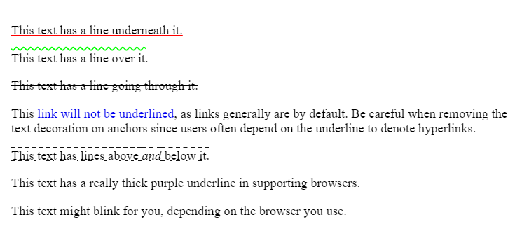

# text-decoration

Сокращенное свойство **`text-decoration`** устанавливает внешний вид декоративных линий в тексте. Это сокращение для [`text-decoration-line`](text-decoration-line.md), [`text-decoration-color`](text-decoration-color.md), [`text-decoration-style`](text-decoration-style.md) и [`text-decoration-thickness`](text-decoration-thickness.md).

??? info "Текст"

    <div class="col3" markdown="1">

    - [hanging-punctuation](hanging-punctuation.md)
    - [hyphens](hyphens.md)
    - [letter-spacing](letter-spacing.md)
    - [line-break](line-break.md)
    - [overflow-wrap](overflow-wrap.md)
    - [paint-order](paint-order.md)
    - [tab-size](tab-size.md)
    - [text-align](text-align.md)
    - [text-align-last](text-align-last.md)
    - [text-indent](text-indent.md)
    - [text-justify](text-justify.md)
    - [text-size-adjust](text-size-adjust.md)
    - [text-transform](text-transform.md)
    - [white-space](white-space.md)
    - [word-break](word-break.md)
    - [word-spacing](word-spacing.md)

    </div>

    <div class="col3" markdown="1">

    - [letter-spacing](letter-spacing.md)
    - [text-decoration](text-decoration.md)
    - `text-decoration-color`
    - `text-decoration-line`
    - `text-decoration-style`
    - `text-decoration-thickness`
    - [text-decoration-skip](text-decoration-skip.md)
    - `text-decoration-skip-ink`
    - [text-emphasis](text-emphasis.md)
    - [text-emphasis-color](text-emphasis-color.md)
    - [text-emphasis-position](text-emphasis-position.md)
    - [text-emphasis-style](text-emphasis-style.md)
    - [text-indent](text-indent.md)
    - [text-rendering](text-rendering.md)
    - [text-shadow](text-shadow.md)
    - `text-underline-position`
    - [text-transform](text-transform.md)
    - [white-space](white-space.md)
    - [word-spacing](word-spacing.md)

    </div>

## Синтаксис

```css
text-decoration: none;
text-decoration: underline red;
text-decoration: underline wavy red;

text-decoration: inherit;
text-decoration: initial;
text-decoration: unset;
```

## Определение

|                      |                                                                                                                                                                                                                    |
| -------------------- | ------------------------------------------------------------------------------------------------------------------------------------------------------------------------------------------------------------------ |
| Начальное значение   | как каждое их свойств сокращения:<br>`text-decoration-color: currentcolor`<br>`text-decoration-style: solid`<br>`text-decoration-line: none`                                                                       |
| Применяется ко       | всем элементам и псевдо-элементам `::first-letter` и `::first-line`                                                                                                                                                |
| Наследуется          | нет                                                                                                                                                                                                                |
| Вычисленное значение | как каждое их свойств сокращения:<br>`text-decoration-line`: как определено<br>`text-decoration-style`: как определено<br>`text-decoration-color`: вычисленный цвет<br>`text-decoration-thickness`: как определено |
| Тип анимации         | как каждое их свойств сокращения:<br>`text-decoration-color`: цвет<br>`text-decoration-style`: дискретный<br>`text-decoration-line`: дискретный<br>`text-decoration-thickness`: вычисленное значение типа          |

## Поддержка браузерами

<p class="ciu_embed" data-feature="mdn-css__properties__text-decoration" data-periods="future_1,current,past_1,past_2" data-accessible-colours="false"></p>

## Примеры

### Пример 1

<iframe class="interactive" frameborder="0" height="390" src="https://interactive-examples.mdn.mozilla.net/pages/css/text-decoration.html" title="MDN Web Docs Interactive Example" width="100%"></iframe>

### Пример 2

=== "CSS"

    ```css
    .under {
      text-decoration: underline red;
    }

    .over {
      text-decoration: wavy overline lime;
    }

    .line {
      text-decoration: line-through;
    }

    .plain {
      text-decoration: none;
    }

    .underover {
      text-decoration: dashed underline overline;
    }

    .thick {
      text-decoration: solid underline purple 4px;
    }

    .blink {
      text-decoration: blink;
    }
    ```

=== "HTML"

    ```html
    <p class="under">This text has a line underneath it.</p>
    <p class="over">This text has a line over it.</p>
    <p class="line">This text has a line going through it.</p>
    <p>
      This
      <a class="plain" href="#">link will not be underlined</a>,
      as links generally are by default. Be careful when
      removing the text decoration on anchors since users often
      depend on the underline to denote hyperlinks.
    </p>
    <p class="underover">
      This text has lines above <em>and</em> below it.
    </p>
    <p class="thick">
      This text has a really thick purple underline in
      supporting browsers.
    </p>
    <p class="blink">
      This text might blink for you, depending on the browser
      you use.
    </p>
    ```

=== "Результат"

    

### Пример 3

```html
<!DOCTYPE html>
<html>
  <head>
    <meta charset="utf-8" />
    <title>text-decoration</title>
    <style>
      a {
        /* Убираем подчеркивание у ссылок */
        text-decoration: none;
      }
      a:hover {
        /* Добавляем подчёркивание 
		при наведении курсора мыши на ссылку */
        text-decoration: underline;
      }
    </style>
  </head>
  <body>
    <p>
      <a href="page/1.html">Стратегическое нападение</a>
    </p>
  </body>
</html>
```

## См. также

- Элемент [`a`](/html/a/) — текст <a href="#">ссылки</a>
- Элемент [`u`](/html/u/) — <u>подчеркнутый</u> текст
- Элемент [`s`](/html/s/) — <s>зачеркнутый</s> текст

## Ссылки

- Свойство [`text-decoration`](https://developer.mozilla.org/ru/docs/Web/CSS/text-decoration) <sup><small>MDN (рус.)</small></sup>
- [CSS Text Decoration Module Level 4](https://drafts.csswg.org/css-text-decor-4/) <sup><small>Спецификация (eng.)</small></sup>
- [CSS Text Decoration Level 3](https://drafts.csswg.org/css-text-decor-3/#text-decoration-property) <sup><small>Спецификация (eng.)</small></sup>
- [CSS Level 2 (Revision 1)](http://www.w3.org/TR/CSS2/text.html#lining-striking-props) <sup><small>Спецификация (eng.)</small></sup>
- [CSS Level 1](http://www.w3.org/TR/CSS1/#text-decoration) <sup><small>Спецификация (eng.)</small></sup>
