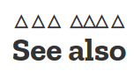

# text-emphasis-style

Свойство **`text-emphasis-style`** устанавливает внешний вид меток выделения.

## Синтаксис

```css
/* Initial value */
text-emphasis-style: none; /* No emphasis marks */

/*  value */
text-emphasis-style: 'x';
text-emphasis-style: '点';
text-emphasis-style: '\25B2';
text-emphasis-style: '*';
text-emphasis-style: 'foo'; /* Should NOT use. It may be computed to or rendered as 'f' only */

/* Keywords value */
text-emphasis-style: filled;
text-emphasis-style: open;
text-emphasis-style: filled sesame;
text-emphasis-style: open sesame;

/* Global values */
text-emphasis-style: inherit;
text-emphasis-style: initial;
text-emphasis-style: unset;
```

## Значения

`none`
: Без выделения

`filled`
: Форма заполнена сплошным цветом.

`open`
: Форма полая.

`dot`
: Отображать маленькие кружки в виде отметок. Заполненная точка - `•` (`U+2022`), а открытая точка - `◦` (`U+25E6`).

`circle`
: Показать большие круги в виде отметок. Заполненный кружок - `●` (`U+25CF`), а открытый кружок - `○` (`U+25CB`).

`double-circle`
: Отображать двойные кружки в виде отметок. Заполненный двойной кружок - `◉` (`U+25C9`), а открытый двойной кружок - `◎` (`U+25CE`).

`triangle`
: Отображать треугольники в виде отметок. Заполненный треугольник - `▲` (`U+25B2`), а открытый треугольник - `△` (`U+25B3`).

`sesame`
: Показать сезам в виде отметок. Заполненный - `﹅` (`U+FE45`), а открытый - `﹆` (`U+FE46`).

`<строка>`
: Отобразить данную строку в виде отметок. Авторам не следует указывать более одного символа . Браузер может обрезать или игнорировать строки, состоящие из нескольких символов.

## Спецификация

- [CSS Text Decoration Module Level 3](https://drafts.csswg.org/css-text-decor-3/#text-emphasis-style-property)

## Пример

```css
h2 {
  -webkit-text-emphasis-style: triangle open;
  text-emphasis-style: triangle open;
}
```

Результат:



## См. также

- [`text-emphasis-color`](text-emphasis-color.md)
- [`text-emphasis`](text-emphasis.md)
- [`text-emphasis-position`](text-emphasis-position.md)

## Ссылки

- [text-emphasis-style](https://developer.mozilla.org/en-US/docs/Web/CSS/text-emphasis-style) на MDN
