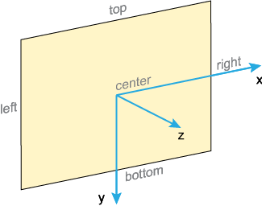

# transform-origin

Свойство **`transform-origin`** устанавливает координаты точки, относительно которой будет происходить трансформация элемента.

## Синтаксис

```css
/* One-value syntax */
transform-origin: 2px;
transform-origin: bottom;

/* x-offset y-offset */
transform-origin: 3cm 2px;

/* x-offset-keyword y-offset */
transform-origin: left 2px;

/* x-offset-keyword y-offset-keyword */
transform-origin: right top;

/* y-offset-keyword x-offset-keyword */
transform-origin: top right;

/* x-offset y-offset z-offset */
transform-origin: 2px 30% 10px;

/* x-offset-keyword y-offset z-offset */
transform-origin: left 5px -3px;

/* x-offset-keyword y-offset-keyword z-offset */
transform-origin: right bottom 2cm;

/* y-offset-keyword x-offset-keyword z-offset */
transform-origin: bottom right 2cm;

/* Global values */
transform-origin: inherit;
transform-origin: initial;
transform-origin: unset;
```

## Значения

`<x>`
: Координата по оси X. Может принимать следующие значения:

: `<размер> | <проценты> | left | center | right`

: Здесь <размер> — любая единица измерения CSS.

`<y>`
: Координата по оси Y. Может принимать следующие значения:

: `<размер> | <проценты> | top | center | bottom`

`<z>`
: Координата по оси Z. Может задаваться только в любых корректных единицах для измерения длины (исключая проценты).

Оси и значения показаны на рис. 1.



Отсчёт координат ведётся от левого верхнего угла элемента, по умолчанию точка трансформации находится в его центре, как показано на рисунке выше. При использовании процентов они берутся от размеров элемента.

### Примечание

- Internet Explorer 9 поддерживает свойство `-ms-transform-origin`.
- Chrome до версии 36 и Android до версии 4 поддерживают свойство `-webkit-transform-origin`.
- Safari поддерживает свойство `-webkit-transform-origin`.
- Opera до версии 12.10 и с версии 15 до 23 поддерживает свойство `-o-transform-origin`.
- Firefox до версии 16 поддерживает свойство `-moz-transform-origin`.

Значение по-умолчанию:

```css
transform-origin: 50% 50% 0;
```

Применяется к: К трансформируемым элементам

## Спецификации

- [CSS Transforms Level 1](http://dev.w3.org/csswg/css-transforms/#transform-origin)

## Поддержка браузерами

CSS Transform 2D:

<p class="ciu_embed" data-feature="transforms2d" data-periods="future_1,current,past_1,past_2">
  <a href="http://caniuse.com/#feat=transforms2d">Can I Use transforms2d?</a> Data on support for the transforms2d feature across the major browsers from caniuse.com.
</p>

CSS Transform 3D:

<p class="ciu_embed" data-feature="transforms3d" data-periods="future_1,current,past_1,past_2">
  <a href="http://caniuse.com/#feat=transforms3d">Can I Use transforms3d?</a> Data on support for the transforms3d feature across the major browsers from caniuse.com.
</p>

## Описание и примеры

```html
<!DOCTYPE html>
<html>
  <head>
    <meta charset="utf-8" />
    <title>transform-origin</title>
    <style>
      div {
        background: #fc0;
        padding: 10px;
        display: inline-block;
        border: 1px solid #000;
      }
      div:hover {
        /* Точка поворота в правом верхнем углу */
        transform-origin: 100% 0;
        /* Поворачиваем на 20 градусов против часовой стрелки */
        transform: rotate(-20deg);
      }
    </style>
  </head>
  <body>
    <div>Пример</div>
  </body>
</html>
```
