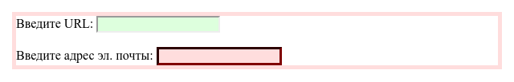

# :valid

Псевдокласс **`:valid`** применяется к полям формы, содержимое которых проходит проверку в браузере на соответствие указанному типу. Например, для `type="number"` вводится число, а не буквы, для `type="email"` корректный адрес электронной почты.

## Синтаксис

```css
:valid {
  /* ... */
}
```

## Спецификации

- [HTML Living Standard](https://html.spec.whatwg.org/multipage/semantics-other.html#selector-valid)
- [HTML5](https://www.w3.org/TR/html50/#selector-valid)
- [Selectors Level 4](https://drafts.csswg.org/selectors-4/#validity-pseudos)
- [CSS Basic User Interface Module Level 3](https://drafts.csswg.org/css-ui-3/#pseudo-validity)

## Примеры

### Пример 1

Этот пример представляет собой простую форму, цвета элементов которой зелёные, когда данные корректные, и красные, когда нет.

```html tab="HTML"
<form>
  <label>Введите URL:</label>
  <input type="url" />
  <br />
  <br />
  <label>Введите адрес эл. почты:</label>
  <input type="email" required />
</form>
```

```css tab="CSS"
input:invalid {
  background-color: #ffdddd;
}

form:invalid {
  border: 5px solid #ffdddd;
}

input:valid {
  background-color: #ddffdd;
}

form:valid {
  border: 5px solid #ddffdd;
}

input:required {
  border-color: #800000;
  border-width: 3px;
}
```

Результат:



## См. также

- [:invalid](invalid.md)
- [:required](required.md)
- [:optional](optional.md)

## Ссылки

- [:valid](https://developer.mozilla.org/ru/docs/Web/CSS/:valid) на MDN
