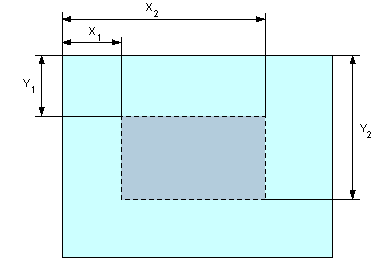
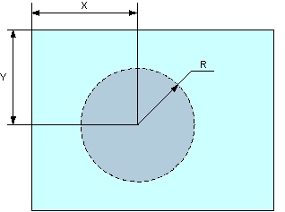
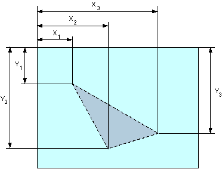

# &lt;area&gt;

Тег **`<area>`** _(от англ. **area** - область)_ определяет активные области изображения, которые являются ссылками.

Рисунок с привязанными к нему активными областями называется в совокупности картой-изображением. Такая карта по внешнему виду ничем не отличается от обычного изображения, но при этом оно может быть разбито на невидимые зоны разной формы, где каждая из областей служит ссылкой. Элемент `<area>` задаёт форму области, её размеры, устанавливает адрес документа, на который следует сделать ссылку. `<area>` всегда располагается в контейнере [`<map>`](map.md), который связывает координаты областей с изображением.

Несколько областей могут перекрывать друг друга, сверху будет та, которая в коде HTML располагается выше.

## Синтаксис

```html
<map>
  <area href="адрес" />
</map>
```

Закрывающий тег не требуется.

## Атрибуты

[`alt`](#alt)
: Альтернативный текст для области изображения.

[`coords`](#coords)
: Координаты активной области.

`download`

[`href`](#href)
: Задаёт адрес документа, на который следует перейти.

[`hreflang`](#hreflang)
: Указывает язык документа, на который ведёт ссылка.

`media`

`rel`

[`shape`](#shape)
: Форма области.

[`target`](#target)
: Имя фрейма, куда браузер будет загружать документ.

[`type`](#type)
: Устанавливает MIME-тип документа, на который ведёт ссылка.

Также для этого элемента доступны [универсальные атрибуты](uni-attr.md).

### alt

Атрибут **`alt`** устанавливает альтернативный текст для области изображения. Такой текст не отображается в браузере, но поисковые системы его могут прочитать.

**Синтаксис**

```html
<area alt="<текст>" />
```

**Значения**

Любая подходящяя текстовая строка.

**Значение по умолчанию**

Нет.

### coords

Атрибут **`coords`** устанавливает координаты области, она также называется «горячая область». Такая область может быть ссылкой на файл или связана с действием, определяемым скриптом.

Значения координат представляют собой набор чисел, разделённых запятыми. Если две области перекрываются между собой, приоритет имеет та, которая определена в коде HTML выше.

**Синтаксис**

```html
<area coords="<координата 1>, <координата 2>, <координата 3>, ..." />
```

**Значения**

Набор координат определяется формой «горячей области», которая задается атрибутом `shape`. Отсчёт координат обычно ведётся от левого верхнего угла изображения и указывается в пикселях.

Для прямоугольника (`shape="rect"`) определяется четыре координаты — X1, Y1, X2, Y2, как показано на рис. 1.



Для окружности (`shape="circle"`) определяется три координаты — координаты центра окружности (X, Y) и ее радиус (R), как показано на рис. 2.



Для полигона (многоугольника) (`shape="poly"`) последовательно указываются координаты каждой вершины (X1, Y1, X2, Y2, :), как показано на рис. 3.



**Значение по умолчанию**

Нет.

### href

Атрибут **`href`** задаёт адрес документа, на который следует перейти. Поскольку в качестве адреса ссылки может использоваться документ любого типа, то результат перехода по ссылке зависит от конечного файла. Так, архивы (файлы с расширением zip или rar) будут сохраняться на локальный диск. По умолчанию новый документ загружается в текущую вкладку браузера, однако это поведение можно изменить с помощью атрибута `target`.

**Синтаксис**

```html
<area href="<адрес>" />
```

**Значения**

В качестве значения принимается полный или относительный путь к файлу, а также указатель на функцию JavaScript.

**Значение по умолчанию**

Нет.

### hreflang

Атрибут **`hreflang`** указывает язык документа, на который ведёт ссылка активной области изображения.

**Синтаксис**

```html
<map>
  <area href="<адрес>" hreflang="<язык>" />
</map>
```

**Значения**

Код языка

**Значение по умолчанию**

Нет.

### shape

Атрибут **`shape`** определяет форму «горячей области», координаты которой задаются с помощью атрибута `coords`.

**Синтаксис**

```html
<area shape="circle | default | poly | rect" />
```

**Значения**

`circle`
: Область в виде окружности.

`default`
: Указывает всю область.

`poly`
: Область в виде полигона (многоугольника).

`rect`
: Прямоугольная область.

**Значение по умолчанию**

- `rect`

### target

Атрибут **`target`** определяет, как открывать ссылки — в новой вкладке, в текущей вкладке или в окне фрейма.

**Синтаксис**

```html
<area target="<значение>" />
```

**Значения**

В качестве значения используется имя фрейма, заданное атрибутом name элемента [`<iframe>`](iframe.md). Если установлено несуществующее имя, то будет открыта новая вкладка. В качестве зарезервированных имён используются следующие.

`_blank`
: Загружает страницу в новую вкладку браузера.

`_self`
: Загружает страницу в текущую вкладку.

`_parent`
: Загружает страницу во фрейм-родитель; если фреймов нет, то это значение работает как `_self`.

`_top`
: Отменяет все фреймы и загружает страницу в полном окне браузера; если фреймов нет, то это значение работает как `_self`.

**Значение по умолчанию**

- `_self`

### type

Атрибут **`type`** устанавливает MIME-тип документа, на который ведёт ссылка. Этот атрибут носит рекомендательный характер и может использоваться для стилизации ссылок с заданным типом документа. Атрибут `type` должен добавляться только при наличии атрибута `href`.

**Синтаксис**

```html
<area href="<адрес>" type="<MIME-тип>" />
```

**Значения**

MIME-тип

**Значение по умолчанию**

Нет.

## Спецификации

- [WHATWG HTML Living Standard](https://html.spec.whatwg.org/multipage/embedded-content.html#the-area-element)
- [HTML5](http://www.w3.org/TR/html5/embedded-content-0.html#the-area-element)
- [HTML 4.01 Specification](http://www.w3.org/TR/html401/struct/objects.html#h-13.6.1)

## Описание и примеры

```html
<!DOCTYPE html>
<html>
  <head>
    <meta charset="utf-8" />
    <title>AREA</title>
    <style>
      #title {
        line-height: 0;
        /* Изменяем межстрочное расстояние */
      }

      #title img {
        border: none;
        /* Убираем рамку вокруг изображения */
      }
    </style>
  </head>

  <body>
    <div id="title">
      
      <br /><br />
      
    </div>
    <p>
      <map name="Navigation">
        <area
          shape="poly"
          coords="113,24,211,24,233,0,137,0"
          href="page/inform.html"
          alt="Информация"
        />
        <area
          shape="poly"
          coords="210,24,233,0,329,0,307,24"
          href="page/activity.html"
          alt="Мероприятия"
        />
        <area
          shape="poly"
          coords="304,24,385,24,407,0,329,0"
          href="page/depart.html"
          alt="Отделения"
        />
        <area
          shape="poly"
          coords="384,24,449,24,473,0,406,0"
          href="page/techinfo.html"
          alt="Техническая информация"
        />
        <area
          shape="poly"
          coords="449,24,501,24,525,0,473,0"
          href="page/study.html"
          alt="Обучение"
        />
        <area
          shape="poly"
          coords="501,24,560,24,583,0,525,0"
          href="page/work.html"
          alt="Работа"
        />
        <area
          shape="poly"
          coords="560,24,615,24,639,0,585,0"
          href="page/misk.html"
          alt="Разное"
        />
      </map>
    </p>
  </body>
</html>
```

## Ссылки

- [`<area>`](https://developer.mozilla.org/ru/docs/Web/HTML/Element/area) на MDN
