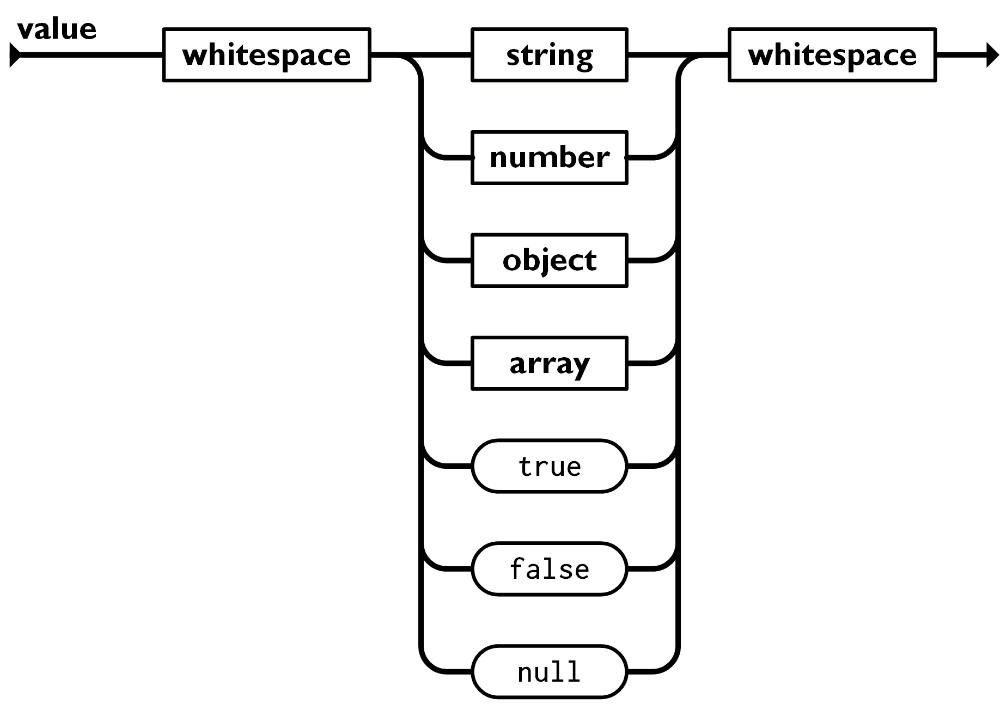
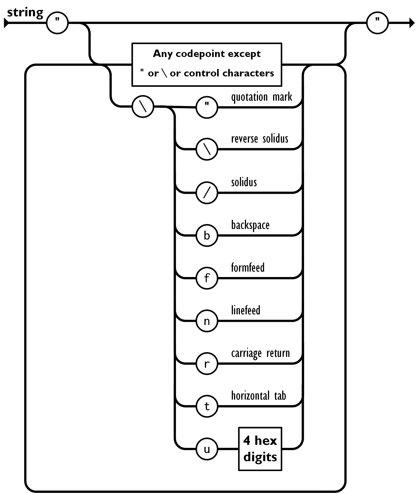
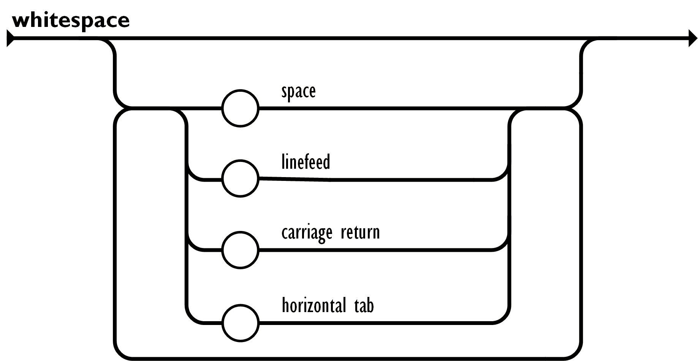

# Введение в JSON

**JSON** (JavaScript Object Notation) - простой формат обмена данными, удобный для чтения и написания как человеком, так и компьютером. Он основан на подмножестве языка программирования JavaScript, определенного в стандарте ECMA-262 3rd Edition - December 1999. JSON - текстовый формат, полностью независимый от языка реализации, но он использует соглашения, знакомые программистам C-подобных языков, таких как C, C++, C#, Java, JavaScript, Perl, Python и многих других. Эти свойства делают JSON идеальным языком обмена данными.

JSON основан на двух структурах данных:

- Коллекция пар ключ/значение. В разных языках, эта концепция реализована как объект, запись, структура, словарь, хэш, именованный список или ассоциативный массив.
- Упорядоченный список значений. В большинстве языков это реализовано как массив, вектор, список или последовательность.

Это универсальные структуры данных. Почти все современные языки программирования поддерживают их в какой-либо форме. Логично предположить, что формат данных, независимый от языка программирования, должен быть основан на этих структурах.

В нотации JSON это выглядит так:

**Объект** - неупорядоченный набор пар ключ/значение. Объект начинается с `{` (открывающей фигурной скобки) и заканчивается `}` (закрывающей фигурной скобкой). Каждое имя сопровождается `:` (двоеточием), пары ключ/значение разделяются `,` (запятой).

**Массив** - упорядоченная коллекция значений. Массив начинается с `[` (открывающей квадратной скобки) и заканчивается `]` (закрывающей квадратной скобкой). Значения разделены `,` (запятой).

Значение может быть строкой в двойных кавычках, числом, `true`, `false`, `null`, объектом или массивом. Эти структуры могут быть вложенными.

**Строка** - коллекция нуля или больше символов Unicode, заключенная в двойные кавычки, используя `\` (обратную косую черту) в качестве символа экранирования. Символ представляется как односимвольная строка. Похожий синтаксис используется в C и Java.

**Число** представляется так же, как в C или Java, кроме того, что используется толко десятичная система счисления.

_Пробелы_ могут использоваться между любыми лексемами.

Исключая некоторые детали кодирования, вышеизложенное полностью описывает язык JSON.

## Ссылки

- [Введение в JSON](http://json.org/json-ru.html)
