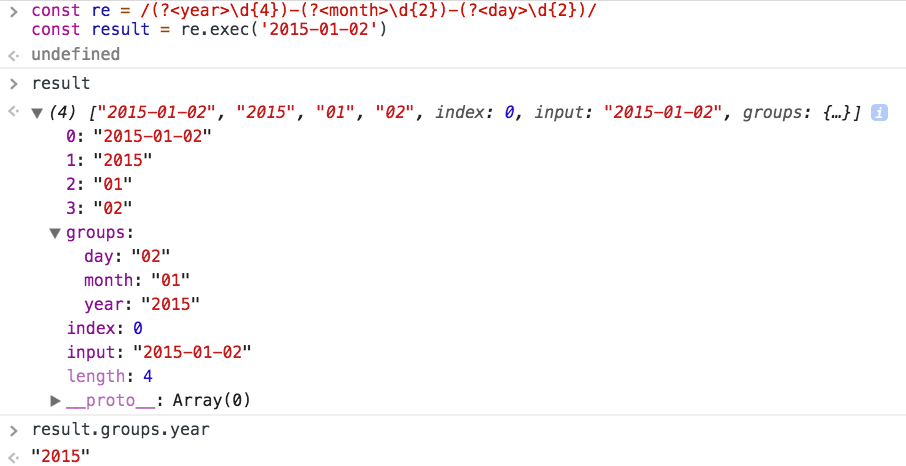

# Руководство по регулярным выражениям в JavaScript

## Введение в регулярные выражения

**Регулярные выражения (RegExp)** - это очень эффективный способ работы со строками.

Составив регулярное выражение с помощью специального синтаксиса вы можете:

- искать текст в строке
- заменять подстроки в строке
- извлекать информацию из строки

Почти во всех языках программирования есть регулярные выражения. Есть небольшие различия в реализации, но общие концепции применяются практически везде.

Регулярные выражения относятся к 1950-м годам, когда они были формализованы как концептуальный шаблон поиска для алгоритмов обработки строк.

Регулярные выражения реализованные в UNIX, таких как grep, sed и популярных текстовых редакторах, начали набирать популярность и были добавлены в язык программирования Perl, а позже и в множество других языков.

JavaScript, наряду с Perl, это один из языков программирования в котором поддержка регулярных выражений встроена непосредственно в язык.

## Сложно, по полезно

Новичкам регулярные выражения могут показаться абсолютной ерундой, а зачастую даже и профессиональным разработчикам, если не вкладывать время необходимое для их понимания.

Регулярные выражения сложно писать, сложно читать и сложно поддерживать/изменять.

Но иногда регулярные выражения это единственный разумный способ выполнить какие-то манипуляции над строками, поэтому они являются очень ценным инструментом.

Это руководство нацелено на то чтобы самым простым способом дать вам некоторое представление о регулярных выражениях в JavaScript и предоставить информацию о том как читать и создавать регулярные выражения.

Эмпирическое правило заключается в том, что простые регулярные выражения просты для чтения и записи, в то время как сложные регулярные выражения могут быстро превратиться в беспорядок, если вы не глубоко понимаете основы.

## Как выглядят регулярные выражения

В JavaScript регулярные выражения это объект, который может быть определён двумя способами.

Первый способ заключается в создании нового объекта RegExp с помощью конструктора:

```js
const re1 = new RegExp('hey')
```

Второй способ заключается в использовании литералов регулярных выражений:

```js
const re1 = /hey/
```

Вы знаете что в JavaScript есть литералы объектов и литералы массивов? В нём также есть литералы regexp.

В приведённом выше примере `hey` называется шаблоном. В литеральной форме он находится между двумя слэшами, а в случае с конструктором объекта, нет.

Это первое важное отличие между двумя способами определения регулярных выражений, остальные мы увидим позже.

## Как они работают?

Регулярное выражение, которое мы определили выше как `re1`, очень простое. Оно ищет строку `hey` без каки-либо ограничений: строка может содержать много текста, а слово `hey` находиться где-то в середине и регулярное выражение сработает. Строка может содержать только слово `hey` и регулярка опять сработает.

Это довольно просто.

Вы можете попробовать протестировать регулярное выражение с помощью метода `RegExp.test(String)`, который возвращает логическое (`boolean`) значение:

```js
re1.test('hey') // ✅
re1.test('blablabla hey blablabla') // ✅

re1.test('he') // ❌
re1.test('blablabla') // ❌
```

В примере выше мы просто проверили удовлетворяет ли `"hey"` шаблону регулярного выражения, который храниться в `re1`.

Это проще простого, но вы уже знаете много о регулярных выражениях.

## Закрепление

```js
;/hey/
```

сработает независимо от того где находится `hey` внутри строки.

Если вы хотите найти строки, которые начинаются с `hey`, то используйте оператор `^`:

```js
/^hey/.test('hey')     // ✅
/^hey/.test('bla hey') // ❌
```

Если вы хотите найти строки, которые заканчиваются на `hey`, то используйте оператор `$`:

```js
/hey$/.test('hey')     // ✅
/hey$/.test('bla hey') // ✅
/hey$/.test('hey you') // ❌
```

Объединяя два предыдущих оператора вы можете найти строку, которая полностью совпадает с `hey`:

```js
;/^hey$/.test('hey') // ✅
```

Чтобы найти строку начинающуюся с одной подстроки, а заканчивающуюся другой подстрокой вы можете использовать `.*`, который будет совпадать с любым символом повторяющимся 0 или более раз:

```js
/^hey.*joe$/.test('hey joe')             // ✅
/^hey.*joe$/.test('heyjoe')              // ✅
/^hey.*joe$/.test('hey how are you joe') // ✅
/^hey.*joe$/.test('hey joe!')            // ❌
```

## Поиск элементов по диапазону

Вместо того чтобы искать определённую строку, вы можете указать диапазон символов, например:

```js
/[a-z]/ // a, b, c, ... , x, y, z
/[A-Z]/ // A, B, C, ... , X, Y, Z
/[a-c]/ // a, b, c
/[0-9]/ // 0, 1, 2, 3, ... , 8, 9
```

Эти регулярные выражения ищут строки, которые содержат хотя бы один символ из выбранного диапазона:

```js
/[a-z]/.test('a')  // ✅
/[a-z]/.test('1')  // ❌
/[a-z]/.test('A')  // ❌

/[a-c]/.test('d')  // ❌
/[a-c]/.test('dc') // ✅
```

Диапазоны можно комбинировать:

```js
/[A-Za-z0-9]/
/[A-Za-z0-9]/.test('a') // ✅
/[A-Za-z0-9]/.test('1') // ✅
/[A-Za-z0-9]/.test('A') // ✅
```

## Поиск многократных совпадений элемента диапазона

Вы можете проверить содержит ли строка только один символ из диапазона с помощью символа `-`:

```js
/^[A-Za-z0-9]$/

/^[A-Za-z0-9]$/.test('A')  // ✅
/^[A-Za-z0-9]$/.test('Ab') // ❌
```

## Инверсия шаблона

Символ `^` в начале шаблона привязывает его к началу строки.

Использование этого символа внутри диапазона инвертирует диапазон, поэтому:

```js
/[^A-Za-z0-9]/.test('a') // ❌
/[^A-Za-z0-9]/.test('1') // ❌
/[^A-Za-z0-9]/.test('A') // ❌
/[^A-Za-z0-9]/.test('@') // ✅
```

## Метасимволы

- `\d` совпадает с любым числом, эквивалентно `[0-9]`
- `\D` совпадает с любым символом, который не является числом, эквивалентно `[^0-9]`
- `\w` совпадает с любым буквенно-числовым символом, эквивалентно `[A-Za-z0-9]`
- `\W` совпадает с любым символом, который не является буквенно-числовым значением, эквивалентно `[^A-Za-z0-9]`
- `\s` совпадает с любым пробельным символом: пробел, табуляция, символ новой строки и пробелы Unicode
- `\S` совпадает с любым символом, который не является пробелом
- `\0` совпадает с `null`
- `\n` совпадает с символом новой строки
- `\t` совпадает с символом табуляции
- `\uXXXX` совпадает с символом Unicode с кодом `XXXX` (требуется флаг `u`)
- `.` совпадает с любым символовом, кроме символа новой строки (таким как `\n`) (если вы не используете флаг `s`, объясним позже)
- `[^]` совпадает с любым символом, включая символ новой строки. Полезно при работе с многострочными строками

## Выбор в регулярных выражениях

Если вы хотите выбрать одну или другую строку, используйте оператор `|`.

```js
/hey|ho/.test('hey') // ✅
/hey|ho/.test('ho')  // ✅
```

## Квантификаторы

Представьте что у вас есть регулярное выражение, которое проверяет строку на то чтобы она состояла только из одной цифры:

```js
;/^\d$/
```

Вы можете использовать квантификатор `?`, который сделает этот символ необязательным. В нашем случае цифра должна встречаться 0 или 1 раз:

```js
;/^\d?$/
```

но что если мы хотим чтобы регулярное выражение срабатывало на несколько цифр?

Вы можете сделать это 4 способами, используя `+`, `*`, `{n}` и `{n,m}`.

## +

Совпадает с одним или более (>=1) элементами:

```js
/^\d+$/

/^\d+$/.test('12')     // ✅
/^\d+$/.test('14')     // ✅
/^\d+$/.test('144343') // ✅
/^\d+$/.test('')       // ❌
/^\d+$/.test('1a')     // ❌
```

## \*

Совпадает с 0 или более (>=0) элементами:

```js
/^\d+$/

/^\d*$/.test('12')     // ✅
/^\d*$/.test('14')     // ✅
/^\d*$/.test('144343') // ✅
/^\d*$/.test('')       // ✅
/^\d*$/.test('1a')     // ❌
```

## {n}

Совпадает точно с `n` количеством элементов:

```js
/^\d{3}$/

/^\d{3}$/.test('123')  // ✅
/^\d{3}$/.test('12')   // ❌
/^\d{3}$/.test('1234') // ❌

/^[A-Za-z0-9]{3}$/.test('Abc') // ✅
```

## {n,m}

Совпадает с диапазоном от `n` до `m` элементов:

```js
/^\d{3,5}$/

/^\d{3,5}$/.test('123')    // ✅
/^\d{3,5}$/.test('1234')   // ✅
/^\d{3,5}$/.test('12345')  // ✅
/^\d{3,5}$/.test('123456') // ❌
```

`m` можно опустить и оставить второй предел без ограничений, чтобы было минимум `n` элементов:

```js
/^\d{3,}$/

/^\d{3,}$/.test('12')        // ❌
/^\d{3,}$/.test('123')       // ✅
/^\d{3,}$/.test('12345')     // ✅
/^\d{3,}$/.test('123456789') // ✅
```

## Опциональные элементы

Следующий за элементом знак `?`, сделает его необязательным:

```js
/^\d{3}\w?$/

/^\d{3}\w?$/.test('123')   // ✅
/^\d{3}\w?$/.test('123a')  // ✅
/^\d{3}\w?$/.test('123ab') // ❌
```

## Группы

Используя круглые скобки, вы можете создавать группы символов `(...)`.

Пример ниже ищет точное совпадение из 3 цифр за которым следует один или более буквенно-числовые символов:

```js
/^(\d{3})(\w+)$/

/^(\d{3})(\w+)$/.test('123')          // ❌
/^(\d{3})(\w+)$/.test('123s')         // ✅
/^(\d{3})(\w+)$/.test('123something') // ✅
/^(\d{3})(\w+)$/.test('1234')         // ✅
```

Повторяющиеся символы, которые находятся после закрывающей группу скобки, относятся ко всей группе:

```js
/^(\d{2})+$/

/^(\d{2})+$/.test('12')   // ✅
/^(\d{2})+$/.test('123')  // ❌
/^(\d{2})+$/.test('1234') // ✅
```

## Захват групп

До сих пор мы видели, как тестировать строки и проверять, содержат ли они определенный шаблон.

Крутая возможность регулярных выражений заключается в том, что можно захватывать определённые части строки и складывать их в массив.

Вы можете делать это с помощью групп, а точнее с помощью захвата групп.

По умолчанию, группы итак захватываются. Теперь вместо использования `RegExp.test(String)`, который просто возвращает логическое значение, мы будем использовать один из следующих методов:

- `String.match(RegExp)`
- `RegExp.exec(String)`

Они абсолютно одинаковые и оба возвращают массив с проверяемой строкой в качестве первого элемента, а в остальных элементах совпадения для каждой найденной группы.

Если совпадений не найдено, то он возвращает `null`.

```js
'123s'.match(/^(\d{3})(\w+)$/)
//Array [ "123s", "123", "123s" ]

/^(\d{3})(\w+)$/.exec('123s')
//Array [ "123s", "123", "s" ]

'hey'.match(/(hey|ho)/)
//Array [ "hey", "hey" ]

/(hey|ho)/.exec('hey')
//Array [ "hey", "hey" ]

/(hey|ho)/.exec('ha!')
//null
```

Когда группа совпадает несколько раз, то только последнее найденное значение будет добавлено в возвращаемый массив.

```js
'123456789'.match(/(\d)+/)
//Array [ "123456789", "9" ]
```

## Опциональные группы

Захват групп можно сделать опциональным с помощью `(...)?`. Если ничего не будет найдено, то в возвращаемый массив будет добавлен элемент `undefined`:

```js
//Array [ "123 s", "123", " ", "s" ]
/^(\d{3})(\s)?(\w+)$/.exec('123 s')
//Array [ "123s", "123", undefined, "s" ]
/^(\d{3})(\s)?(\w+)$/.exec('123s')
```

## Ссылка на найденную группу

Каждой найденной группе присваивается число. `$1` ссылается на первый элемент, `$2` на второй, и так далее. Это полезно, когда мы будет говорить о замене части строки.

## Именованный захват групп

Это новая возможность ES2018.

Группе можно назначить имя, а не просто слот в возвращаемом массиве:

```js
const re = /(?<year>\d{4})-(?<month>\d{2})-(?<day>\d{2})/
const result = re.exec('2015-01-02')

// result.groups.year === '2015';
// result.groups.month === '01';
// result.groups.day === '02';
```



## Использование match и exec без групп

Существует разница при использовании `match` и `exec` без групп: в первом элементе массива будет находится не полностью найденная строка, а прямое совпадение:

```js
/hey|ho/.exec('hey')   // [ "hey" ]
/(hey).(ho)/.exec('hey ho') // [ "hey ho", "hey", "ho" ]
```

## Незахватываемые группы

Так как по умолчанию группы являются захватываемыми, нам нужен способ игнорировать некоторые группы в возвращаемом массиве. Это возможно с помощью незахватываемых групп, которые начинаются с `(?:...)`.

```js
'123s'.match(/^(\d{3})(?:\s)(\w+)$/)
// null
'123 s'.match(/^(\d{3})(?:\s)(\w+)$/)
// Array [ "123 s", "123", "s" ]
```

## Флаги

Вы можете использовать следующие флаги на любых регулярных выражениях:

- `g`: ищет совпадения глобально
- `i`: делает регулярное выражение не чувствительным к регистру
- `m`: включает многострочный режим. В этом режиме `^` и `$` совпадают с началом и концом всей строки. Без этого флага, с многострочными строками они совпадают с началом и концом каждой строки.
- `u`: включает поддержку Unicode (добавлено в ES6/ES2015)
- `s`: (новое в ES2018) сокращение от "single line", он позволяет `.` совпадать с символами новой строки

Флаги можно комбинировать, а также они добавляются в конец строки литерала:

```js
;/hey/gi.test('HEy') // ✅
```

или передаются вторым параметром в конструктор объекта RegExp:

```js
new RegExp('hey', 'ig').test('HEy') // ✅
```

## Инспектирование регулярных выражений

Вы можете инспектировать свойства регулярных выражений:

- `source` - строка шаблона
- `multiline` - принимается значение `true` если установлен флаг `m`
- `global` - принимается значение `true` если установлен флаг `g`
- `ignoreCase` - принимается значение `true` если установлен флаг `i`
- `lastIndex`

```js
/^(\w{3})$/i.source     //"^(\\d{3})(\\w+)$"
/^(\w{3})$/i.multiline  //false
/^(\w{3})$/i.lastIndex  //0
/^(\w{3})$/i.ignoreCase //true
/^(\w{3})$/i.global     //false
```

## Экранирование

Специальные символы:

- `\`
- `/`
- `[ ]`
- `( )`
- `{ }`
- `?`
- `+`
- `*`
- `|`
- `.`
- `^`
- `$`

Это специальные символы потому что они являются управляющими символами при составлении шаблонов регулярных выражений, поэтому если вы хотите использовать их для поиска совпадений внутри шаблона, то вам нужно экранировать их с помощью символа обратного слэша:

```js
/^\\$/
/^\^$/ // /^\^$/.test('^') ✅
/^\$$/ // /^\$$/.test('$') ✅
```

## Границы строк

`\b` и `\B` позволяют определить находится ли строка в начале или конце слова:

- `\b` совпадает если набор символов находится в начале или конце слова
- `\B` совпадает если набор символов не находится в начале или конце слова

Пример:

```js
'I saw a bear'.match(/\bbear/) //Array ["bear"]
'I saw a beard'.match(/\bbear/) //Array ["bear"]
'I saw a beard'.match(/\bbear\b/) //null
'cool_bear'.match(/\bbear\b/) //null
```

## Замена с помощью регулярных выражений

Мы уже видели как нужно проверять строки на совпадение с шаблоном.

Также мы видели как можно извлекать часть строк соотвествующие шаблону в массив.

Теперь давайте рассмотрим как заменять части строки на основе шаблона.

У объекта `String` в JavaScript есть метод `replace()`, который можно использовать без регулярных выражений для одной замены в строке:

```js
'Hello world!'.replace('world', 'dog') //Hello dog!
'My dog is a good dog!'.replace('dog', 'cat') //My cat is a good dog!
```

Этот метод также может принимать и регулярное выражение в качестве аргумента:

```js
'Hello world!'.replace(/world/, 'dog') //Hello dog!
```

Использование флага `g` - это единственный способ заменить несколько вхождений в строке на ванильном JavaScript:

```js
'My dog is a good dog!'.replace(/dog/g, 'cat') //My cat is a good cat!
```

Группы позволяют нам делать больше причудливых вещей, менять местами части строк:

```js
'Hello, world!'.replace(/(\w+), (\w+)!/, '$2: $1!!!')
// "world: Hello!!!"
```

Вместо строки можно использовать функцию, чтобы делать ещё более интересные вещи. В неё будет передан ряд аргументов, таких как возвращают методы `String.match(RegExp)` или `RegExp.exec(String)`, где количество аргументов зависит от количества групп:

```js
'Hello, world!'.replace(/(\w+), (\w+)!/, (matchedString, first, second) => {
  console.log(first)
  console.log(second)

  return `${second.toUpperCase()}: ${first}!!!`
})
//"WORLD: Hello!!!"
```

## Жадность

Регулярные выражения называются жадными по умолчанию.

Что это значит?

Возьмём например это регулярное выражение:

```js
;/\$(.+)\s?/
```

Предполагается, что нам нужно извлечь из строки сумму в долларах:

```js
;/\$(.+)\s?/.exec('This costs $100')[1]
//0
```

но что если у нас есть больше слов после числа, это отвлекает

```js
;/\$(.+)\s?/.exec('This costs $100 and it is less than $200')[1]
//100 and it is less than $200
```

Почему? Потому что регулярное выражение после знака `$` совпадает с любым символом `.+` и не останавливается пока не достигнет конца строки. Затем он останавливается, потому что `\s?` делает конечное пространство необязательным.

Чтобы исправить это, нам нужно указать что регулярное выражение должно быть ленивым и найти наименьшее количество совпадений. Мы можем сделать это с помощью символа `?` после квантификатора:

```js
;/\$(.+?)\s/.exec('This costs $100 and it is less than $200')[1]
//100
```

Итак, символ `?` может означать разные вещи в зависимости от своего положения, поэтому он может быть и квантификатором и индикатором ленивого режима.

## Опережение: соответствие строки в зависимости от того что за ней следует

Используйет `?=` для поиска совпадений в строке за которой следует определённая подстрока

```js
/Roger(?=Waters)/

/Roger(?= Waters)/.test('Roger is my dog') //false
/Roger(?= Waters)/.test('Roger is my dog and Roger Waters is a famous musician') //true
```

`?!` выполняет обратную операцию и находит совпадений в строке за которыми не следует определённая подстрока:

```js
/Roger(?!Waters)/

/Roger(?! Waters)/.test('Roger is my dog') //true
/Roger(?! Waters)/.test('Roger is my dog and Roger Waters is a famous musician') //false
```

## Ретроспектива: соответствие строки в зависимости от того что ей предшествует

Это новая возможность ES2018.

Опережение использует символ `?=`. Ретроспектива использует `?<=`:

```js
/(?<=Roger) Waters/

/(?<=Roger) Waters/.test('Pink Waters is my dog') //false
/(?<=Roger) Waters/.test('Roger is my dog and Roger Waters is a famous musician') //true
```

Инверсия ретроспективы использует `?<!`:

```js
/(?<!Roger) Waters/

/(?<!Roger) Waters/.test('Pink Waters is my dog') //true
/(?<!Roger) Waters/.test('Roger is my dog and Roger Waters is a famous musician') //false
```

## Регулярные выражения и Unicode

Флаг `u` является обязательным при работе с Unicode строками, в частности когда может понадобится обрабатывать строки в астральных плоскостях, которые не включены в первые 1600 символов Unicode.

Например эмодзи, но и только они.

Если вы не добавили этот флаг, то это просто регулярное выражение, которые должно найти совпадение одного символа, не будет работать, потому что для JavaScript этот эмодзи внутри представлен двумя символами:

```js
/^.$/.test('a') // ✅
/^.$/.test('?') // ❌
/^.$/u.test('?') // ✅
```

Поэтому, всегда используйте флаг `u`.

Unicode, как и обычные символы, может обрабатывать диапазоны:

```js
/[a-z]/.test('a')  // ✅
/[1-9]/.test('1')  // ✅

/[?-?]/u.test('?')  // ✅
/[?-?]/u.test('?')  // ❌
```

JavaScript проверяет внутренние коды представления, поэтому `? < ? < ?` на самом деле `\u1F436 < \u1F43A < \u1F98A`. Посмотрите полный список эмодзи чтобы увидеть коды и узнать их порядок.

## Экранирование свойств Unicode

Как мы говорили выше, в шаблоне регулярного выражения вы можете использовать `\d` чтобы найти совпадение на любую цифру, `\s` чтобы найти совпадение на любой символ кроме пробела, `\w` чтобы найти совпадение на любой буквенно-числовой символ и т. д.

Экранирование свойств Unicode - это возможность ES2018, которая добавляет очень крутую функцию, расширяя эту концепцию на всех Unicode символы и добавляя `\p{}` и `\P{}`.

У любого Unicode символа есть набор свойств. Например `Script` определяет семейство языков, `ASCII` - это логическое значение равное `true` для ASCII символов и т. д. Вы можете положить это свойство в фигурные скобки и регулярное выражение будет проверять чтобы его значение было истинным:

```js
/^\p{ASCII}+$/u.test('abc')   // ✅
/^\p{ASCII}+$/u.test('ABC@')  // ✅
/^\p{ASCII}+$/u.test('ABC?') // ❌
```

`ASCII_Hex_Digit` - это ещё одно логическое свойство, которое проверяет содержит ли строка тольк валидные шестнадцатеричные цифры:

```js
/^\p{ASCII_Hex_Digit}+$/u.test('0123456789ABCDEF') //✅
/^\p{ASCII_Hex_Digit}+$/u.test('h')
```

Существует много других логических свойств, которые вы можете проверить просто добавив их имя в фигурные скобки, включая `Uppercase`, `Lowercase`, `White_Space`, `Alphabetic`, `Emoji` и другие:

```js
/^\p{Lowercase}$/u.test('h') // ✅
/^\p{Uppercase}$/u.test('H') // ✅

/^\p{Emoji}+$/u.test('H')   // ❌
/^\p{Emoji}+$/u.test('??') // ✅
```

В дополнении к этим бинарным свойствам, вы можете проверить любое свойство символа Unicode чтобы соответствовало конкретному значению. В примере ниже я проверяю, записана ли строка в греческом или латинском алфавите:

```js
/^\p{Script=Greek}+$/u.test('ελληνικά') // ✅
/^\p{Script=Latin}+$/u.test('hey') // ✅
```

Прочитать больше обо всех свойствах вы можете [здесь](https://tc39.es/proposal-regexp-unicode-property-escapes/).

## Примеры

### Извлечение числа из строки

Предположим, что есть строка содержащая только одно число, которое нужно извлечь. `/\d+/` должен сделать это:

```ts
'Test 123123329'.match(/\d+/)
// Array [ "123123329" ]
```

## Поиск E-mail адреса:

Простейший подход заключается в проверке безпробельных символов до и после знака `@`, с помощью `\S`:

```js
/(\S+)@(\S+)\.(\S+)/

/(\S+)@(\S+)\.(\S+)/.exec('copesc@gmail.com')
//["copesc@gmail.com", "copesc", "gmail", "com"]
```

Однако, это упрощенный пример, так как под него попадает множество не валидных E-mail адресов.

### Захват текста между двойными кавычками

Представим, что у вас есть строка, которая содержит текст заключённый в двойные кавычки и вам нужно извлечь этот текст.

Лучший способ сделать это - использовать захват групп, потому то мы знаем что наше совпадение должно начинаться и заканчиваться символом `"`, поэтому мы можем легко настроить шаблон, но также мы хотим удалить эти кавычки из результата.

Мы найдём то что нам нужно в `result[1]`:

```js
const hello = 'Hello "nice flower"'
const result = /"([^']*)"/.exec(hello)
//Array [ "\"nice flower\"", "nice flower" ]
```

### Получение содержимого из HTML тега

Например получить содержимое из тега `span`, допуская при этом любое количество аргументов у тега:

```js
/<span\b[^>]*>(.*?)<\/span>/

/<span\b[^>]*>(.*?)<\/span>/.exec('test')
// null
/<span\b[^>]*>(.*?)<\/span>/.exec('<span>test</span>')
// ["<span>test</span>", "test"]
/<span\b[^>]*>(.*?)<\/span>/.exec('<span class="x">test</span>')
// ["<span class="x">test</span>", "test"]
```
