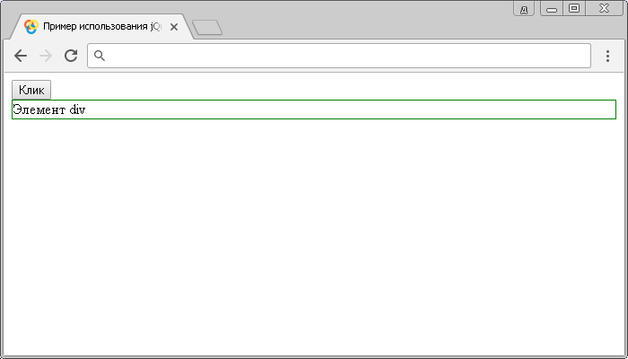

# .dblclick()

Метод **`.dblclick()`** привязывает JavaScript обработчик событий `dblclick` (двойной клик левой кнопкой мыши), или запускает это событие на выбранный элемент.

Следующие условия обязательно должны быть выполнены, чтобы событие `dblclick` сработало:

- Левая кнопка мыши нажата, когда курсор находился внутри элемента.
- Левая кнопка мыши отпущена пока курсор находится внутри элемента.
- Левая кнопка мыши нажата повторна пока курсор находится внутри элемента. Повторный клик левой кнопки мыши должен быть сделан в определенное временное окно, которое задается операционной системой пользователя.
- Левая кнопка мыши отпущена повторно пока курсор находится внутри элемента.

## Синтаксис

Синтаксис 1.0:

```js
$(selector).dblclick() // метод используется без параметров
$(selector).dblclick(handler)
```

- `handler` - `Function( Event eventObject )`

Синтаксис 1.4.3:

```js
$(selector).dblclick(eventData, handler)
```

- `eventData` - `Anything`
- `handler` - `Function( Event eventObject )`

Метод `.dblclick()`, используемый вместе с функцией, переданной в качестве параметра (`handler`) является, короткой записью метода `.on()`, а без параметра является короткой записью метода `.trigger()`:

```js
$(selector).on('dblclick', handler)
$(selector).trigger('dblclick')
```

Добавлен в версии jQuery 1.0 (синтаксис обновлен в версии 1.4.3)

## Параметры

`eventData`
: Объект, содержащий данные, которые будут переданы в обработчик событий.

`handler`
: Функция, которая будет выполнена каждый раз, когда событие срабатывает. Функция в качестве параметра может принимать объект `Event`.

## Пример

```html
<!DOCTYPE html>
<html>
  <head>
    <title>
      Использование jQuery метода .dblclick() (без параметров и с функцией)
    </title>
    <script src="https://ajax.googleapis.com/ajax/libs/jquery/3.1.0/jquery.min.js"></script>
    <script>
      $(document).ready(function() {
        $('button').click(function() {
          // задаем функцию при нажатиии на элемент <button>
          $('div').dblclick() // вызываем событие dblclick на элементе <div>
        })
        $('div').dblclick(function() {
          // задаем функцию при двойном клике на элементе <div>
          $('div').toggle() // отображаем, или скрываем элемент
        })
      })
    </script>
  </head>
  <body>
    <button>Клик</button>
    <div style="border:1px solid green">Элемент div</div>
  </body>
</html>
```

В этом примере с использованием метода `.dblclick()` мы при нажатии на элемент `<button>` (кнопка) вызываем событие `dblclick` на элементе `<div>`. Самому элементу `<div>` задаем, что при срабатывании события `dblclick` на элементе выполнить функцию, которая с использованием метода `.toggle()` отобразит, или скроет элемент.

Если мы вызываем напрямую событие `dblclick` на элемент `<div>`, то мы его можем только скрыть, по той причине, что напрямую кликнуть по скрытому элементу нельзя, но мы можем опять отобразить этот элемент кликнув по кнопке, которая симулирует щелчок по этому элементу.

Результат:



Пример использования метода `.dblclick()` (без параметров и с функцией)
