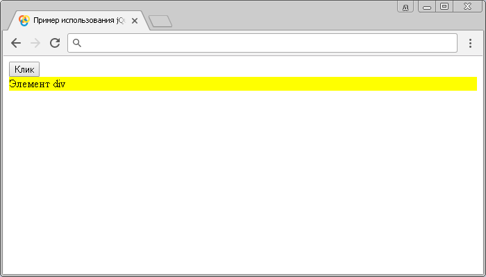
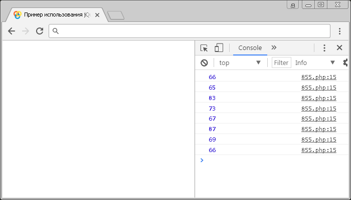

# .keyup()

Метод **`.keyup()`** привязывает JavaScript обработчик событий `keyup` (нажатая клавиша была отпущена), или запускает это событие на выбранный элемент.

Событие `keyup` посылается элементу в тот момент, когда пользователь отпустит нажатую клавишу на клавиатуре. Если эта клавиша удерживается нажатой, то событие не сработает до того момента, пока пользователь её не отпустит. Это событие может быть прикреплено к любому элементу, но сработает только на тех элементах, которые имеют фокус.

Обратите внимание, что событие `keyup` по аналогии с событием `keydown` (метод `.keydown()`) срабатывает на любой кнопке (включая специальные - Alt, Ctrl, Shift, Esc, PrScr и тому подобное).

## Синтаксис

Синтаксис 1.0:

```js
$(selector).keyup() // метод используется без параметров

$(selector).keyup(handler)
```

- `handler` - `Function( Event eventObject )`

Синтаксис 1.4.3:

```js
$(selector).keyup(eventData, handler)
```

- `eventData` - `Anything`
- `handler` - `Function( Event eventObject )`

Обращаю Ваше внимание, что метод `.keyup()`, используемый вместе с функцией, переданной в качестве параметра (handler) является, короткой записью метода `.on()`, а без параметра является короткой записью метода `.trigger()`:

```js
$(selector).on('keyup', handler)
$(selector).trigger('keyup')
```

Добавлен в версии jQuery 1.0 (синтаксис обновлен в версии 1.4.3)

## Параметры

`eventData`
: Объект, содержащий данные, которые будут переданы в обработчик событий.

`handler`
: Функция, которая будет выполнена каждый раз, когда событие срабатывает. Функция в качестве параметра может принимать объект `Event`.

## Примеры

### Пример 1

```html
<!DOCTYPE html>
<html>
  <head>
    <title>
      Использование jQuery метода .keyup() (без параметров и с функцией)
    </title>
    <script src="https://ajax.googleapis.com/ajax/libs/jquery/3.1.0/jquery.min.js"></script>
    <script>
      $(document).ready(function() {
        $('button').click(function() {
          // задаем функцию при нажатиии на элемент button
          $('div').keyup() // вызываем событие keyup на элементе <div>
        })
        $('div').keyup(function() {
          // задаем функцию при отпускании после нажатия любой клавиши клавиатуры на элементе
          $('div').css('background', 'yellow') // задаем цвет заднего фона элемента
        })
      })
    </script>
  </head>
  <body>
    <button>Клик</button>
    <div>Элемент div</div>
  </body>
</html>
```

В этом примере с использованием метода `.keyup()` мы при нажатии на элемент `<button>` (кнопка) вызываем событие `keyup` на элементе `<div>`. Самому элементу `<div>` задаем, что при срабатывании события `keyup` на элементе выполнить функцию, которая с использованием метода `.css()` установит цвет заднего фона элемента желтым.

Обратите внимание, что напрямую мы не можем вызвать у элемента `<div>` событие `keyup` по той причине, что элемент не может получить фокус.

Результат:



Пример использования jQuery метода `.keyup()` (без параметров и с функцией)

### Пример 2

Рассмотрим следующий пример в котором с помощью метода `.keyup()` будем выводить в консоль браузера код нажатой пользователем клавиши на клавиатуре:

```html
<!DOCTYPE html>
<html>
  <head>
    <title>
      Использование jQuery метода .keyup() (вывод кода нажатой клавиши)
    </title>
    <script src="https://ajax.googleapis.com/ajax/libs/jquery/3.1.0/jquery.min.js"></script>
    <script>
      $(document).ready(function() {
        $('body').keyup(function(event) {
          // задаем функцию при отпускании после нажатия любой клавиши клавиатуры на элементе
          console.log(event.which) // выводим код нажатой клавиши
        })
      })
    </script>
  </head>
  <body></body>
</html>
```

В этом примере с использованием метода `.keyup()` мы при отпускании после нажатия любой клавиши на элементе `<body>` вызываем событие `keyup`, в котором вызываем функию, которая в качестве параметра принимает объект `Event` и выводим в консоль значения свойства `which` этого объекта, которое содержит код нажатой клавиши клавиатуры. В примере были нажаты и выведены в консоль коды клавиш на клавиатуре по очереди: `basicweb`. Обратите внимание на то, что мы в этом примере получаем код клавиши (скан-код), а не символа. Даже если мы бы ввели `basicweb` в русской раскладке результат вывода в консоль был бы тот же. Чтобы вывести код символа вы можете воспользоваться методом `.keypress()`.

Результат:



Пример использования метода `.keyup()` (вывод кода нажатой клавиши)
