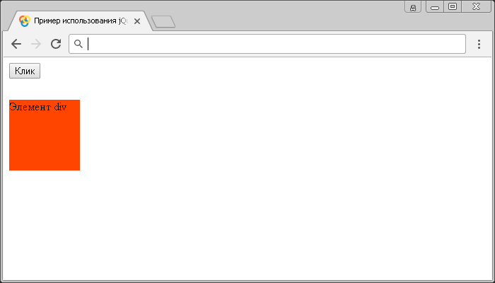
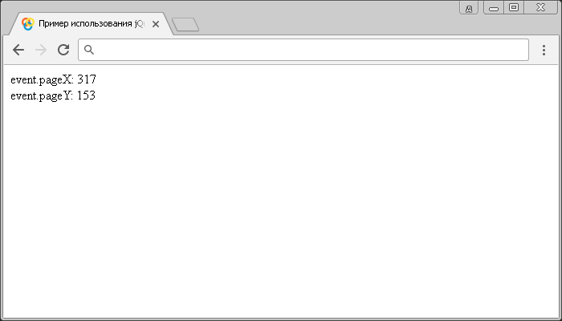

# .mousemove()

Метод `.mousemove()` привязывает JavaScript обработчик событий "`mousemove`" (срабатывает, когда указатель мыши перемещается внутри элемента), или запускает это событие на выбранный элемент.

Каждый раз, когда пользователь перемещает указатель мыши на один пиксель, событие "`mousemove`" срабатывает. Необходимо с осторожностью использовать это событие по той причине, что оно занимает много системных ресурсов при многократном вызове.

## Синтаксис

Синтаксис 1.0:

```js
$(selector).mousemove() // метод используется без параметров
$(selector).mousemove(handler)
```

- `handler` - `Function( Event eventObject )`

Синтаксис 1.4.3:

```js
$(selector).mousemove(eventData, handler)
```

- `eventData` - `Anything`
- `handler` - `Function( Event eventObject )`

Метод `.mousemove()`, используемый вместе с функцией, переданной в качестве параметра (`handler`) является, короткой записью метода `.on()`, а без параметра является короткой записью метода `.trigger()`:

```js
$(selector).on('mousemove', handler)
$(selector).trigger('mousemove')
```

Добавлен в версии jQuery 1.0 (синтаксис обновлен в версии 1.4.3)

## Параметры

`eventData`
: Объект, содержащий данные, которые будут переданы в обработчик событий.

`handler`
: Функция, которая будет выполнена каждый раз, когда событие срабатывает. Функция в качестве параметра может принимать объект `Event`.

## Пример

```html
<!DOCTYPE html>
<html>
  <head>
    <title>
      Использование jQuery метода .mousemove() (без параметров и с функцией)
    </title>
    <style>
      /* CSS стили */
    </style>
    <script src="https://ajax.googleapis.com/ajax/libs/jquery/3.1.0/jquery.min.js"></script>
    <script>
      $(document).ready(function() {
        $('button').click(function() {
          // задаем функцию при нажатиии на элемент <button>
          $('div').mousemove() // вызываем событие mousemove на элементе <div>
        })
        $('div').mousemove(function() {
          // задаем функцию при перемещении указателя
          $('div').toggleClass('orangered-bg') // добавляем, или убираем класс orangered-bg у элемента
        })
      })
    </script>
  </head>
  <body>
    <button>Клик</button>
    <div>Элемент div</div>
  </body>
</html>
```

В этом примере с использованием метода `.mousemove()` мы при нажатии на элемент `<button>` (кнопка) вызываем событие "`mousemove`" на элементе `<div>`. Самому элементу `<div>` задаем, что при срабатывании события "`mousemove`" на элементе выполнить функцию, которая с использованием метода `.toggleClass()` добавит, или уберет класс `orangered-bg` у элемента, что приводит к мерцанию заднего фона элемента при перемещении курсора над ним, так как событие вызывается многократно.

Результат нашего примера:



Пример использования jQuery метода `.mousemove()` (без параметров и с функцией)

Рассмотрим следующий пример в котором с помощью метода `.mousemove()` будем остлеживать координаты курсора:

```html
<!DOCTYPE html>
<html>
  <head>
    <title>Использование jQuery метода .mousemove() (координаты курсора)</title>
    <script src="https://ajax.googleapis.com/ajax/libs/jquery/3.1.0/jquery.min.js"></script>
    <script>
      $(document).ready(function() {
        $(document).mousemove(function(event) {
          // задаем функцию при перемещении курсора мыши над документом
          $('div:first').text('event.pageX: ' + event.pageX) // добавляем в первый элемент <div> в документе позицию курсора мыши относительно левого края документа
          $('div:last').text('event.pageY: ' + event.pageY) // добавляем в последний элемент <div> в документе позицию курсора мыши относительно верхнего края документа
        })
      })
    </script>
  </head>
  <body>
    <div></div>
    <div></div>
  </body>
</html>
```

В этом примере с использованием метода `.mousemove()` мы при перемещении курсора мыши над документом задаем функцию, которая в качестве параметра получает объект `Event`. С использованием метода `.text()` и свойств объекта `Event` (`event.pageX` и `event.pageY`) добавляем в первый и последний элемент `<div>` информацию о позиции курсора мыши относительно левого и верхнего края документа (вместо `document` можно указать любой интересующий Вас элемент и узнать позицию курсора относительно этого элемента, а не всего документа).

Результат нашего примера:



Пример использования метода `.mousemove()` (координаты курсора).
