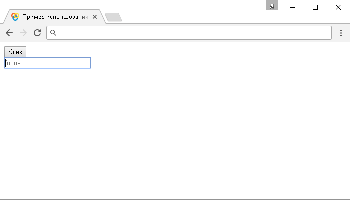
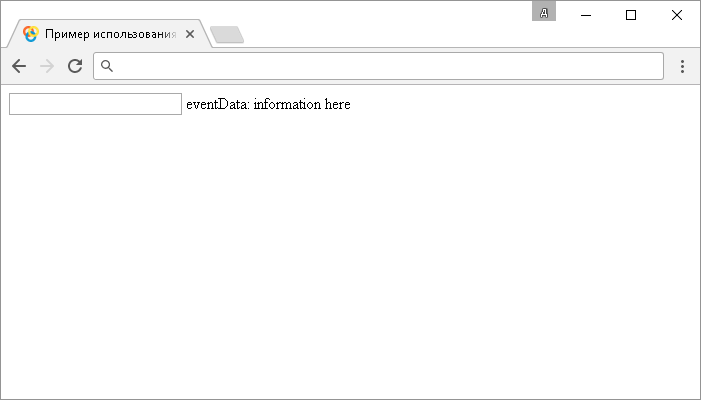

# .blur()

Метод **`.blur()`** привязывает JavaScript обработчик событий "`blur`" (потеря фокуса элементом), или запускает это событие на выбранный элемент.

## Синтаксис

Синтаксис 1.0:

```js
$(selector).blur() // метод используется без параметров
$(selector).blur(handler)
```

- `handler` - `Function( Event eventObject )`

Синтаксис 1.4.3:

```js
$(selector).blur(eventData, handler)
```

- `eventData` - `Anything`
- `handler` - `Function( Event eventObject )`

Метод `.blur()`, используемый вместе с функцией, переданной в качестве параметра (`handler`) является, короткой записью метода `.on()`, а без параметра является короткой записью метода `.trigger()`:

```js
$(selector).on('blur', handler)
$(selector).trigger('blur')
```

Добавлен в версии jQuery 1.0 (синтаксис обновлен в версии 1.4.3)

## Параметры

`eventData`
: Объект, содержащий данные, которые будут переданы в обработчик событий.

`handler`
: Функция, которая будет выполнена каждый раз, когда событие срабатывает. Функция в качестве параметра может принимать объект `Event`.

## Пример

```html
<!DOCTYPE html>
<html>
  <head>
    <title>
      Использование jQuery метода .blur() (без параметров и с функцией)
    </title>
    <script src="https://ajax.googleapis.com/ajax/libs/jquery/3.1.0/jquery.min.js"></script>
    <script>
      $(document).ready(function() {
        // задаем функцию при нажатиии на элемент <button>
        $('button').click(function() {
          // вызываем событие blur на элементе <div>
          $('div').blur()
        })

        // задаем функцию при получении фокуса элементом <input>
        $('input').focus(function() {
          // добавляем элементу <input> атрибут placeholder со значением focus
          $('div').attr('placeholder', 'focus')
        })

        // задаем функцию при потери фокуса элементом <input>
        $('input').blur(function() {
          // добавляем элементу <input> атрибут placeholder со значением blur
          $('div').attr('placeholder', 'blur')
        })
      })
    </script>
  </head>
  <body>
    <button>Клик</button>
    <input />
  </body>
</html>
```

В этом примере с использованием метода `.blur()` мы при нажатии на элемент `<button>` (кнопка) вызываем событие "`blur`" на элементе `<input>`. Самому элементу `<input>` задаем, что при срабатывании события "`blur`" на элементе выполнить функцию, которая с использованием метода `.attr()` добавляет атрибут `placeholder` со значением `blur`.

Кроме того, мы с использованием метода `.focus()` устанавливаем, что при получении фокуса элементом `<input>` вызвать функцию, которая с использованием метода `.attr()` добавляет атрибут `placeholder` со значением `focus`.

Результат:



Пример использования метода `.blur()` (без параметров и с функцией)

Рассмотрим следующий пример, в котором мы используем метод `.blur()` с двумя параметрами:

```html
<!DOCTYPE html>
<html>
  <head>
    <title>Использование jQuery метода .blur() (с двумя параметрами)</title>
    <script
      sr="https://ajax.googleapis.com/ajax/libs/jquery/3.1.0/jquery.min.js"
    ></script>
    <script>
      $(document).ready(function() {
        // создаем переменную, которая будет передана в объект Event
        var eventData = { myData: 'information here' }
        // задаем функцию при потере фокуса и передаем данные в объект события
        $('input').blur(eventData, function(event) {
          // выводим значение свойства data Объекта Event
          $('span').text('eventData: ' + event.data.myData)
        })
      })
    </script>
  </head>
  <body>
    <input />
    <span></span>
  </body>
</html>
```

В этом примере с использованием метода `.blur()` мы при при потере фокуса элементом `<input>` задаем функцию, которая передает данные в объект события `Event` (значение созданной переменной) и методом `.text()` выводим в элементе `<span>` эти данные с использованием свойства `data` объекта `Event`.

Результат:



Пример использования метода `.blur()` (без параметров и с функцией)
