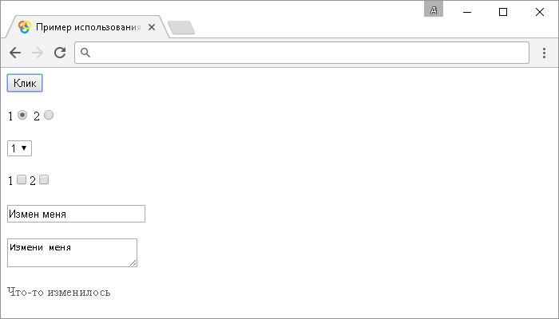

# .change()

Метод **`.change()`** привязывает JavaScript обработчик событий "`change`" (изменение элемента), или запускает это событие на выбранный элемент. Метод используется с элементами HTML формы.

Событие "`select`" срабатывает, когда значение элемента формы меняется (элементы `<input>`, `<textarea>` и элементы `<select>`). Для таких элементов как радио-кнопки, флаговые кнопки и элементы раскрывающегося списка, событие "`select`" вызывается немедленно после того как пользователь сделает выбор, а для элементов с текстовым содержимым откладывается до того момента пока элемент управления не потеряет фокус (например, такие элементы как `<input>` с текстовым типом `type="text"`, или `<textarea>`).

Если значение элемента изменяется с использованием JavaScript, например с использованием метода `.val()`, то событие "`change`" не вызывается.

## Синтаксис

Синтаксис 1.0:

```js
$(selector).change() // метод используется без параметров
$(selector).change(handler)
```

- `handler` - `Function( Event eventObject )`

Синтаксис 1.4.3:

```js
$(selector).change(eventData, handler)
```

- `eventData` - `Anything`
- `handler` - `Function( Event eventObject )`

Обращаю Ваше внимание, что метод `.change()`, используемый вместе с функцией, переданной в качестве параметра (`handler`) является, короткой записью метода `.on()`, а без параметра является короткой записью метода `.trigger()`:

```js
$(selector).on('change', handler)
$(selector).trigger('change')
```

Добавлен в версии jQuery 1.0 (синтаксис обновлен в версии 1.4.3)

## Параметры

`eventData`
: Объект, содержащий данные, которые будут переданы в обработчик событий.

`handler`
: Функция, которая будет выполнена каждый раз, когда событие срабатывает. Функция в качестве параметра может принимать объект `Event`.

## Пример

```html
<!DOCTYPE html>
<html>
  <head>
    <title>
      Использование jQuery метода .change() (без параметров и с функцией)
    </title>
    <script src="https://ajax.googleapis.com/ajax/libs/jquery/3.1.0/jquery.min.js"></script>
    <script>
      $(document).ready(function() {
        $('button').click(function() {
          // задаем функцию при нажатиии на элемент <button>
          $('textarea').change() // вызываем событие change на элементе <textarea>
        })

        // задаем функцию при срабатывании события change на элементе
        // с которым взаимодействует пользователь
        $(this).change(function() {
          $('p')
            .css('display', 'block') // задаем, что элемент <p> становится блочным
            .text('Что-то изменилось') // добавляем текстовое содержимое
            .fadeOut(750) //  плавно изменяем прозрачность для элемента
        })
      })
    </script>
  </head>
  <body>
    <button>Клик</button>
    1<input type="radio" name="smth" /> 2<input
      type="radio"
      name="smth"
    /><br /><br />
    <select>
      <option>1</option>
      <option>2</option>
      <option>3</option> </select
    ><br /><br />
    1<input type="checkbox" />2<input type="checkbox" /><br /><br />
    <input value="Измени меня" /><br /><br />
    <textarea>Измени меня</textarea>
    <p></p>
  </body>
</html>
```

В этом примере с использованием метода `.change()` мы при нажатии на элемент `<button>` (кнопка) вызываем событие "`change`" на элементе `<textarea>`. Вместо этого элемента можно было использовать любой другой элемент в этом примере.

Обратите внимание, что `$(this)` ссылается на тот элемент с которым в настоящее время взаимодействует пользователь и при срабатывании события "`change`" на этом элементе выполняется функция, которая запускает выполнение цепочки следующих методов jQuery:

- С помощью метода `.css()` делает элемент `<p>` блочным. Это необходимо для того, чтобы отобразить этот элемент после первого вызова, так как, используемый метод `.fadeOut()` по завершению эффекта добавляет элементу значение свойства `display` со значением `none` (элемент не отображается в документе).
- С помощью метода `.text()` добавляем текстовое содержимое.
- С помощью метода `.fadeOut()` плавно изменяем прозрачность для элемента (из видимого состояния в скрытое) за 750 миллисекунд (0,75 секунды).

Результат:



Пример использования метода `.change()` (без параметров и с функцией)
