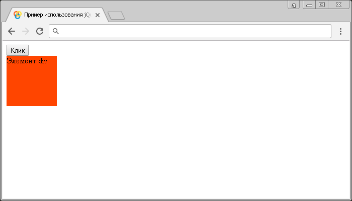

# contextmenu()

Метод **`.contextmenu()`** привязывает JavaScript обработчик событий `contextmenu` (вызов контекстного меню на элементе - клик правой кнопкой мыши), или запускает это событие на выбранный элемент.

## Синтаксис

Синтаксис 1.0:

```js
$(selector).contextmenu() // метод используется без параметров
$(selector).contextmenu(handler)
```

- `handler` - `Function( Event eventObject )`

Синтаксис 1.4.3:

```js
$(selector).contextmenu(eventData, handler)
```

- `eventData` - `Anything`
- `handler` - `Function( Event eventObject )`

Метод `.contextmenu()`, используемый вместе с функцией, переданной в качестве параметра (`handler`) является, короткой записью метода `.on()`, а без параметра является короткой записью метода `.trigger()`:

```js
$(selector).on('contextmenu', handler)
$(selector).trigger('contextmenu')
```

Добавлен в версии jQuery 1.0 (синтаксис обновлен в версии 1.4.3)

## Параметры

`eventData`
: Объект, содержащий данные, которые будут переданы в обработчик событий.

`handler`
: Функция, которая будет выполнена каждый раз, когда событие срабатывает. Функция в качестве параметра может принимать объект `Event`.

## Пример

```html
<!DOCTYPE html>
<html>
  <head>
    <title>
      Использование jQuery метода .contextmenu() (без параметров и с функцией)
    </title>
    <style>
      /* CSS стили */
    </style>
    <script src="https://ajax.googleapis.com/ajax/libs/jquery/3.1.0/jquery.min.js"></script>
    <script>
      $(document).ready(function() {
        $('button').click(function() {
          // задаем функцию при нажатиии на элемент <button>
          $('div').contextmenu() // вызываем событие contextmenu на элементе <div>
        })
        $('div').contextmenu(function() {
          // задаем функцию при нажатиии на элемент <div>
          $('div').toggleClass('orangered-bg') // добавляем, или убираем класс orangered-bg у элемента
        })
      })
    </script>
  </head>
  <body>
    <button>Клик</button>
    <div>Элемент div</div>
  </body>
</html>
```

В этом примере с использованием метода `.contextmenu()` мы при нажатии на элемент `<button>` (кнопка) вызываем событие `contextmenu` на элементе `<div>`. Самому элементу `<div>` задаем, что при срабатывании события `contextmenu` на элементе выполнить функцию, которая с использованием метода `.toggleClass()` добавит, или уберет класс `orangered-bg` у элемента.

Результат:



Пример использования метода `.contextmenu()` (без параметров и с функцией)
