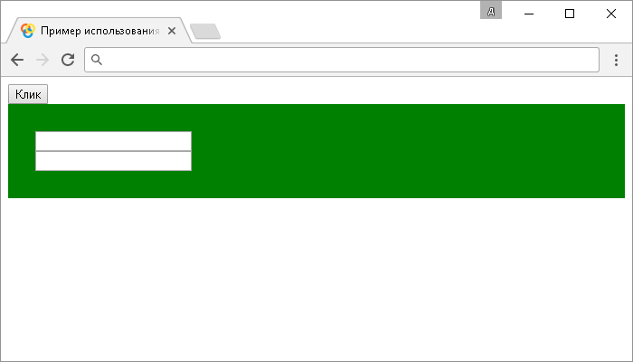

# .focusin()

Метод **`.focusin()`** привязывает JavaScript обработчик событий "`focusin`" (получение фокуса элементом, или любым вложенным элементом), или запускает это событие на выбранный элемент. Если Вам необходимо привязать JavaScript обработчик событий, который срабатывает при потере фокуса элемента, или любым вложенным элементом, то воспользуйтесь методом `.focusout()`.

Метод `.focusin()` в отличие от метода `.focus()` поддерживает всплывающие события (event bubbling).

## Синтаксис

Синтаксис 1.0:

```js
$(selector).focusin() // метод используется без параметров
```

Синтаксис 1.4:

```js
$(selector).focusin(handler)
```

- `handler` - `Function( Event eventObject )`

Синтаксис 1.4.3:

```js
$(selector).focusin(eventData, handler)
```

- `eventData` - `Anything`
- `handler` - `Function( Event eventObject )`

Метод `.focusin()`, используемый вместе с функцией, переданной в качестве параметра (`handler`), является короткой записью метода `.on()`, а без параметра является короткой записью метода `.trigger()`:

```js
$(selector).on('focusin', handler)
$(selector).trigger('focusin')
```

Добавлен в версии jQuery 1.0 (синтаксис обновлен в версии 1.4 и 1.4.3)

## Параметры

`eventData`
: Объект, содержащий данные, которые будут переданы в обработчик событий.

`handler`
: Функция, которая будет выполнена каждый раз, когда событие срабатывает. Функция в качестве параметра может принимать объект `Event`.

## Пример

```html
<!DOCTYPE html>
<html>
  <head>
    <title>
      Использование метода .focusin() (без параметров и с функцией)
    </title>
    <script src="https://ajax.googleapis.com/ajax/libs/jquery/3.1.0/jquery.min.js"></script>
    <script>
      $(document).ready(function() {
        $('button').click(function() {
          // задаем функцию при нажатиии на элемент <button>
          $('div').focusin() // вызываем событие focusin на элементе <div>
        })
        $('div').focusin(function() {
          // задаем функцию при получении фокуса элементом  <div>, или любым вложенным элементом
          $(this).css('background', 'red') // устанавливаем элементу <div> цвет заднего фона красный
        })
        $('div').focusout(function() {
          // задаем функцию при потере фокуса элементом  <div>, или любым вложенным элементо
          $(this).css('background', 'green') // устанавливаем элементу <div> цвет заднего фона зеленый
        })
      })
    </script>
  </head>
  <body>
    <button>Клик</button><br />
    <div style="padding:30px;">
      <input /><br />
      <input />
    </div>
  </body>
</html>
```

В этом примере с использованием метода `.focusin()` мы при нажатии на элемент `<button>` (кнопка) вызываем событие "`focusin`" на элементе `<div>`. Самому элементу `<div>` задаем, что при срабатывании события "`focusin`" выполнить функцию, которая с использованием метода `.css()` устанавливает цвет заднего цвета красный, а при срабатывании события "`focusout`" зеленый.

Результат:



Пример использования метода `.focusin()` (без параметров и с функцией)
