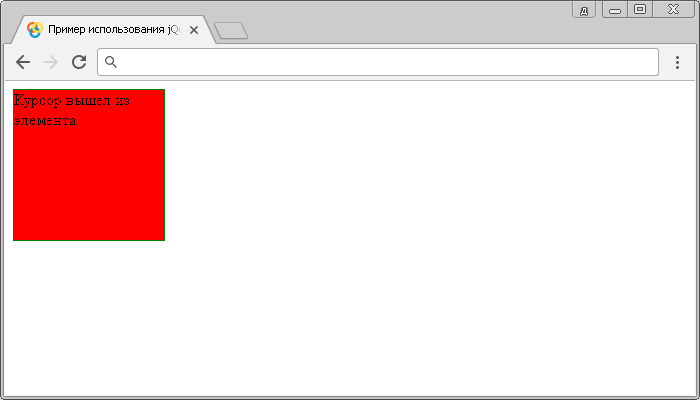

# .hover()

Метод **`.hover()`** связывает один или два обработчика событий для элемента, которые будут выполнены, когда указатель мыши находится на элементе и при его отведении.

## Синтаксис

Синтаксис 1.0:

```js
$(selector).hover(handlerIn, handlerOut)
```

- `handlerIn` - `Function( Event eventObject )`
- `handlerOut` - `Function( Event eventObject )`

Синтаксис 1.4:

```js
$(selector).hover(handlerInOut)
```

- `handlerInOut` - `Function( Event eventObject )`

Метод `.hover()` объединяет обработчики событий "`mouseenter`" (срабатывает, когда указатель мыши заходит на элемент) и "`mouseleave`" (срабатывает, когда указатель мыши выходит из элемента) и при вызове с двумя функциями в качестве параметров является короткой записью вызова методов `.mouseenter()` и `.mouseleave()`:

```js
$(selector)
  .mouseenter(handlerIn)
  .mouseleave(handlerOut)
```

Если в качестве параметра метода передается только одна функция, то она будет вызвана как при наведении указателя мыши на элемент, так и при выходе курсора с элемента.

Добавлен в версии jQuery 1.0 (синтаксис обновлен в версии 1.4)

## Параметры

`handlerIn`
: Функция, которая срабатывает, когда указатель мыши заходит на элемент. Функция в качестве параметра может принимать объект `Event`.

`handlerIn`
: Функция, которая срабатывает, когда указатель мыши выходит из элемента. Функция в качестве параметра может принимать объект `Event`.

`handlerInOut`
: Функция, которая срабатывает, когда указатель мыши заходит на элемент и выходит из элемента. Функция в качестве параметра может принимать объект `Event`.

## Пример

```html
<!DOCTYPE html>
<html>
  <head>
    <title>Использование jQuery метода .hover() (две функции)</title>
    <style>
      /* CSS стили */
    </style>
    <script src="https://ajax.googleapis.com/ajax/libs/jquery/3.1.0/jquery.min.js"></script>
    <script>
      $(document).ready(function() {
        $('div').hover(
          function() {
            // задаем функцию при наведении курсора на элемент
            $('div')
              .css('background', 'green') // задаем цвет заднего фона
              .text('Курсор на элементе') // задаем текстовое содержимое
          },
          function() {
            // задаем функцию, которая срабатывает, когда указатель выходит из элемента
            $('div')
              .css('background', 'red') // задаем цвет заднего фона
              .text('Курсор вышел из элемента') // задаем текстовое содержимое
          }
        )
      })
    </script>
  </head>
  <body>
    <div></div>
  </body>
</html>
```

В этом примере с использованием метода `.hover()` мы при наведении курсором мыши на элементе `<div>` задаем функцию, которая с использованием метода `.css()` задает цвет заднего фона элемента, а с использованием метода `.text()` задаем текстовое содержимое. После того как указатель выходит из элемента срабатывает вторая функция, которая также изменяет цвет заднего фона и изменяет текстовое содержимоей элемента `<div>`.

Результат:



Пример использования метода `.hover()` (две функции)

Рассмотрим следующий пример в котором передадим в качестве параметра метода `.hover()` одну функцию:

```html
<!DOCTYPE html>
<html>
  <head>
    <title>Использование jQuery метода .hover() (одна функция)</title>
    <style>
      /* CSS стили */
    </style>
    <script src="https://ajax.googleapis.com/ajax/libs/jquery/3.1.0/jquery.min.js"></script>
    <script>
      $(document).ready(function() {
        $('div').hover(function() {
          // задаем функцию при наведении курсора на элемент и при его отведении
          $(this).toggleClass('background-red') // добавляем, или убираем класс у текущего элемента div
        })
      })
    </script>
  </head>
  <body>
    <div></div>
  </body>
</html>
```

В этом примере с использованием метода `.hover()` мы при наведении курсором мыши на элементе `<div>` задаем функцию, которая с использованием метода `.toggleClass()` добавляет класс элементу при наведении, и убирает класс у элемента, когда курсор выходит за элемент, то есть мы используем одну функцию для двух событий.

Результат:


Пример использования метода `.hover()` (одна функция)
