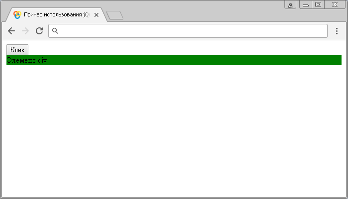
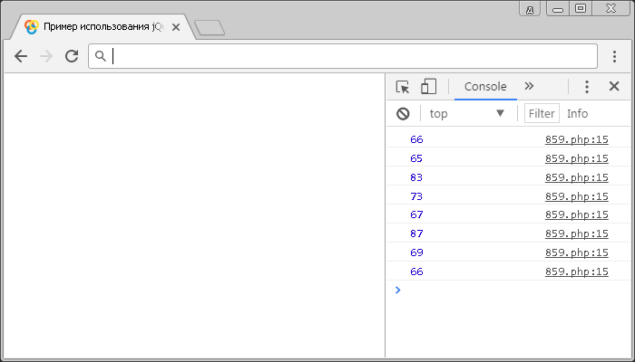

# .keydown()

Метод **`.keydown()`** позволяет привязать JavaScript обработчик событий `keydown` (нажатие на любую клавишу клавиатуры), или запускает это событие на выбранный элемент.

Событие `keydown` посылается элементу в тот момент, когда пользователь нажимает клавишу на клавиатуре. Если эта клавиша удерживается нажатой, то событие вызывается многократно. Это событие может быть прикреплено к любому элементу, но сработает только на тех элементах, которые имеют фокус.

Событие `keydown` в отличии от события `keypress` (метод `.keypress()`), которое не срабатывает на специальных кнопках (`Alt`, `Ctrl`, `Shift`, `Esc`, `PrScr` и тому подобное), срабатывает при нажатии на любую кнопку.

## Синтаксис

Синтаксис 1.0:

```js
$(selector).keydown() // метод используется без параметров

$(selector).keydown(handler)
```

- `handler` - `Function( Event eventObject )`

Синтаксис 1.4.3:

```js
$(selector).keydown(eventData, handler)
```

- `eventData` - `Anything`
- `handler` - `Function( Event eventObject )`

Метод `.keydown()`, используемый вместе с функцией, переданной в качестве параметра (`handler`) является, короткой записью метода `.on()`, а без параметра является короткой записью метода `.trigger()`:

```js
$(selector).on('keydown', handler)
$(selector).trigger('keydown')
```

Добавлен в версии jQuery 1.0 (синтаксис обновлен в версии 1.4.3)

## Параметры

`eventData`
: Объект, содержащий данные, которые будут переданы в обработчик событий.

`handler`
: Функция, которая будет выполнена каждый раз, когда событие срабатывает. Функция в качестве параметра может принимать объект `Event`.

## Примеры

### Пример 1

```html
<!DOCTYPE html>
<html>
  <head>
    <title>
      Использование jQuery метода .keydown() (без параметров и с функцией)
    </title>
    <script src="https://ajax.googleapis.com/ajax/libs/jquery/3.1.0/jquery.min.js"></script>
    <script>
      $(document).ready(function() {
        $('button').click(function() {
          // задаем функцию при нажатиии на элемент button
          $('div').keydown() // вызываем событие keydown на элементе <div>
        })
        $('div').keydown(function() {
          // задаем функцию при нажатиии любой клавиши клавиатуры на элементе
          $('div').css('background', 'green') // задаем цвет заднего фона элемента
        })
      })
    </script>
  </head>
  <body>
    <button>Клик</button>
    <div>Элемент div</div>
  </body>
</html>
```

В этом примере с использованием метода `.keydown()` мы при нажатии на элемент `<button>` (кнопка) вызываем событие `keydown` на элементе `<div>`. Самому элементу `<div>` задаем, что при срабатывании события `keydown` на элементе выполнить функцию, которая с использованием метода `.css()` установит цвет заднего фона элемента зелёным.

Напрямую мы не можем вызвать у элемента `<div>` событие `keydown` по той причине, что элемент не может получить фокус.

Результат:



Пример использования метода `.keydown()` (без параметров и с функцией)

### Пример 2

Рассмотрим следующий пример в котором с помощью метода `.keydown()` будем выводить в консоль браузера код нажатой пользователем клавиши на клавиатуре:

```html
<!DOCTYPE html>
<html>
  <head>
    <title>
      Использование jQuery метода .keydown() (вывод кода нажатой клавиши)
    </title>
    <script src="https://ajax.googleapis.com/ajax/libs/jquery/3.1.0/jquery.min.js"></script>
    <script>
      $(document).ready(function() {
        $('body').keydown(function(event) {
          // задаем функцию при нажатиии любой клавиши клавиатуры на элементе
          console.log(event.which) // выводим код нажатой клавиши
        })
      })
    </script>
  </head>
  <body></body>
</html>
```

В этом примере с использованием метода `.keydown()` мы при нажатии на элементе `<body>` вызываем событие `keydown`, в котором вызываем функию, которая в качестве параметра принимает объект `Event` и выводим в консоль значения свойства `which` этого объекта, которое содержит код нажатой клавиши клавиатуры. В нашем примере были нажаты и выведены в консоль коды клавиш на клавиатуре по очереди: `basicweb`. Обратите внимание на то, что мы в этом примере получаем код клавиши (скан-код), а не символа. Даже если мы бы ввели `basicweb` в русской раскладке результат вывода в консоль был бы тот же. Чтобы вывести код символа вы можете воспользоваться методом `.keypress()`.

Результат нашего примера:



Пример использования jQuery метода `.keydown()` (вывод кода нажатой клавиши)
