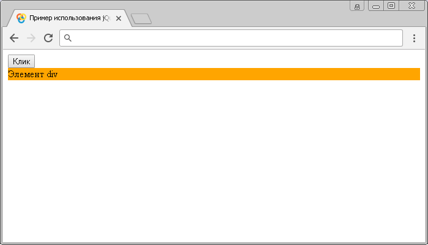
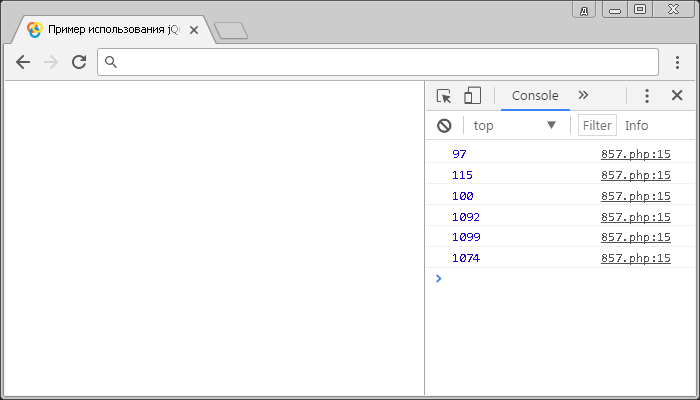

# keypress()

Метод **`.keypress()`** привязывает JavaScript обработчик событий `keypress` (нажатие на любую клавишу клавиатуры кроме специальных - Alt, Ctrl, Shift, Esc, PrScr и тому подобные), или запускает это событие на выбранный элемент.

Обратите внимание, что событие `keypress` может иметь различное поведение в браузерах в связи с отсутствием единого стандарта. Событие `keypress` посылается элементу в тот момент, когда браузер пользователя регистрирует ввод с клавиатуры. Если эта клавиша удерживается нажатой, то событие вызывается многократно. Это событие может быть прикреплено к любому элементу, но сработает только на тех элементах, которые имеют фокус.

Обратите внимание, что событие `keydown` (метод `.keydown()`) в отличии от события `keypress`, которое не срабатывает на специальных кнопках (Alt, Ctrl, Shift, Esc, PrScr и тому подобное), срабатывает при нажатии на любую кнопку.

## Синтаксис

Синтаксис 1.0:

```js
$(selector).keypress() // метод используется без параметров

$(selector).keypress(handler)
```

- `handler` - `Function( Event eventObject )`

Синтаксис 1.4.3:

```js
$(selector).keypress(eventData, handler)
```

- `eventData` - `Anything`
- `handler` - `Function( Event eventObject )`

Метод `.keypress()`, используемый вместе с функцией, переданной в качестве параметра (handler) является, короткой записью метода `.on()`, а без параметра является короткой записью метода `.trigger()`:

```js
$(selector).on('keypress', handler)

$(selector).trigger('keypress')
```

Добавлен в версии jQuery 1.0 (синтаксис обновлен в версии 1.4.3)

## Параметры

`eventData`
: Объект, содержащий данные, которые будут переданы в обработчик событий.

`handler`
: Функция, которая будет выполнена каждый раз, когда событие срабатывает. Функция в качестве параметра может принимать объект `Event`.

## Примеры

### Пример 1

```html
<!DOCTYPE html>
<html>
  <head>
    <title>
      Использование jQuery метода .keypress() (без параметров и с функцией)
    </title>
    <script src="https://ajax.googleapis.com/ajax/libs/jquery/3.1.0/jquery.min.js"></script>
    <script>
      $(document).ready(function() {
        $('button').click(function() {
          // задаем функцию при нажатиии на элемент button
          $('div').keypress() // вызываем событие keypress на элементе <div>
        })
        $('div').keypress(function() {
          // задаем функцию при нажатиии любой, кроме специальных клавиш клавиатуры на элементе
          $('div').css('background', 'orange') // задаем цвет заднего фона элемента
        })
      })
    </script>
  </head>
  <body>
    <button>Клик</button>
    <div>Элемент div</div>
  </body>
</html>
```

В этом примере с использованием метода `.keypress()` мы при нажатии на элемент `<button>` (кнопка) вызываем событие `keypress` на элементе `<div>`. Самому элементу `<div>` задаем, что при срабатывании события `keypress` на элементе выполнить функцию, которая с использованием метода `.css()` установит цвет заднего фона элемента оранжевым.

Обратите внимание, что напрямую мы не можем вызвать у элемента `<div>` событие `keypress` по той причине, что элемент не может получить фокус.

Результат:



Пример использования jQuery метода `.keypress()` (без параметров и с функцией)

## Пример 2

Рассмотрим следующий пример в котором с помощью метода `.keypress()` будем выводить в консоль браузера код символа нажатого пользователем на клавиатуре:

```html
<!DOCTYPE html>
<html>
  <head>
    <title>
      Использование jQuery метода .keypress() (вывод кода символа нажатой
      клавиши)
    </title>
    <script src="https://ajax.googleapis.com/ajax/libs/jquery/3.1.0/jquery.min.js"></script>
    <script>
      $(document).ready(function() {
        $('body').keypress(function(event) {
          // задаем функцию при нажатиии любой, кроме специальной клавиши клавиатуры на элементе
          console.log(event.which) // выводим код символа нажатой клавиши
        })
      })
    </script>
  </head>
  <body></body>
</html>
```

В этом примере с использованием метода `.keypress()` мы при нажатии на элементе `<body>` вызываем событие `keypress`, в котором вызываем функию, которая в качестве параметра принимает объект `Event` и выводим в консоль значения свойства `which` этого объекта, которое содержит код символа нажатой клавиши клавиатуры. В нашем примере были нажаты и выведены в консоль следующие коды символов по очереди: `asdфыв`. Обратите внимание на то, что мы в этом примере получаем код символа, а не клавиши (скан-код). Получить скан-код вы можете с использованием метода `.keydown()`, независимо от расскладки клавиатуры скан-код будет один.

Результат:



Пример использования jQuery метода `.keypress()` (вывод кода симола нажатой клавиши)
