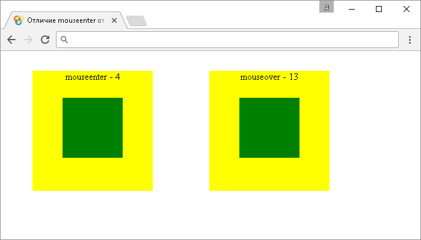

# .mouseenter()

Метод **`.mouseenter()`** привязывает JavaScript обработчик событий "`mouseenter`" (срабатывает, когда указатель мыши заходит на элемент), или запускает это событие на выбранный элемент.

В отличие от события "`mouseover`", событие "`mouseenter`" срабатывает только тогда, когда указатель мыши входит в выбранный элемент. Событие "`mouseover`" срабатывает даже тогда, когда указатель мыши переходит с родительского элемента на дочерний (вложенный) и с дочернего элемента обратно на родительский не смотря на то, что указатель в этот момент не покидал пределы родительского элемента (event bubbling).

## Синтаксис

Синтаксис 1.0:

```js
$(selector).mouseenter() // метод используется без параметров
$(selector).mouseenter(handler)
```

- `handler` - `Function( Event eventObject )`

Синтаксис 1.4.3:

```js
$(selector).mouseenter(eventData, handler)
```

- `eventData` - `Anything`
- `handler` - `Function( Event eventObject )`

Метод `.mouseenter()`, используемый вместе с функцией, переданной в качестве параметра (`handler`) является, короткой записью метода `.on()`, а без параметра является короткой записью метода `.trigger()`:

```js
$(selector).on('mouseenter', handler)
$(selector).trigger('mouseenter')
```

Добавлен в версии jQuery 1.0 (синтаксис обновлен в версии 1.4.3)

## Параметры

`eventData`
: Объект, содержащий данные, которые будут переданы в обработчик событий.

`handler`
: Функция, которая будет выполнена каждый раз, когда событие срабатывает. Функция в качестве параметра может принимать объект `Event`.

## Пример

```html
<!DOCTYPE html>
<html>
  <head>
    <title>
      Использование jQuery метода .mouseenter() (без параметров и с функцией)
    </title>
    <style>
      /* CSS стили */
    </style>
    <script src="https://ajax.googleapis.com/ajax/libs/jquery/3.1.0/jquery.min.js"></script>
    <script>
      $(document).ready(function() {
        $('button').click(function() {
          // задаем функцию при нажатиии на элемент <button>
          $('div').mouseenter() // вызываем событие mouseenter на элементе <div>
        })
        $('div').mouseenter(function() {
          // задаем функцию при вхождении указателя мыши в элемент <div>
          $('div').css('background', 'green') // изменяем цвет заднего фона
        })
        $('div').mouseleave(function() {
          // задаем функцию при выхождении указателя мыши из элемента <div>
          $('div').css('background', 'red') // изменяем цвет заднего фона
        })
      })
    </script>
  </head>
  <body>
    <button>Клик</button>
    <div>Элемент div</div>
  </body>
</html>
```

В этом примере с использованием метода `.mouseenter()` мы при нажатии на элемент `<button>` (кнопка) вызываем событие "`mouseenter`" на элементе `<div>`. Самому элементу `<div>` задаем, что при срабатывании события "`mouseenter`" на элементе выполнить функцию, которая с использованием метода `.css()` изменяет цвет заднего фона элемента. То есть мы вызываем событие `.mouseenter()` либо при нажатии на кнопку, либо при вхождении указателя мыши на элемент.

Кроме того, мы задаем функцию при выхождении указателя мыши из элемента `<div>` (событие `.mouseleave()`), которая по аналогии с предыдущим событием изменяет цвет заднего фона элемента.

Результат:


Пример использования jQuery метода `.mouseenter()` (без параметров и с функцией)

Рассмотрим следующий пример в котором сравним разницу в срабатывании событий "`mouseenter`" и "`mouseover`":

```html
<!DOCTYPE html>
<html>
  <head>
    <title>Отличие событий mouseenter и mouseover</title>
    <style>
      /* CSS стили */
    </style>
    <script src="https://ajax.googleapis.com/ajax/libs/jquery/3.1.0/jquery.min.js"></script>
    <script>
      $(document).ready(function() {
        var enter = 0 // переменная (счетчик возникновения события)
        $('.enter').mouseenter(function() {
          // задаем функцию при вхождении указателя мыши в элемент с классом .enter (событие mouseenter)
          enter++ // инкремент
          $('.enter span').text('mouseenter - ' + enter) // выводим количество срабатываний события
        })
        var over = 0 // переменная (счетчик возникновения события)
        $('.over').mouseover(function() {
          // задаем функцию при вхождении указателя мыши в элемент с классом .over (событие mouseover)
          over++ // инкремент
          $('.over span').text('mouseover - ' + over) // выводим количество срабатываний события
        })
      })
    </script>
  </head>
  <body>
    <div class="enter">
      <span>mouseenter - </span>
      <div></div>
    </div>
    <div class="over">
      <span>mouseover - </span>
      <div></div>
    </div>
  </body>
</html>
```

В этом примере для демонстрации отличий между событиями "`mouseenter`" и "`mouseover`" мы создали два отдельних родительских блока, содержащих в себе дочерние блоки. Обратите внимание, что событие "`mouseover`" срабатывает даже тогда, когда указатель мыши переходит с родительского элемента на дочерний (вложенный) и с дочернего элемента обратно на родительский не смотря на то, что указатель в этот момент не покидал пределы родительского элемента (event bubbling), а событие "`mouseenter`" срабатывает только когда указатель входит на родительский элемент, независимо от того перемещается он по дочерним элементам, или нет.

Результат:



Отличие событий `mouseenter` и `mouseover`.
