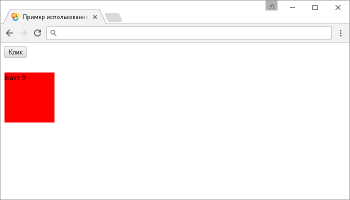
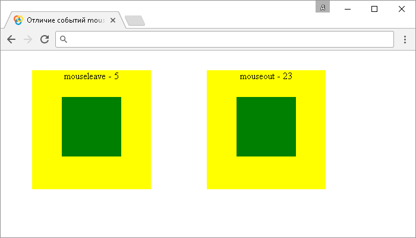

# mouseleave()

Метод **`.mouseleave()`** привязывает JavaScript обработчик событий "`mouseleave`" (срабатывает, когда указатель мыши выходит из элемента), или запускает это событие на выбранный элемент.

В отличие от события "`mouseout`", событие "`mouseeleave`" срабатывает только тогда, когда указатель мыши выходит из выбранного элемента. Событие "`mouseout`" срабатывает даже тогда, когда указатель мыши переходит с родительского элемента на дочерний (вложенный) и с дочернего элемента обратно на родительский не смотря на то, что указатель в этот момент не покидал пределы родительского элемента (event bubbling).

## Синтаксис

Синтаксис 1.0:

```js
$(selector).mouseleave() // метод используется без параметров
$(selector).mouseleave(handler)
```

- `handler` - `Function( Event eventObject )`

Синтаксис 1.4.3:

```js
$(selector).mouseleave(eventData, handler)
```

- `eventData` - `Anything`
- `handler` - `Function( Event eventObject )`

Метод `.mouseleave()`, используемый вместе с функцией, переданной в качестве параметра (`handler`) является, короткой записью метода `.on()`, а без параметра является короткой записью метода `.trigger()`:

```js
$(selector).on('mouseleave', handler)
$(selector).trigger('mouseleave')
```

Добавлен в версии jQuery 1.0 (синтаксис обновлен в версии 1.4.3)

## Параметры

`eventData`
: Объект, содержащий данные, которые будут переданы в обработчик событий.

`handler`
: Функция, которая будет выполнена каждый раз, когда событие срабатывает. Функция в качестве параметра может принимать объект `Event`.

## Пример

```html
<!DOCTYPE html>
<html>
  <head>
    <title>
      Использование jQuery метода .mouseleave() (без параметров и с функцией)
    </title>
    <style>
      /* CSS стили */
    </style>
    <script src="https://ajax.googleapis.com/ajax/libs/jquery/3.1.0/jquery.min.js"></script>
    <script>
      $(document).ready(function() {
        $('button').click(function() {
          // задаем функцию при нажатиии на элемент <button>
          $('div').mouseleave() // вызываем событие mouseleave на элементе <div>
        })
        $('div').mouseenter(function() {
          // задаем функцию при вхождении указателя мыши в элемент <div>
          $('div').css('background', 'green') // изменяем цвет заднего фона
        })
        var num = 0 // переменная (счетчик возникновения события)
        $('div').mouseleave(function() {
          // задаем функцию при выхождении указателя мыши из элемента <div>
          num++ // инкремент
          $('div').css('background', 'red') // изменяем цвет заднего фона
          $('div').text('leave ' + num) // выводим количество срабатываний события
        })
      })
    </script>
  </head>
  <body>
    <button>Клик</button>
    <div></div>
  </body>
</html>
```

В этом примере с использованием метода `.mouseleave()` мы при нажатии на элемент `<button>` (кнопка) вызываем событие "`mouseleave`" на элементе `<div>`. Самому элементу `<div>` задаем, что при срабатывании события "`mouseenter`" на элементе выполнить функцию, которая с использованием метода `.css()` изменяет цвет заднего фона элемента и с помощью метода `.text()` выводим текстовое содержимое и значение переменной, которая выступает в роли счетчика. То есть мы вызываем событие `.mouseleave()` либо при нажатии на кнопку, либо при вхождении указателя мыши на элемент.

Кроме того, мы задаем функцию при вхождении указателя мыши из элемента `<div>` (событие `.mouseenter()`), которая по аналогии с предыдущим событием изменяет цвет заднего фона элемента.

Результат:



Пример использования метода `.mouseleave()` (без параметров и с функцией)

Рассмотрим следующий пример в котором сравним разницу в срабатывании событий "`mouseleave`" и "`mouseout`":

```html
<!DOCTYPE html>
<html>
  <head>
    <title>Отличие событий mouseleave и mouseout</title>
    <style>
      /* CSS стили */
    </style>
    <script src="https://ajax.googleapis.com/ajax/libs/jquery/3.1.0/jquery.min.js"></script>
    <script>
      $(document).ready(function() {
        var leave = 0 // переменная (счетчик возникновения события)
        $('.leave').mouseleave(function() {
          // задаем функцию при выхождении указателя мыши из элемента с классом .leave (событие mouseleave)
          leave++ // инкремент
          $('.leave span').text('mouseleave - ' + leave) // выводим количество срабатываний события
        })
        var out = 0 // переменная (счетчик возникновения события)
        $('.out').mouseover(function() {
          // задаем функцию при выхождении указателя мыши из элемента с классом .out (событие mouseout)
          out++ // инкремент
          $('.out span').text('mouseout - ' + out) // выводим количество срабатываний события
        })
      })
    </script>
  </head>
  <body>
    <div class="leave">
      <span>mouseleave - </span>
      <div></div>
    </div>
    <div class="out">
      <span>mouseout - </span>
      <div></div>
    </div>
  </body>
</html>
```

В этом примере для демонстрации отличий между событиями "`mouseleave`" и "`mouseout`" мы создали два отдельних родительских блока, содержащих в себе дочерние блоки. Обратите внимание, что событие "`mouseout`" срабатывает даже тогда, когда указатель мыши переходит с родительского элемента на дочерний (вложенный) и с дочернего элемента обратно на родительский не смотря на то, что указатель в этот момент не покидал пределы родительского элемента (event bubbling), а событие "`mouseleave`" срабатывает только когда указатель выходит из родительского элемента, независимо от того перемещается он по дочерним элементам, или нет.

Результат:



Отличие событий `mouseleave` и `mouseout`.
