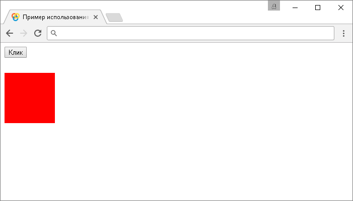
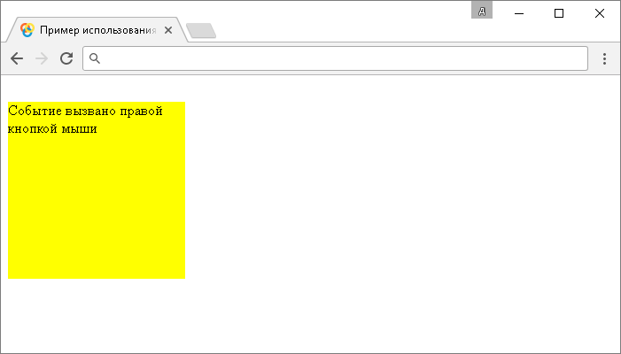

# .mouseup()

Метод **`.mouseup()`** привязывает JavaScript обработчик событий "`mouseup`"(срабатывает, когда указатель мыши находится над элементом и кнопка мыши отпущена), или запускает это событие на выбранный элемент.

Событие "`mouseup`" срабатывает при отпускании любой кнопки мыши, если вам необходимо определить какая конкретно отпущена кнопка, то вы можете воспользоваться свойством `which` объекта `Event`. Значению `1` соответствует левая кнопка, `2` - средняя кнопка и `3` для правой кнопки. Пример находится внизу страницы.

Если вам необходимо задать событие, которое срабатывает, когда указатель мыши находится над элементом и кнопка мыши нажата, то вы можете воспользоваться методом `.mousedown()`.

## Синтаксис

Синтаксис 1.0:

```js
$(selector).mouseup() // метод используется без параметров
$(selector).mouseup(handler)
```

- `handler` - `Function( Event eventObject )`

Синтаксис 1.4.3:

```js
$( selector ).mouseup eventData, handler )
```

- `eventData` - `Anything`
- `handler` - `Function( Event eventObject )`

Метод `.mouseup()`, используемый вместе с функцией, переданной в качестве параметра (`handler`) является, короткой записью метода `.on()`, а без параметра является короткой записью метода `.trigger()`:

```js
$(selector).on('mouseup', handler)
$(selector).trigger('mouseup')
```

Добавлен в версии jQuery 1.0 (синтаксис обновлен в версии 1.4.3)

## Параметры

`eventData`
: Объект, содержащий данные, которые будут переданы в обработчик событий.

`handler`
: Функция, которая будет выполнена каждый раз, когда событие срабатывает. Функция в качестве параметра может принимать объект `Event`.

## Пример

```html
<!DOCTYPE html>
<html>
  <head>
    <title>
      Использование jQuery метода .mouseup() (без параметров и с функцией)
    </title>
    <style>
      /* CSS стили */
    </style>
    <script src="https://ajax.googleapis.com/ajax/libs/jquery/3.1.0/jquery.min.js"></script>
    <script>
      $(document).ready(function() {
        $('button').click(function() {
          // задаем функцию при нажатиии на элемент <button>
          $('div').mouseup() // вызываем событие mouseup на элементе <div>
        })
        $('div').mousedown(function() {
          // задаем функцию при нажатии кнопки мыши на элементе <div>
          $('div').css('background', 'green') // изменяем цвет заднего фона
        })
        $('div').mouseup(function() {
          // задаем функцию, когда указатель мыши находится над элементом <div> и кнопка мыши отпускается
          $('div').css('background', 'red') // изменяем цвет заднего фона
        })
      })
    </script>
  </head>
  <body>
    <button>Клик</button>
    <div></div>
  </body>
</html>
```

В этом примере с использованием метода `.mouseup()` мы при нажатии на элемент `<button>` (кнопка) вызываем событие "`mouseup`" на элементе `<div>`. Самому элементу `<div>` задаем, что при срабатывании события "`mouseup`" на элементе выполнить функцию, которая с использованием метода `.css()` изменяет цвет заднего фона элемента. То есть мы вызываем событие `.mouseup()` либо при нажатии на кнопку, либо при отпускании кнопки мыши на элементе.

Кроме того, мы задаем функцию, когда указатель мыши находится над элементом и кнопка мыши нажимается (метод `.mousedown()`) и элементу `<div>` задаем зеленый цвет заднего фона.

Результат:



Пример использования метода `.mouseup()` (без параметров и с функцией)

В следующем примере мы рассмотрим пример в котором в зависимости от нажатой кнопки мыши будем выводить текстовое содержимое:

```html
<!DOCTYPE html>
<html>
  <head>
    <title>Пример вызова события mouseup в зависимости от нажатой кнопки</title>
    <style>
      /* CSS стили */
    </style>
    <script src="https://ajax.googleapis.com/ajax/libs/jquery/3.1.0/jquery.min.js"></script>
    <script>
      $(document).ready(function() {
        $('div').mouseup(function(event) {
          // задаем функцию при отпускании кнопки мыши на элементе <div>
          switch (
            event.which // передаем свойсто
          ) {
            case 1: // если отпущена левая кнопка (значение 1)
              $('div').text('Событие вызвано левой кнопкой мыши')
              break
            case 2: // если отпущена средняя кнопка (значение 2)
              $('div').text('Событие вызвано средней кнопкой мыши')
              break
            case 3: // если отпущена правая кнопка (значение 3)
              $('div').text('Событие вызвано правой кнопкой мыши')
              break
          }
        })
      })
    </script>
  </head>
  <body>
    <button>Клик</button>
    <div></div>
  </body>
</html>
```

В этом примере с использованием метода `.mouseup()` и свойства `which` объекта `Event` мы в зависимости от отпускания определенной кнопки выводим различное текстовое содержимое. Значению `1` соответствует левая кнопка, `2` - средняя кнопка и `3` для правой кнопки.

Результат:



Пример вызова события mouseup в зависимости от нажатой кнопки.
