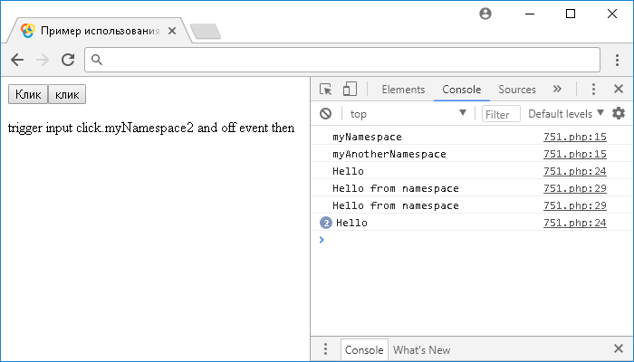
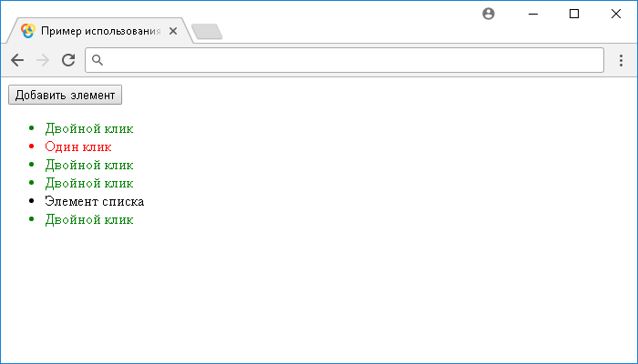
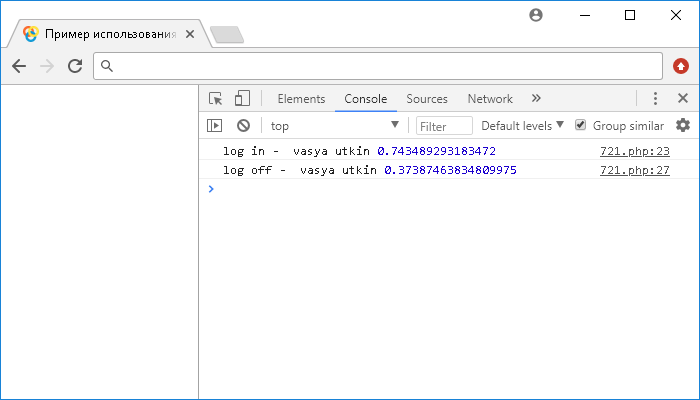

# on()

Метод **`.on()`** приcоединяет для выбранных элементов функцию обработчика события для одного, или нескольких событий.

## Синтаксис

Синтаксис 1.7:

```js
// назначение функции для одного, или нескольких событий
$(selector).on(events, selector, data, handler)
```

- `events` - `String`
- `selector` - `String`
- `data` - `Anything`
- `handler` - `Function( Event eventObject, Anything extraParams )`

```js
// назначение определенному событию, или событиям своей функции
$(selector).on(eventMap, selector, data)
```

- `eventMap` - `PlainObject`
- `selector` - `String`
- `data` - `Anything`

Добавлен в версии jQuery 1.7

## Параметры

`events`
: Один, или несколько разделенных пробелами типов событий (опционально допускается указывать пространство имен). Например: "`click`" или "`click dblclick.myNamespace`"

`eventMap`
: Объект, содержащий строковый ключ, или ключи, определяющие тип события, а в качестве значения этих ключей выступает функция, которая будет выполнена каждый раз, когда конкретное событие срабатывает. Например: `{"event": handler, "anotherEvent.myNamespace": anotherHandler}`

`selector`
: Строка селектора для фильтрации потомков выбранных элементов, запускающих событие. Обратите внимание, что если параметр отсутствует, или имеет значение `null`, то обработчик всегда вызывается при достижении выбранного элемента (не зависимо событие вызвано на элементе, или вложенном элементе).

`data`
: Какие-либо данные, или объект, содержащий данные, которые будут переданы в обработчик событий при его срабатывании (свойство объекта `Event` `event.data`).

`handler`
: Функция, которая будет выполнена каждый раз, когда событие срабатывает. Функция в качестве параметра может принимать объект `Event` и при необходимости дополнительные параметры для решения конкретной задачи. Значение `false` также может использоваться в качестве сокращенной записи функции, которая имеет тело `return false` (при вызове возвращает значение `false`).

## Пример

### Имена событий и пространства имён

Любые имена событий могут быть использованы в качестве аргумента события. jQuery будет проходить через стандартные типы событий JavaScript, вызывая функцию обработчик, в то время когда браузер их генерирует, откликаясь на те, или иные действия пользователя, например такое событие как нажатие левой кнопкой мыши на элемент.

Метод `.trigger()` может вызвать как стандартные имена событий браузера, так и пользовательские имена событий. Пользовательские имена событий должны содержать только алфавитно-цифровые символы, символ подчеркивания и двоеточие. Пространства имен, начинающиеся с подчеркивания, зарезервированы для использования библиотекой jQuery.

Пространства имен событий, или пользовательские имена событий упрощают удаление, или запуск необходимых обработчиков событий, по этой причине они зачастую используются при написании различных плагинов. Давайте рассмотрим использование пространств имен и пользовательских имен событий в jQuery на следующем примере:

```html
<!DOCTYPE html>
<html>
  <head>
    <title>Использование jQuery метода .on() (пространства имен)</title>
    <script src="https://ajax.googleapis.com/ajax/libs/jquery/3.1.0/jquery.min.js"></script>
    <script>
      $(document).ready(function() {
        // *** Первая часть примера ***
        $('button').on('myEvent.myNamespace.myAnotherNamespace', function(
          event
        ) {
          // задаем функцию при вызове события myEvent и назначаем два пространства имен
          console.log(event.namespace) // выводим в консоль имя пространства имен события
        })
        $('button').click(function(event) {
          // задаем функцию при нажатии на элемент <button>
          // вызываем событие myEvent пространства имен myNamespace
          $('button').trigger('myEvent.myNamespace')

          // вызываем событие myEvent пространства имен myAnotherNamespace
          $('button').trigger('myEvent.myAnotherNamespace')
        })
        // *** Вторая часть примера ***
        $('input').on({
          // прикрепляем обработчики для элемента <input>
          click: function() {
            // прикрепляем обработчик для события click
            console.log('Hello')
          },
          'click.myNamespace2': function() {
            // прикрепляем обработчики для события click пространства имен myNamespace2
            console.log('Hello from namespace')
          }
        })
        $('p').click(function() {
          // задаем функцию при нажатии на элемент <p>

          // вызываем событие click пространства имен myNamespace2
          $('input').trigger('click.myNamespace2')

          // отсоединяем событие click пространства имен myNamespace2
          $('input').off('click.myNamespace2')
        })
      })
    </script>
  </head>
  <body>
    <button>Клик</button>
    <input type="button" value="клик" />
    <p>trigger input click.myNamespace2 and off event then</p>
  </body>
</html>
```

В этом примере с использованием метода `.on()` мы приcоединяем для элемента `<button>` (кнопка) функцию обработчика события `myEvent` (пользовательское событие) и назначаем два пространства имен.

Кроме того, с помощью обработчика событий "`click`" (клик левой кнопкой мыши) задаем функцию при нажатии на элемент `<button>`, которая с помощью метода `.trigger()` вызывает два события "`myEvent.myNamespace`" и "`myEvent.myAnotherNamespace`" в результате чего в консоль будут выведены значения пространств имен объекта `Event` (свойство `event.namespace`).

Следующая часть примера демонстрирует работу с пространствами имен. С помощью метода `.on()` мы приcоединяем для элемента `<input>` обработчики событий "`click`" и "`click`" пространства имен `myNamespace2`.

При нажатии на элемент `<input>` будут срабатывать оба собтия и выводится два сообщения в консоль. Кроме того, мы с помощью обработчика событий "`click`" (клик левой кнопкой мыши) задаем функцию при нажатии на элемент `<p>`, которая вызывает событие "`click`" пространства имен `myNamespace2`, и затем с помощью метода `.off()` удаляет этот обработчик событий (при нажатии на `<input>` будет выводиться только одно сообщение).

Результат:



Пример использования метода `.on()` (пространства имен)

### Прямые и делегированные события

Метод `.on()` позволяет задать как прямые, так и делегированные события. За это отвечает параметр `selector` метода, в том случае, если он опущен, или равен `null` устанавливается прямой обработчик события, он вызывается каждый раз, когда событие происходит на выбранных элементах, независимо от того, происходит ли это непосредственно на элементе, или всплывает от дочернего (вложенного) элемента.

В том случае, если параметр `selector` указан, то в этом случае будет установлен делегированный обработчик события,он вызывается в том случае, когда событие происходит непосредственно на привязанном элементе (указанном в параметре метода), а не на самом элементе. В этом случае jQuery контролирует всплытие события и запускает обработчик события для любых элементов по этому пути в дереве DOM, соответствующих значению указанному в параметре метода.

Давайте с Вами разберем когда использовать прямые, а когда делегированные события, в чем заключаются их преимущества и недостатки. Прямые обработчики событий привязываются только к выбранным в данный момент элементам, они должны существовать во время вызова метода `.on()`. Необходимо осуществлять привязку после того как документ будет готов, или необходимые элементы будут существовать в разметке HTML (дереве DOM).

Если какие-либо элементы добавляются динамически в документ, то Вам придется при работе с прямыми событиями каждый раз перевызывать метод `.on()`, чтобы привязать динамически добавленным элементам обработчик события, иначе на таких элементах обработчик не будет срабатывать. Второй вариант, который позволит Вам не отслеживать подобные ситуации, это использовать делегированные события для присоединения обработчиков событий. В этом заключается их основное преимущество.

Еще к одному преимуществу делегированной обработки событий можно отнести экономию ресурсов, она заключается в том, что Вам не надо привязывать событие к каждому конкретному элементу, которых может быть тысячи, а делегировать это одному конкретному элементу.

При работе с делегированными событиями для экономии ресурсов рекомендуется размещать элемент, которому делегирована обработка события ближе по дереву DOM к отслеживаемым элементам. Кроме того, делегированные события не работают для SVG (масштабируемая векторная графика).

Перейдем к рассмотрению примера:

```html
<!DOCTYPE html>
<html>
  <head>
    <title>Обработчик события для динамически добавленных элементов</title>
    <script src="https://ajax.googleapis.com/ajax/libs/jquery/3.1.0/jquery.min.js"></script>
    <script>
      $(document).ready(function() {
        $('button').on('click', function() {
          // приcоединяем для выбранных элементов функцию обработчика события
          // вставляем содержимое, указанное в параметре метода в конец каждого
          // выбранного элемента <ul>
          $('ul').append('<li>Элемент списка</li>')
        })
        $('ul li').on('click', function() {
          // приcоединяем для выбранных элементов функцию обработчика события (одиночный  клик)
          $(this)
            .text('Один клик')
            .css('color', 'red') // изменяем текст элемента и изменяем цвет текста
        })
        $('ul').on('dblclick', 'li', function() {
          // приcоединяем для выбранных элементов функцию обработчика события (двойной клик)
          $(this)
            .text('Двойной клик')
            .css('color', 'green') // изменяем текст элемента и изменяем цвет текста
        })
      })
    </script>
  </head>
  <body>
    <button>Клик</button>
    <input type="button" value="клик" />
    <p>trigger input click.myNamespace2 and off event then</p>
  </body>
</html>
```

В этом примере с использованием метода `.on()` мы приcоединяем для элемента `<button>` (кнопка) функцию обработчика события "`click`", которая с помощью метода `.append()` вставляет содержимое (элемент списка `<li>`) в конец элемента `<ul>`.

С использованием метода `.on()` мы создали прямое событие, которое при клике левой кнопкой мыши на элементе `<li>`, вложенном в элемент `<ul>` вызывает функцию, которая методом `.text()` изменяем текст элемента и методом `.css()` изменяет цвет текста.

Кроме того, с использованием метода `.on()` мы создали делегированное событие, которое при двойном клике левой кнопкой мыши на элементе `<li>`, вложенном в элемент `<ul>` вызывает функцию, которая методом `.text()` изменяем текст элемента и методом `.css()` изменяет цвет текста.

Обратите внимание на отличие в синтаксисе между прямыми и делегированными событиями. Казалось бы, они делают одно и тоже, но попробуйте добавить дополнительный элемент `<li>`. Как вы можете заметить прямые события не будут срабатывать, в этом и заключается основное преимущество делегированных событий.

Результат:



Обработчик события для динамически добавленных элементов

### Обработчик событий и его среда

Обязательный параметр `handler` является функцией, или значением `false` в том случае, если в качестве первого параметра передается объект `eventMap`, содержащий ключ, или ключи, а в качестве значения этих ключей выступает функция. Допускается передавать анонимную функцию, или передавать имя, объявленной именованной функции:

```js
// использование анонимной функции
$('selector').on('event', function() {})

// использование именованной функции
$('selector').on('event', functionName)
```

Когда браузер запускает событие, или когда метод `.trigger()` был вызван, jQuery передает обработчику объект события (`Event`), он может использоваться для анализа и изменения состояния события, например чтобы обеспечить кроссбраузерность. Этот объект представляет из себя нормализованный набор данных, предоставленных браузером пользователя. Оригинальный объект по прежнему будет доступен в свойстве `event.originalEvent`.

По умолчанию большинство событий переходят от исходной цели события к объекту `document`. На каждом элементе по пути следования jQuery вызывает все соответствующие обработчики событий, которые были присоединены.

Функция обработчик может предотвратить дальнейший подъем события по дереву DOM, предотвращаю запуск обработчиков этих элементов путем вызова метода `event.stopPropagation()`. Однако все остальные обработчики, прикрепленные к текущему элементу, будут запущены, чтобы предотвратить это поведение, вы можете вызвать метод объекта `event.stopImmediatePropagation()`.

Обработчик может вызывать метод `event.preventDefault()`, который позволяет отменить любое действие, установленное по умолчанию, например, это полезно, чтобы предотвратить переход на другую страницу при нажатии на ссылку. Учтите, что не все события имеют действия по умолчанию, и не все действия по умолчанию могут быть отменены.

Если функция обработчик возвращает `false`, то в этом случае автоматически будут вызваны методы `event.stopPropagation()` и `event.preventDefault()`. Значение параметра `false` в качестве обработчика события равнозначно следующему коду:

```js
$('selector').on('event', function() {
  return false
})
```

Например, чтобы предотвратить переход на другую страницу при нажатии на элемент `<a>`, достаточно приcоединить для них следующее событие:

```js
$('a').on('click', false)
```

Когда jQuery вызывает обработчик, ключевое слово `this` ссылается на элемент, который доставил это событие, для прямых событий это элемент, к которому событие было присоединено, а для делегированных событий это один из элементов, который был указан в параметре `selector`.

Обратите внимание, что `this` может быть не равен свойству `event.target` в том случае, если событие всплыло от потомков элемента. Для того, чтобы конкретный элемент можно было использовать с методами jQuery необходимо создать объект jQuery из одного элемента следуюшим образом:

```js
$(this).anyMethod()
```

### Передача данных в обработчик события

Если вместе с методом `.on()` используется аргумент `data` и его значение не равно `null`, или `undefined`, то оно передается в обработчик события и доступно в свойстве `event.data` каждый раз, когда событие срабатывает. Аргумент `data` может быть любого типа, но если используется строковое значение, то селектор должен быть указан, или передан как `null`, чтобы данные не были приняты за селектор. Рекомендуется использовать простой объект для передачи нескольких значений в качестве свойств. Начиная с версии jQuery 1.4, один и тот же обработчик событий может быть связан с элементом несколько раз:

```js
function myData(e) {
  console.log(e.data.myProperty)
}

// выведет myValue при срабатывании
$('a').on('click', { myProperty: myValue }, myData)

// выведет myAnotherValue при срабатывании
$('a').on('click', { myProperty: myAnotherValue }, myData)
```

В качестве альтернативы вы можете передавать необходимые данные обработчику событий с помощью второго аргумента метода `.trigger()`, или метода `.triggerHandler()`.

Давайте рассмотрим следующий пример, который демонстрирует как с помощью метода `.trigger()` передать произвольные данные через объект события:

```html
<!DOCTYPE html>
<html>
  <head>
    <title>
      Использование jQuery метода .trigger() (передача дополнительных данных)
    </title>
    <script>
      $(document).ready(function() {
        var secretKey = function() {
          // инициализируем переменную, содержащую функцию
          return Math.random() // возвращаем случайное значение от 0 до 1
        }
        // устанавливаем обработчики пользовательских событий "login" и
        // "logoff" и передаем объект, содержащий данные, которые будут
        // переданы в обработчик событий
        $('body').on('login', { secretkey: secretKey() }, function(
          event,
          param1,
          param2
        ) {
          // выводим в консоль значения дополнительных параметров и
          // значение свойства secretkey, переданное в объект данных
          // (свойство Event.data)
          console.log('log in - ', param1, param2, event.data.secretkey)
        })
        $('body').on('logoff', { secretkey: secretKey() }, function(event) {
          console.log(
            'log off - ',
            event.user,
            event.pass,
            event.data.secretkey
          ) // выводим в консоль значения свойств объекта Event и
          // значение свойства secretkey, переданное в объект данных (свойство Event.data)
        })
        // выполняем все функции обработчики событий, присоединенные у выбранного
        // элемента <body> для типа событий "login" и "logoff"
        $('body').trigger('login', ['vasya', 'utkin']) // передаем данные обработчику
        // событий (доступны в качестве дополнительных аргументов)

        $('body').trigger({
          // передаем данные в объект события jQuery
          type: 'logoff',
          user: 'vasya',
          pass: 'utkin'
        })
      })
    </script>
  </head>
  <body></body>
</html>
```

В этом примере мы инициализировали переменную, которая содержит функцию, которая при вызове возвращает случайное число от `0` до `1`. С помощью метода `.on()` для элемента `<body>` установили обработчики пользовательских событий "`login`" и "`logoff`". В качестве второго параметра метода передали объект, содержащий данные, которые будут переданы в обработчик событий при его срабатывании (свойство объекта `Event` - `event.data`). Обратите внимание, что в качестве значения свойства нашего объекта будет использован результат вызова функции, содержащайся в созданной нами переменной.

Для события "`login`" мы передаем функции, которая будет выполнена каждый раз, когда событие срабатывает в качестве параметров, объект `Event` и два дополнительных параметра, значения которых она получит при вызове метода `.trigger()` для данного типа событий. Функция выводит в консоль значения дополнительных параметров и значение свойства `secretkey`, переданное в объект данных (свойство объекта `Event` - `event.data`).

Для события "`logoff`" мы передаем функции, которая будет выполнена каждый раз, когда событие срабатывает в качестве параметра объект `Event`. Функция выводит в консоль значения свойств объекта `Event`, включая пользовательские свойства, которые мы передаем в объект при вызове метода `.trigger()` для данного типа событий и значение свойства `secretkey`, переданное в объект данных (свойство объекта `Event` - `event.data`).

Для того, чтобы выполнить все функции обработчики событий, присоединенные у выбранного элемента `<body>` для типа событий "`login`" и "`logoff`" мы используем метод `.trigger()`. В первом случае мы указываем в качестве первого параметра метода `.trigger()` строковое значение, которое соответствует типу событий "`login`" и передаем массив данных. Обратите внимание, что данные содержащиеся под нулевым индексом в массиве будут соответствовать первому дополнительному параметру в обработчике этого события.

Во втором случае мы указываем в качестве параметра метода `.trigger()` объект данных, содержащий пары ключ-значение, который мы передадим в объект события jQuery (`Event`). Обратите внимание, что свойство `type` этого объекта должно соответствовать событию, которое мы хотим инициировать, иначе обработчик события вызван не будет.

Результат:



Пример использования метода `.trigger()` (передача дополнительных данных)

## Дополнительная информация

В большинстве случаев такое событие как "`click`" происходит сравнительно нечасто, и не заставляет нас задумываться о производительности, так как в этом случае это не является серьезной проблемой. Однако, такие события как "`mousemove`", или "`scroll`", могут срабатывать десятки раз в секунду, в этих случаях производительность может значительно снижаться, что может стать для нас большой проблемой.

Производительность может быть увеличена за счет сокращения объема работы, выполняемой в самом обработчике события, кэширования данных, необходимых обработчику, а не постоянного их пересчета, в том числе за счет ограничения скорости количества фактических обновлений страницы с помощью метода `setTimeout()`.

Такие события как "`focus`" и "`blur`" по спецификации W3C не всплывают, но в jQuery определены кроссбраузерные события "`focusin`" и "`focusout`", которые подлежат всплытию. Когда события "`focus`", или "`blur`" используются для присоединения делегированных обработчиков событий, jQuery отображает имена и передает их как "`focusin`" и "`focusout`" соответственно. Для обеспечения согласованности и ясности используйте имена типов событий "`focusin`" и "`focusout`".

Во всех браузерах события "`load`", "`scroll`" и "`error`" (например, в элементе ``) не всплывают. В Internet Explorer 8 и ниже события "`paste`" и "`reset`" не всплывают. Такие события не поддерживаются для использования с делегированием, но их можно использовать, когда обработчик событий непосредственно присоединен к элементу, генерирующему это событие.
