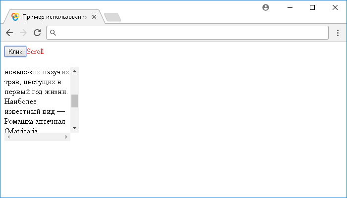

# .scroll()

Метод **`.scroll()`** привязывает JavaScript обработчик событий "`scroll`" (срабатывает при прокрутке элементов), или запускает это событие на выбранный элемент.

Событие "`scroll`" посылается, когда изменяется положение прокрутки элемента, независимо от причины, будь-то щелчок мыши на полосе прокрутки, или перетаскивание полосы прокрутки, перетаскивание внутри элемента, при нажатии клавиш со стрелками, или перемещение с помощью колеса мыши.

Событие "`scroll`" допускается устанавливать не только на объект `window`, но и на фреймах (элементы `<iframe>`), элементах, свойство `overflow` которых установлено в `scroll`, или в `auto`, когда высота, или ширина элемента меньше, чем высота, или ширина его содержимого.

## Синтаксис

Синтаксис 1.0:

```js
$(selector).scroll() // метод используется без параметров
$(selector).scroll(handler)
```

- `handler` - `Function( Event eventObject )`

Синтаксис 1.4.3:

```js
$(selector).scroll(eventData, handler)
```

- `eventData` - `Anything`
- `handler` - `Function( Event eventObject )`

Метод `.scroll()`, используемый вместе с функцией, переданной в качестве параметра (`handler`) является, короткой записью метода `.on()`, а без параметра является короткой записью метода `.trigger()`:

```js
$(selector).on('scroll', handler)
$(selector).trigger('scroll')
```

Добавлен в версии jQuery 1.0 (синтаксис обновлен в версии 1.4.3)

## Параметры

`eventData`
: Объект, содержащий данные, которые будут переданы в обработчик событий.

`handler`
: Функция, которая будет выполнена каждый раз, когда событие срабатывает. Функция в качестве параметра может принимать объект `Event`.

## Пример

```html
<!DOCTYPE html>
<html>
  <head>
    <title>
      Использование jQuery метода .scroll() (без параметров и с функцией)
    </title>
    <script src="https://ajax.googleapis.com/ajax/libs/jquery/3.1.0/jquery.min.js"></script>
    <script>
      $(document).ready(function() {
        $('button').click(function() {
          // задаем функцию при нажатиии на элемент <button>
          $('div').scroll() // вызываем событие "scroll" на элементе <div>
        })
        $('div').scroll(function() {
          // задаем функцию при срабатывании события "scroll" на элементе <div>
          $('span')
            .text('Scroll') // добавляем текстовое содержимое в элемент <span>
            .css({
              display: 'inline', // элемент <span> отображается как строчный
              color: 'red' // цвет текста красный
            })
            .fadeOut('fast') //  плавно изменяем прозрачность элемента <span>
        })
      })
    </script>
  </head>
  <body>
    <button>Клик</button><span></span><br /><br />
    <div style="overflow: scroll; width: 150px; height: 150px;">
      Ромашка — род многолетних цветковых растений семейства Астровые, или
      Сложноцветные (Asteraceae), объединяет около двадцати видов невысоких
      пахучих трав, цветущих в первый год жизни. Наиболее известный вид —
      Ромашка аптечная (Matricaria chamomilla, syn. Matricaria recutita), это
      растение широко используется в лечебных и косметических целях.
    </div>
  </body>
</html>
```

В этом примере с использованием метода `.scroll()` мы при нажатии на элемент `<button>` (кнопка) вызываем событие "`scroll`" на элементе `<div>`, которому задали, что при срабатывании события "`scroll`" необходимо добавить с использованием метода `.text()` текстовое содержимое в элемент `<span>`, с использованием метода `.css()` установить этому элементу цвет текста красный и строчное отображение, после этого с использованием эффекта `.fadeOut()` плавно изменить прозрачность элемента для его скрытия.

Обратите внимание, что эффект `.fadeOut()` устанавливает по завершению элементу свойство `display` в значение none (элемент не отображается), по этой причине мы каждый раз устанавливаем, что элемент `<span>` должен быть строковый, для его отображения при следующем срабатывании события "`scroll`". При изменении положения прокрутки элемента `<div>` событие "`scroll`" будет срабатывать как и при нажатии на элемент `<button>`.

Результат нашего примера:



Пример использования jQuery метода `.scroll()` (без параметров и с функцией)
