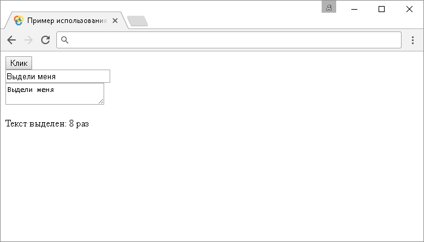

# .select()

Метод **`.select()`** привязывает JavaScript обработчик событий "`select`" (срабатывает при выделении текста), или запускает это событие на выбранный элемент. Метод используется с элементом `<input>` (с текстовым типом `type="text"`) и элементом `<textarea>`.

## Синтаксис

Синтаксис 1.0:

```js
$(selector).select() // метод используется без параметров
$(selector).select(handler)
```

- `handler` - `Function( Event eventObject )`

Синтаксис 1.4.3:

```js
$(selector).select(eventData, handler)
```

- `eventData` - `Anything`
- `handler` - `Function( Event eventObject )`

Метод `.select()`, используемый вместе с функцией, переданной в качестве параметра (`handler`) является, короткой записью метода `.on()`, а без параметра является короткой записью метода `.trigger()`:

```js
$(selector).on('select', handler)
$(selector).trigger('select')
```

Добавлен в версии jQuery 1.0 (синтаксис обновлен в версии 1.4.3)

## Параметры

`eventData`
: Объект, содержащий данные, которые будут переданы в обработчик событий.
`handler`
: Функция, которая будет выполнена каждый раз, когда событие срабатывает. Функция в качестве параметра может принимать объект `Event`.

## Пример

```html
<!DOCTYPE html>
<html>
  <head>
    <title>
      Использование jQuery метода .select() (без параметров и с функцией)
    </title>
    <script src="https://ajax.googleapis.com/ajax/libs/jquery/3.1.0/jquery.min.js"></script>
    <script>
      $(document).ready(function() {
        $('button').click(function() {
          // задаем функцию при нажатиии на элемент <button>
          $('input').select() // вызываем событие select на элементе <input>
        })
        var num = 0 // создаем переменную (счетчик)
        $('input, textarea').select(function() {
          // задаем функцию при срабатывании события select на элементе  <input>, или <textarea>
          num++ // инкремент
          // добавляем в элемент <p> информацию о количестве срабатываний события select
          $('p').text('Текст выделен: ' + num + ' раз')
        })
      })
    </script>
  </head>
  <body>
    <button>Клик</button>
    <input value="Выдели меня" /><br />
    <textarea>Выдели меня</textarea>
  </body>
</html>
```

В этом примере с использованием метода `.select()` мы при нажатии на элемент `<button>` (кнопка) вызываем событие "`select`" на элементе `<input>`. Если вызвать событие на элементе `<textarea>` эффект будет тот же, так как у нас задействован групповой селектор.

Элементам `<input>` и `<textarea>` задали, что при срабатывании события "`select`" выполнить функцию, которая с использованием метода `.text()` добавляет текстовое содержимое со значением переменной, которая содержит количество срабатывания события "`select`".

Обратите внимание на то, что метод `.select()`, вызванный без параметров может вызывать событие "`select`" многократно в браузере Chrome, увеличивая счетчик не на один, а на два, а то и на три.

Результат:



Пример использования метода `.select()` (без параметров и с функцией)
