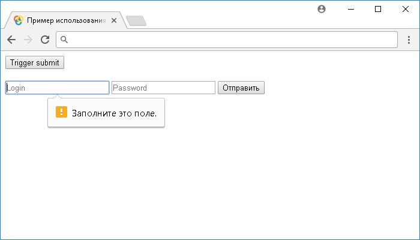

# .submit()

Метод **`.submit()`** привязывает JavaScript обработчик событий "`submit`" (обработчик отправки формы), или запускает это событие на выбранный элемент.

Событие "`submit`" отправляется к элементу, когда пользователь пытается отправить форму. Событие может быть присоединено только к HTML элементам `<form>`, они в свою очередь могут быть отправлены с использованием элемента `<input>` с типом `submit`, или `image`, и элемента `<button>` с типом `submit`.

## Синтаксис

Синтаксис 1.0:

```js
$(selector).submit() // метод используется без параметров
$(selector).submit(handler)
```

- `handler` - `Function( Event eventObject )`

Синтаксис 1.4.3:

```js
$(selector).submit(eventData, handler)
```

- `eventData` - `Anything`
- `handler` - `Function ( Event eventObject )`

Метод `.submit()`, используемый вместе с функцией, переданной в качестве параметра (`handler`) является, короткой записью метода `.on()`, а без параметра является короткой записью метода `.trigger()`:

```js
$(selector).on('submit', handler)
$(selector).trigger('submit')
```

Добавлен в версии jQuery 1.0 (синтаксис обновлен в версии 1.4.3)

## Параметры

`eventData`
: Объект, содержащий данные, которые будут переданы в обработчик событий.

`handler`
: Функция, которая будет выполнена каждый раз, когда событие срабатывает. Функция в качестве параметра может принимать объект `Event`.

## Пример

```html
<!DOCTYPE html>
<html>
  <head>
    <title>
      Использование jQuery метода .submit() (без параметров и с функцией)
    </title>
    <script src="https://ajax.googleapis.com/ajax/libs/jquery/3.1.0/jquery.min.js"></script>
    <script>
      $(document).ready(function() {
        $('button').click(function() {
          // задаем функцию при нажатиии на элемент <button>
          $('form').submit() // вызываем событие submit на элементе <form>
        })
        $('form').submit(function(event) {
          // задаем функцию при срабатывании события "submit" на элементе <form>
          event.preventDefault() // действие события по умолчанию не будет срабатывать
          $('span')
            .text('Form submitted') // добавляем текстовое содержимое в элемент <span>
            .css({
              display: 'inline', // элемент <span> отображается как строчный
              color: 'forestgreen' // цвет текста светло-зеленый
            })
            .fadeOut(1000) //  плавно изменяем прозрачность элемента <span> за 1 секунду
        })
      })
    </script>
  </head>
  <body>
    <button>Trigger submit</button><br /><br />
    <form>
      <input type="text" name="login" placeholder="Login" required />
      <input type="password" name="password" placeholder="Password" required />
      <input type="submit" />
    </form>
  </body>
</html>
```

В этом примере с использованием метода `.submit()` мы при нажатии на элемент `<button>` (кнопка) вызываем событие "`submit`" на элементе `<form>`, которому задали, что при срабатывании события "`submit`" необходимо добавить с использованием метода `.text()` текстовое содержимое в элемент `<span>`, с использованием метода `.css()` установить этому элементу цвет текста светло-зеленый и строчное отображение, после этого с использованием эффекта `.fadeOut()` плавно изменить прозрачность элемента для его скрытия.

Обратите внимание, что эффект `.fadeOut()` устанавливает по завершению элементу свойство `display` в значение none (элемент не отображается), по этой причине мы каждый раз устанавливаем, что элемент `<span>` должен быть строковый, для его отображения при следующем срабатывании события "`submit`". Кроме того, мы указали метод `.preventDefault()` объекта `Event`, благодаря которому, действие события по умолчанию не будет срабатывать (отправка данных формы в адресной строке - метод GET).

Обратите внимание, что при использовании метода `.submit()` без параметров мы можем инициировать событие "`submit`" и с пустыми полями не смотря на наличие атрибутов `required`.

Результат:



Пример использования метода `.scroll()` (без параметров и с функцией)
