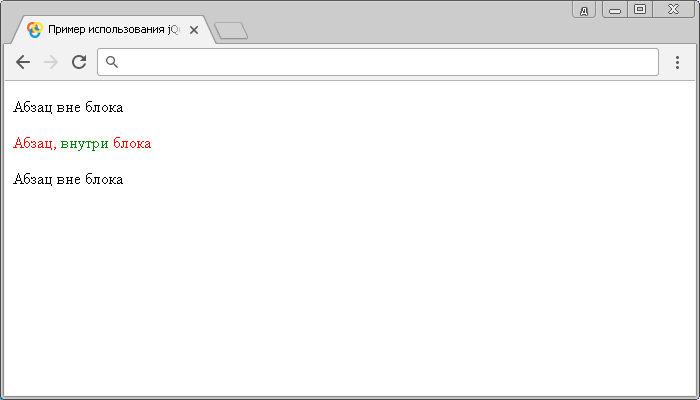

# Селектор потомков

Селектор потомков позволяет выбрать элементы, которые расположены внутри других элементов (содержатся внутри других элементов).

## Синтаксис

```js
$('родитель потомок')
/* в качестве родителя, или потомка может выступать любой селектор */
```

Добавлен в версии jQuery 1.0

## Пример

```html
<!DOCTYPE html>
<html>
	<head>
		<title>Использование jQuery селектора потомков</title>
		<script src="https://ajax.googleapis.com/ajax/libs/jquery/3.1.0/jquery.min.js"></script>
		<script>
			$(document).ready(function(){
				// выбирает все элементы <p>, вложенные в <div> (его потомки)
				$("div p").css("color", "red");
				// выбирает все элементы <span>, вложенные в <p>,
				// которые вложены в <div> (его потомки)
				$("div p span").css("color", "green");
			});
		</script>
	</head>
	<body>
		<p>Абзац <span>вне</span> блока</p>
		<div>
			<p>Абзац, <span>внутри</span> блока</p>
		</div>
		</p>Абзац <span>вне</span> блока</p>
	</body>
</html>
```

В этом примере с использованием селектора потомков jQuery, мы выбрали все элементы `<p>`, вложенные в `<div>` (его потомки) и задали им цвет текста красный. Кроме того, мы выбрали все элементы `<span>`, вложенные в `<p>`, которые вложены в `<div>` и задали им зеленый цвет текста.

Результат нашего примера:



Пример использования jQuery селектора потомков.
