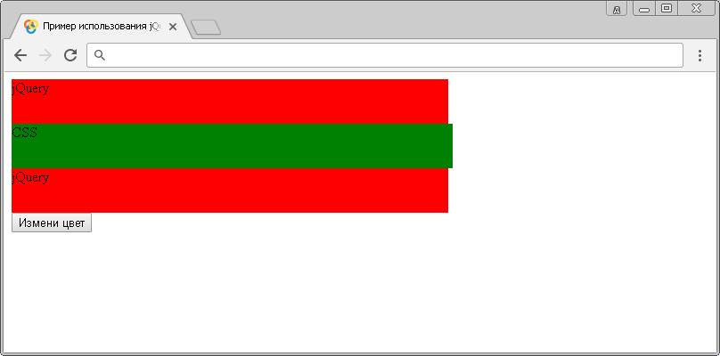

# :animated

Селектор **`:animated`** выбирает все элементы, которые находятся в процессе анимации в тот момент, когда селектор используется.

Обращаю Ваше внимание, что селектор выбирает только те элементы, которые анимированы с использоваием библиотеки jQuery.

## Синтаксис

```js
$(':animated')
```

Добавлен в версии jQuery 1.2

## Пример

```html
<!DOCTYPE html>
<html>
  <head>
    <title>Использование jQuery селектора :animated.</title>
    <script src="https://ajax.googleapis.com/ajax/libs/jquery/3.1.0/jquery.min.js"></script>
    <script>
      $(document).ready(function() {
        animateDiv() // запускаем функцию, отвечающую за нашу анимацию при загрузке документа
        function animateDiv() {
          // функция, отвечающая за нашу анимацию
          $('.test').animate({ width: '100%' }, 2500, 'linear') // указываем, что ширина элемента должна стать 100% за 2500 миллисекунд (линейно - с одной скоростью)
          $('.test').animate({ width: '0%' }, 2500, 'linear', animateDiv) // указываем, что ширина элемента должна стать 0% за 2500 миллисекунд (линейно - с одной скоростью), указываем что после завершения наша функция запускается вновь
        }
        $('button').click(function() {
          // указываем, что при нажатии на кнопку запускается функция
          $(':animated').toggleClass('red') // добавляем класс red анимируемым элементам, или убираем этот класс если он уже установлен (только для анимируемых элементов с помощью jQuery)
        })
      })
    </script>
  </head>
  <body>
    <div class="test">jQuery</div>
    <div class="test2">CSS</div>
    <div class="test">jQuery</div>
    <button>Измени цвет</button>
  </body>
</html>
```

В этом примере с использованием селектора `:animated` мы выбираем все элементы, которые находятся в процессе анимации, которая была вызвана с использованием библиотеки jQuery (первый и третий блок). Обратите внимание, что наш второй блок анимирован с использованием CSS анимации, но он не будет выбран и стилизован с использованием селектора `:animated`.

При нажатии на кнопку происходит добавление селектора класса (анимируемым с использованием библиотеки jQuery блокам), который устанавливает цвет заднего фона красный, при следующем нажатии класс убирается, и так по кругу (jQuery функция `toggleClass`).



Пример использования jQuery селектора `:animated`.
