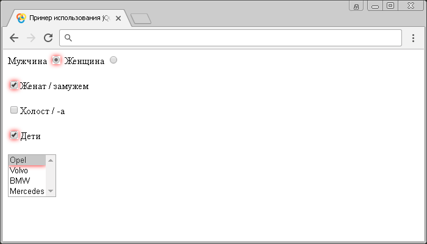

# :checked

Селектор **`:checked`** выбирает все элементы `<input>`, у которых установлен логический атрибут `checked` (только для `<input type="checkbox">` и `<input type="radio">`). Кроме того, выбирает элементы `<option>` (пункты раскрывающегося списка `<select>`) с логическим атрибутом `selected`.

Если необходимо выбрать только пункты раскрывающегося списка `<select>` с логическим атрибутом `selected`, то вы можете воспользоваться селектором `:selected`.

## Синтаксис

```js
$(':checked')
```

Добавлен в версии jQuery 1.0

## Пример

```html
<!DOCTYPE html>
<html>
  <head>
    <title>Использование jQuery селектора :checked.</title>
    <script src="https://ajax.googleapis.com/ajax/libs/jquery/3.1.0/jquery.min.js"></script>
    <script>
      $(document).ready(function() {
        $(':checked').css('box-shadow', '0 0 10px red') // выбираем все элементы, которые предварительно выбраны в нашем примере
      })
    </script>
  </head>
  <body>
    <form>
      <label
        >Мужчина <input type="radio" name="sex" value="male" checked
      /></label>
      <!-- значение выбрано -->
      <label>Женщина <input type="radio" name="sex" value="female"/></label
      ><br /><br />
      <label
        ><input type="checkbox" name="type1" value="busy" checked />Женат /
        замужем</label
      ><br /><br />
      <!-- значение выбрано -->
      <label
        ><input type="checkbox" name="type2" value="free" />Холост / -а</label
      ><br /><br />
      <label
        ><input
          type="checkbox"
          name="type3"
          value="childfree"
          checked
        />Дети</label
      ><br /><br />
      <!-- значение выбрано -->
      <select name="cars" multiple>
        <!--раскрывающийся список в котором может быть выбрано несколько значений (атрибут multiple) -->
        <option value="Opel" selected>Opel</option>
        <!-- параметр должен быть предварительно выбран при загрузке (атрибут selected) -->
        <option value="Volvo">Volvo</option>
        <option value="BMW">BMW</option>
        <option value="Mercedes">Mercedes</option>
      </select>
    </form>
  </body>
</html>
```

В этом примере с использованием селектора `:checked` мы выбрали и стилизовали все элементы `<input>`, у которых установлен логический атрибут `checked`, и элемент `<option>` (пункт раскрывающегося списка `<select>`) с логическим атрибутом `selected`.

Результат нашего примера:



Пример использования селектора `:checked`.
