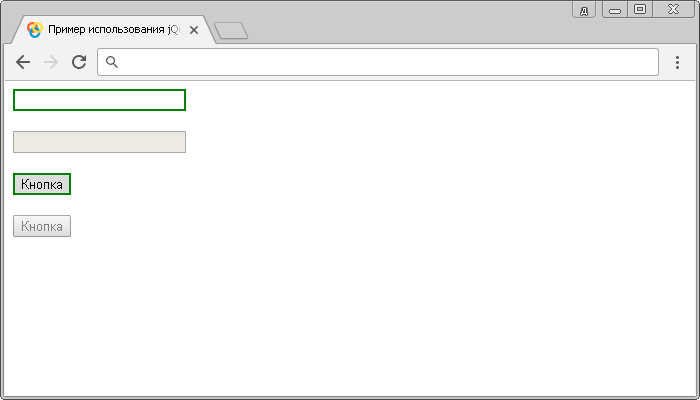

# :enabled

Селектор **`:enabled`** выбирает все элементы, которые активны (у которых не установлен логический атрибут `disabled`).

Селектор `:enabled` применяется только к следующим элементам:

- `<button>` - кнопка
- `<input>` - пользовательское поле для ввода информации
- `<optgroup>` - группировка связанных данных в раскрывающемся списке
- `<option>` - пункт списка
- `<select>` - раскрывающийся (выпадающий) список
- `<textarea>` - область многострочного ввода
- `<menuitem>` - определяет элемент меню
- `<fieldset>` - служит для визуальной группировки элементов

## Синтаксис

```js
$(':enabled')
```

Добавлен в версии jQuery 1.0

## Пример

```html
<!DOCTYPE html>
<html>
  <head>
    <title>Использование jQuery селектора :enabled</title>
    <script src="https://ajax.googleapis.com/ajax/libs/jquery/3.1.0/jquery.min.js"></script>
    <script>
      $(document).ready(function() {
        $(':enabled').css('border', '2px solid green') // выбираем все элементы, которые не имеют логического атрибута disabled.
      })
    </script>
  </head>
  <body>
    <form>
      <input type="text" /><br /><br />
      <input type="text" disabled /><br /><br />
      <button>Кнопка</button><br /><br />
      <button disabled>Кнопка</button>
    </form>
  </body>
</html>
```

В этом примере с использованием селектора `:enabled` мы выбрали и стилизовали все элементы `<input>` и `<button>`, которые не имеют логического атрибута `disabled`.

Результат:



Пример использования селектора `:enabled`.
